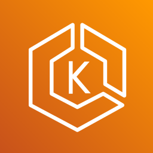
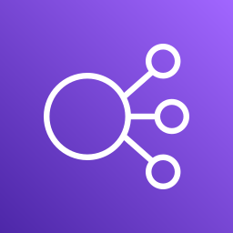
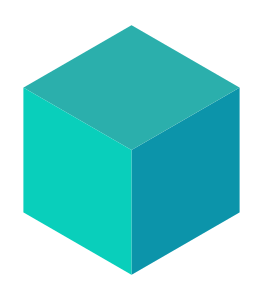
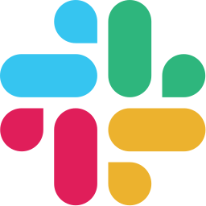
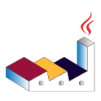
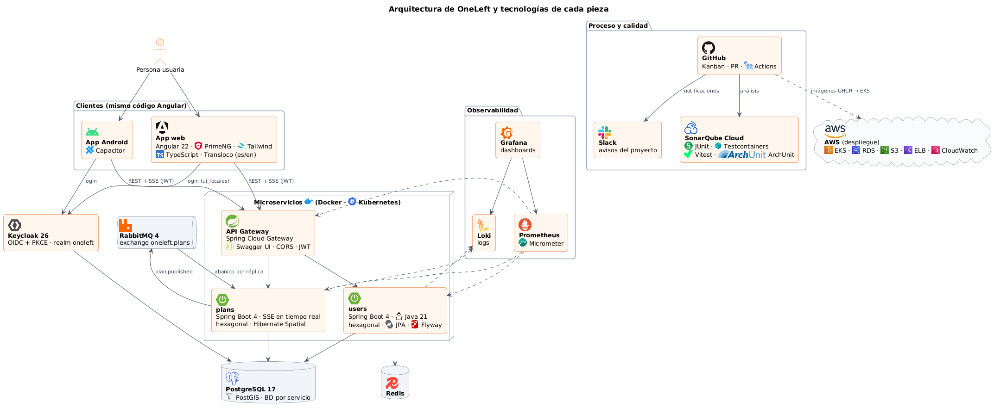

# OneLeft · Documentación

**OneLeft** conecta planes para las próximas horas que tienen plazas libres («falta uno») con personas cercanas que pueden unirse en tiempo real.

## Contenido

- `memoria/`: memoria del TFM, siguiendo la estructura de los TFM del Máster en Ingeniería Web.
- `proceso/`: diario del desarrollo con capturas de cada hito (repositorios, tablero, pipelines, despliegues).
- `anteproyecto/`: propuesta del TFM.

## Tecnologías

| Área | Tecnologías | Uso en OneLeft |
|---|---|---|
| Frontend web |       | App web zoneless con signals, PrimeNG + Tailwind, i18n es/en con Transloco |
| App móvil |   | La app Android replica la web: mismo código Angular empaquetado con Capacitor |
| Backend |         | Microservicios con arquitectura hexagonal detrás de un API Gateway |
| Seguridad |  | OIDC + PKCE, roles del realm, login en es/en (y Google, HU-021) |
| Datos y mensajería |     | Base de datos por servicio, búsqueda geoespacial y eventos de dominio |
| Infraestructura |         | Docker Compose en local; Kubernetes y AWS en la fase de despliegue |
| Observabilidad |     | Métricas, logs centralizados y dashboards aprovisionados |
| Pruebas y calidad |        | Cobertura ≥ 80 %, reglas de arquitectura, recorridos E2E con capturas |
| Proceso y herramientas |         | Kanban en GitHub Projects, CI/CD, avisos en Slack y diagramas como código |

Los logos se descargan con [`tools/fetch-logos.mjs`](tools/fetch-logos.mjs); su origen y licencia están en
[`assets/logos/SOURCES.md`](assets/logos/SOURCES.md). Son marcas de sus propietarios y se usan solo para identificar
cada tecnología.

## Proyecto

| Repositorio | Contenido |
|---|---|
| [oneleft-backend](https://github.com/chabelly-lbetancourt/oneleft-backend) | Microservicios Spring Boot |
| [oneleft-frontend](https://github.com/chabelly-lbetancourt/oneleft-frontend) | App web Angular y app Android con Capacitor |
| [oneleft-infra](https://github.com/chabelly-lbetancourt/oneleft-infra) | Docker, Kubernetes, AWS y observabilidad |
| [oneleft-docs](https://github.com/chabelly-lbetancourt/oneleft-docs) | Memoria del TFM y documentación del proceso |

Entornos: **dev** (integración) → **pre** (*staging*) → **pro** (`main`), ver [CONTRIBUTING.md](CONTRIBUTING.md).

Tablero Kanban: [OneLeft · TFM](https://github.com/users/chabelly-lbetancourt/projects/4) · Normas de trabajo: [CONTRIBUTING.md](CONTRIBUTING.md)

---
Trabajo Fin de Máster · Máster Universitario en Ingeniería Web · ETSISI · Universidad Politécnica de Madrid
