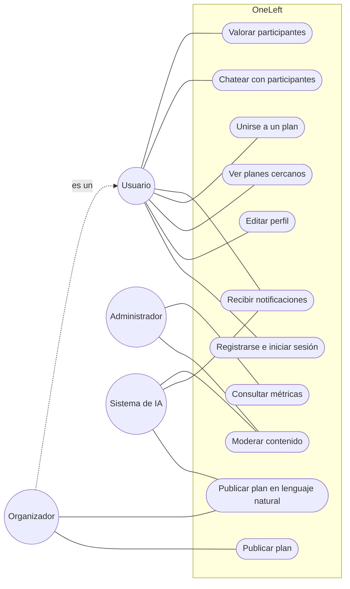
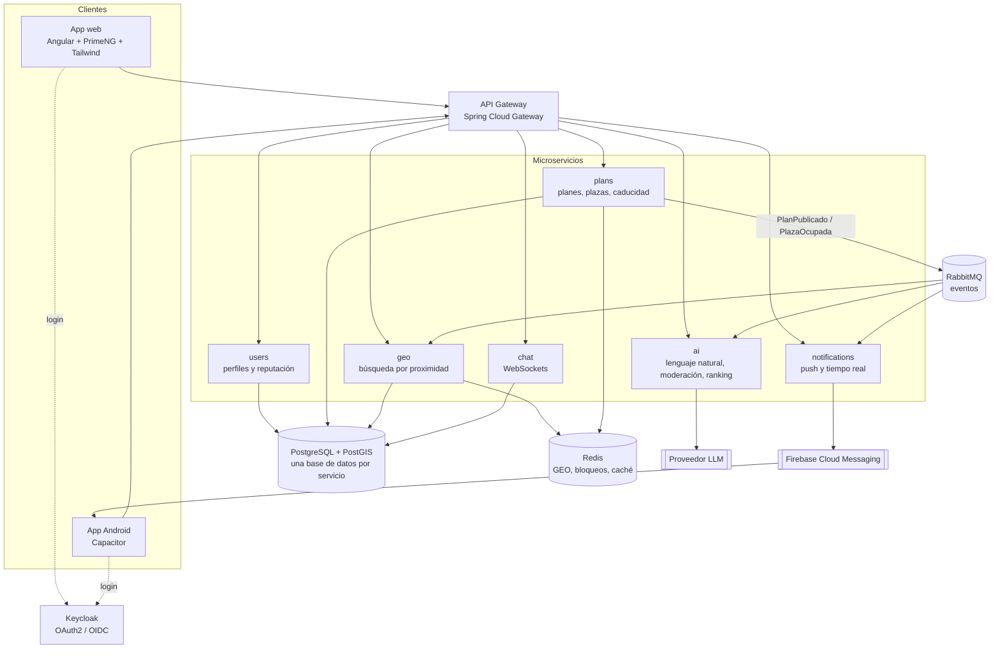
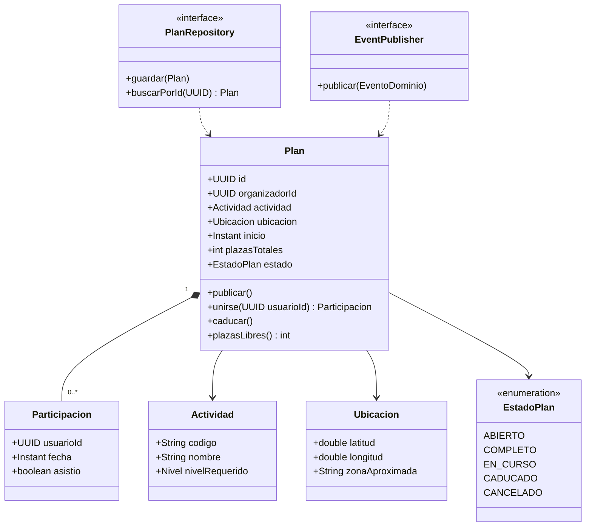
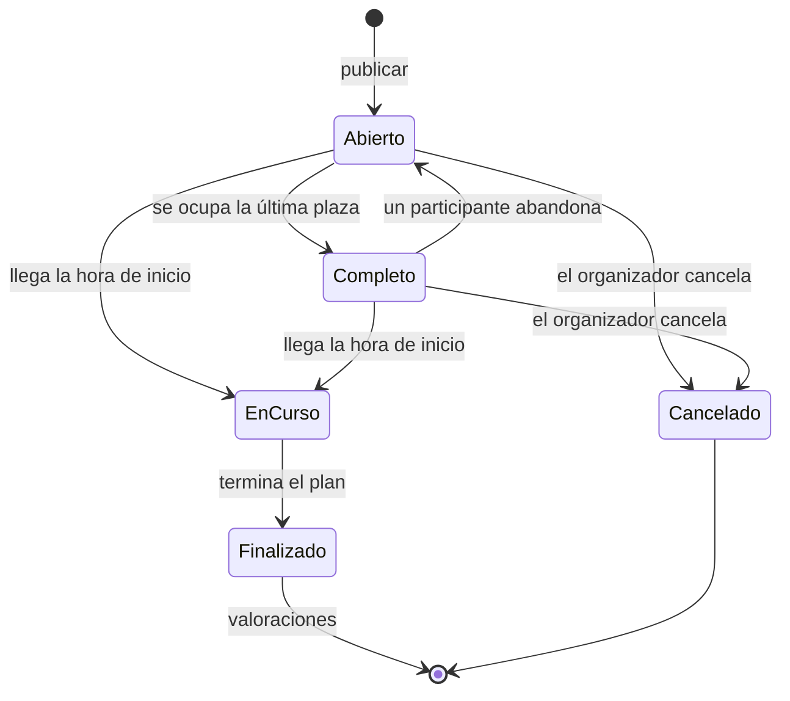
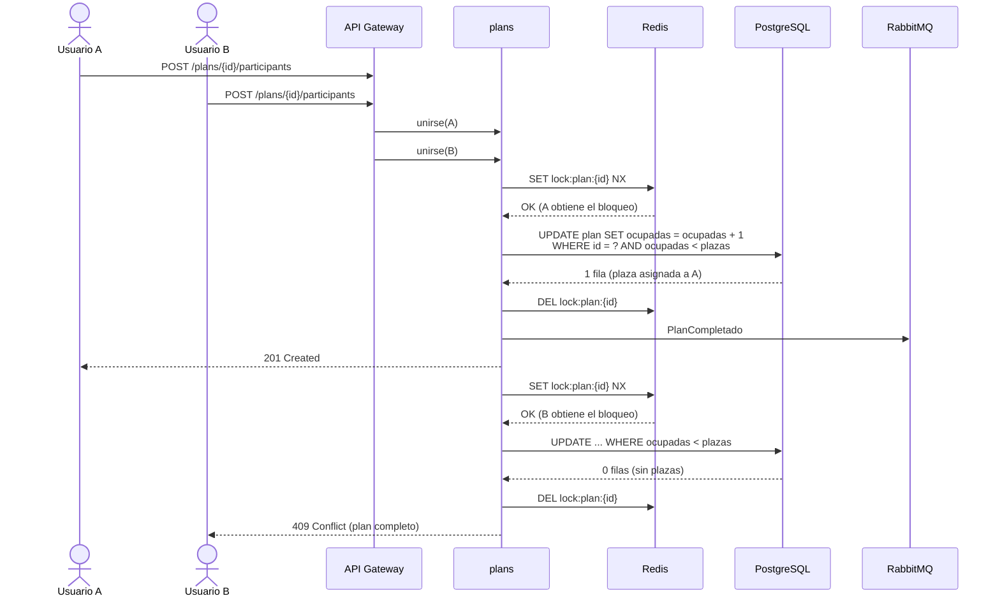
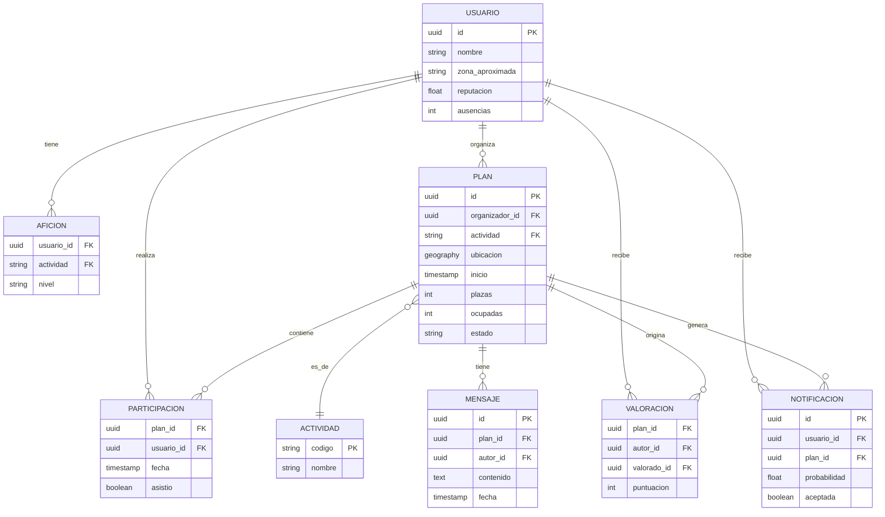
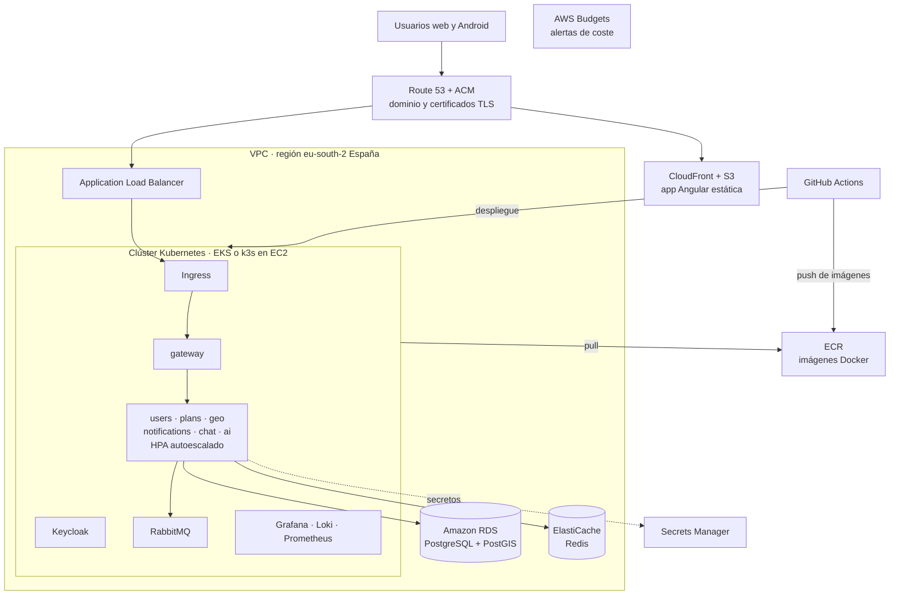
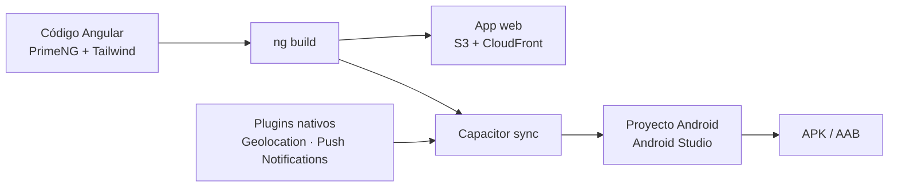
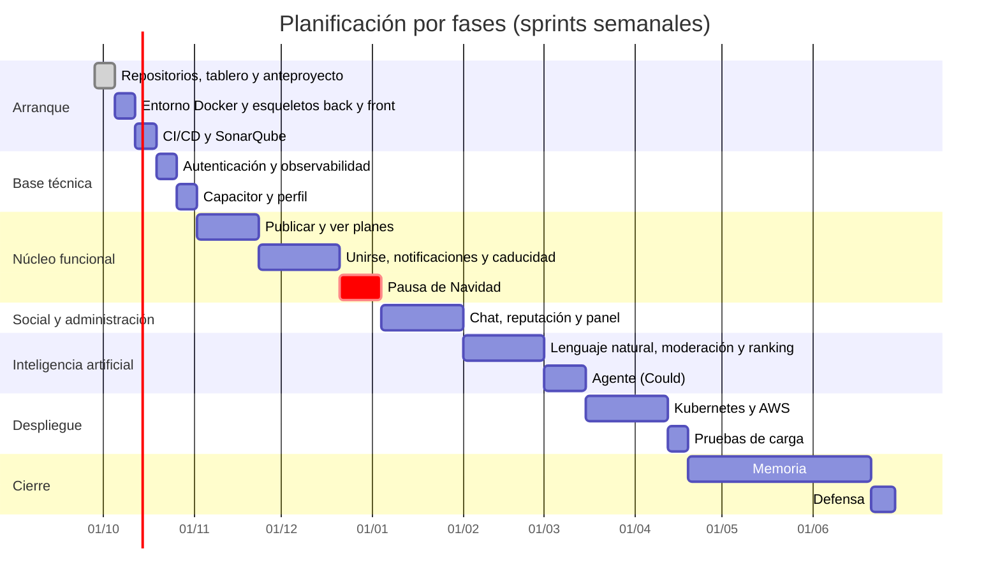

# Anteproyecto · OneLeft

**Título provisional:** OneLeft: plataforma web y móvil de microservicios para completar planes inmediatos con personas cercanas en tiempo real

**Máster Universitario en Ingeniería Web** · ETSISI · Universidad Politécnica de Madrid
**Autor/a:** _[nombre y apellidos]_ · **Tutor/a:** _[pendiente de asignación]_ · **Convocatoria prevista:** julio de 2027

---

## Propuesta para el foro de TFM

**Personas que realizan la propuesta:** _[nombre del alumno/a]_

**Título provisional:** OneLeft: plataforma web y móvil de microservicios para completar planes inmediatos con personas cercanas en tiempo real

**Resumen:** Aplicación web y Android en la que los usuarios publican planes para las próximas horas con plazas libres (deportes, juegos, entradas sobrantes) que se completan en tiempo real con personas cercanas. Incluye emparejamiento geoespacial, notificaciones inteligentes con aprendizaje automático y moderación con IA. Arquitectura de microservicios desplegada en Kubernetes sobre AWS, con observabilidad y gestión ágil documentada.

**Tecnologías:** Spring Boot, Spring Cloud, Angular, PrimeNG, Tailwind CSS, Capacitor (Android), PostgreSQL/PostGIS, Redis, RabbitMQ, Keycloak, Docker, Kubernetes, AWS, Grafana, Loki, GitHub Actions, SonarQube.

---

## 1. Motivación y problema

Cuando a un grupo le falta una persona para un plan inmediato (un partido de pádel a las 19:00, un fútbol 7 en el
que son 13, una entrada que sobra para esta noche), la solución habitual es escribir en varios grupos de mensajería
y esperar. Casi nunca funciona a tiempo.

Las aplicaciones existentes para hacer planes con desconocidos, cada vez más populares como forma de combatir la
soledad, se centran en **eventos organizados con días de antelación** y en **conocer gente**. No resuelven el
caso concreto de **completar un grupo que ya existe en las próximas horas**.

OneLeft propone una plataforma en la que:

1. El organizador publica un plan con fecha de inicio en las próximas horas y el número exacto de plazas libres.
2. El sistema avisa, en tiempo real, a las personas cercanas con más probabilidad de apuntarse.
3. Las plazas se ocupan por orden de llegada y el plan **caduca** automáticamente al empezar.

## 2. Objetivos

### 2.1 Objetivo general

Diseñar, desarrollar y desplegar una plataforma web y móvil basada en microservicios que permita completar planes
inmediatos con personas cercanas en tiempo real, aplicando metodologías ágiles, prácticas DevOps y técnicas de
inteligencia artificial.

### 2.2 Objetivos específicos

| Id | Objetivo | Cómo se mide |
|---|---|---|
| OE1 | Gestionar el proyecto con Scrum ligero y Kanban en GitHub Projects, con priorización MoSCoW y estimación en puntos de historia | Sprints documentados, velocidad y desviaciones analizadas |
| OE2 | Diseñar una arquitectura de microservicios con arquitectura hexagonal, documentada con UML | Diagramas de componentes, clases, secuencia, estados y despliegue |
| OE3 | Implementar la búsqueda geoespacial y la asignación concurrente de plazas sin sobreocupación | Pruebas de concurrencia: nunca más participantes que plazas |
| OE4 | Desarrollar una aplicación web con Angular, PrimeNG y Tailwind CSS y publicarla como app Android con Capacitor | APK funcional con geolocalización y notificaciones push |
| OE5 | Incorporar IA: creación de planes en lenguaje natural, moderación automática y ranking de notificaciones | Tasa de aceptación y tiempo en completar un plan frente a una regla base |
| OE6 | Desplegar la plataforma en Kubernetes sobre AWS con autoescalado | Pruebas de carga con k6 y autoescalado observado |
| OE7 | Implantar observabilidad (logs, métricas) y calidad continua | Dashboards de Grafana y Loki; cobertura ≥ 80 % y quality gate de SonarQube |
| OE8 | Documentar todo el proceso con capturas y evidencias | Diario de desarrollo en `oneleft-docs/proceso` |

## 3. Estado del arte

### 3.1 Aplicaciones similares

| Aplicación | Qué ofrece | Diferencia con OneLeft |
|---|---|---|
| Meetup | Grupos por intereses con eventos programados | Planes con días de antelación; orientado a comunidades |
| Timeleft | Cenas semanales con desconocidos | Un solo tipo de plan, organizado por la plataforma |
| WeMeet (WeRoad), Meet5 | Quedadas en grupo para conocer gente | Eventos organizados; el objetivo es socializar |
| Bumble BFF, Amigos | Encontrar amistades cercanas por intereses | Orientadas a conocer personas, no a completar un plan |
| Couchsurfing Hangouts | Quedadas espontáneas con viajeros | Público viajero; sin plazas ni caducidad |
| Playtomic | Partidos abiertos de pádel | Un único deporte y ligado a la reserva de pista |

**Hueco que cubre OneLeft:** planes de **cualquier actividad** en un **horizonte de horas**, con **plazas exactas**
que se llenan en tiempo real y **caducidad automática**. El objetivo es que un plan no se caiga; conocer gente es la
consecuencia, no el propósito.

### 3.2 Trabajos previos en el Máster en Ingeniería Web

En el Archivo Digital UPM hay TFM del máster con dominios relacionados (gestión de un club de pádel, 2021;
organización de viajes en grupo, 2024), pero ninguno aborda la formación de grupos inmediatos por proximidad,
la asignación concurrente de plazas ni el uso de IA para decidir a quién notificar. Como referencia metodológica y de
estructura se toma [CRIApp](https://oa.upm.es/97133/) (2026).

### 3.3 Alternativas tecnológicas evaluadas

| Necesidad | Elegida | Alternativas | Motivo de la elección |
|---|---|---|---|
| Backend | Spring Boot + Spring Cloud | NestJS, Quarkus, Micronaut | Ecosistema maduro para microservicios; tecnología central del máster |
| Frontend | Angular + PrimeNG + Tailwind | React + MUI, Vue + Vuetify | Framework del máster; PrimeNG aporta componentes complejos y Tailwind el diseño propio |
| App móvil | Capacitor | Kotlin nativo, Flutter, React Native | Reutiliza el 100 % del código Angular con acceso nativo a GPS y notificaciones |
| Geolocalización | PostGIS + Redis GEO | MongoDB geoespacial, Elasticsearch | PostGIS para consultas persistentes; Redis para posiciones en tiempo real |
| Mensajería | RabbitMQ | Kafka, Amazon SQS | Suficiente para el volumen previsto y más sencillo de operar |
| Identidad | Keycloak | Amazon Cognito, Auth0 | Open source, OAuth2/OIDC estándar, sin dependencia de un proveedor |
| Orquestación | Kubernetes | Amazon ECS, Docker Swarm | Estándar de la industria; autoescalado horizontal (HPA) |
| Logs | Loki + Grafana | ELK (Elasticsearch, Logstash, Kibana) | Menor consumo de recursos; integración nativa con Grafana |

## 4. Metodología

### 4.1 Marco ágil: Scrum ligero + Kanban

Al tratarse de un proyecto individual, se adapta Scrum sin ceremonias rígidas:

- **Sprints semanales** (de lunes a domingo), del Sprint 0 (28/09/2026) al Sprint 39 (28/06/2027).
- **Planificación** al inicio de cada sprint: se mueven historias de *Backlog* a *Sprint Backlog* según prioridad y capacidad.
- **Kanban diario** en GitHub Projects: *Backlog → Sprint Backlog → In Progress → Done*, con **límite WIP de 2** en *In Progress*.
- **Revisión** al final de cada sprint: se registra la velocidad real y se documentan las desviaciones en el diario del proceso.

### 4.2 Priorización: MoSCoW

| Categoría | Significado | Ejemplos |
|---|---|---|
| **Must** | Imprescindible para el MVP | Publicar un plan, ver planes cercanos, unirse, notificaciones, caducidad, despliegue en AWS |
| **Should** | Importante, pero el MVP funciona sin ello | Chat, reputación, IA de lenguaje natural y moderación, observabilidad |
| **Could** | Deseable si hay tiempo | Agente «¿qué hago ahora?» |
| **Won't** | Fuera del alcance de esta versión | Pagos dentro de la app, reserva de pistas integrada |

### 4.3 Estimación: puntos de historia (Fibonacci)

| Puntos | Referencia de esfuerzo |
|---|---|
| 1 | Cambio trivial o configuración (menos de 2 horas) |
| 2 | Tarea pequeña y bien conocida (media jornada) |
| 3 | Tarea acotada con alguna incertidumbre (una jornada) |
| 5 | Funcionalidad completa en una capa o integración sencilla (2–3 jornadas) |
| 8 | Funcionalidad con varias capas e incertidumbre técnica (una semana) |
| 13 | Demasiado grande: se divide en historias más pequeñas |

**Capacidad planificada:** 5 puntos por semana de media, compatibles con la redacción progresiva de la memoria.

### 4.4 Herramientas

| Ámbito | Herramienta |
|---|---|
| Gestión ágil | GitHub Projects (tablero Kanban, backlog, roadmap por sprints) |
| Control de versiones | Git y GitHub (4 repositorios, ramas `main`/`dev`/`issue#N`/`hotfix/*`) |
| IDE backend | IntelliJ IDEA |
| IDE frontend | WebStorm (y Android Studio para compilar Android) |
| CI/CD | GitHub Actions |
| Calidad | SonarQube Cloud y SonarQube for IDE |
| Contenedores | Docker y Docker Compose |
| Orquestación | Kubernetes (kind en local, AWS en producción) |
| Observabilidad | Grafana, Loki y Prometheus |
| Pruebas | JUnit, Mockito, Testcontainers, Jasmine/Jest, Playwright, k6 |
| Diagramas | Mermaid y PlantUML |
| Asistencia con IA | Claude Code |

## 5. Requisitos

### 5.1 Requisitos funcionales

| Id | Requisito | HU |
|---|---|---|
| RF-01 | El sistema permitirá el registro, el inicio y el cierre de sesión | HU-001 |
| RF-02 | El usuario podrá indicar sus aficiones, nivel por actividad y zona aproximada | HU-002 |
| RF-03 | El organizador podrá publicar un plan con actividad, lugar, hora de inicio (en las próximas horas) y plazas libres | HU-003 |
| RF-04 | El usuario podrá ver los planes abiertos cercanos en un mapa y en una lista, filtrando por actividad y hora | HU-004 |
| RF-05 | El usuario podrá ocupar una plaza libre; el plan se cerrará al completarse | HU-005 |
| RF-06 | El sistema notificará los planes cercanos compatibles, con límite de avisos por usuario | HU-006 |
| RF-07 | Los planes caducarán automáticamente a su hora de inicio | HU-007 |
| RF-08 | Los participantes de un plan dispondrán de un chat en tiempo real | HU-008 |
| RF-09 | Tras el plan, los participantes podrán valorarse y se registrarán las ausencias | HU-009 |
| RF-10 | El organizador podrá crear un plan escribiendo o dictando una frase | HU-010 |
| RF-11 | Los planes y mensajes se moderarán automáticamente antes de publicarse | HU-011 |
| RF-12 | El sistema elegirá a quién notificar según su probabilidad de aceptar | HU-012 |
| RF-13 | El administrador dispondrá de un panel de gestión y moderación | HU-013 |

### 5.2 Requisitos no funcionales

| Id | Categoría | Requisito |
|---|---|---|
| RNF-01 | Rendimiento | Una notificación llegará en menos de 5 segundos desde la publicación del plan |
| RNF-02 | Escalabilidad | Los servicios críticos escalarán horizontalmente de forma automática ante picos de carga |
| RNF-03 | Concurrencia | Nunca habrá más participantes que plazas, aunque varios usuarios se unan a la vez |
| RNF-04 | Seguridad | Autenticación OAuth2/OIDC; comunicaciones cifradas con TLS |
| RNF-05 | Privacidad | Nunca se mostrará la ubicación exacta de un usuario, solo una zona aproximada (RGPD) |
| RNF-06 | Disponibilidad | Un fallo en un servicio no crítico (chat, IA) no impedirá publicar ni unirse a planes |
| RNF-07 | Portabilidad | La misma aplicación funcionará en navegador y como app Android |
| RNF-08 | Mantenibilidad | Cobertura de pruebas ≥ 80 % y quality gate de SonarQube superado |
| RNF-09 | Observabilidad | Logs centralizados y métricas de todos los servicios en Grafana |
| RNF-10 | Accesibilidad | La interfaz cumplirá WCAG 2.2 nivel AA |
| RNF-11 | Coste | El despliegue en AWS tendrá alertas de presupuesto y se apagará fuera de las pruebas |

### 5.3 Historias de usuario

| HU | Historia | MoSCoW | Puntos | Sprint previsto |
|---|---|---|---|---|
| HU-001 | Registro e inicio de sesión | Must | 5 | 3 |
| HU-002 | Perfil con aficiones y nivel | Should | 3 | 4 |
| HU-003 | Publicar un plan con plazas libres | Must | 5 | 5 |
| HU-004 | Ver planes cercanos | Must | 5 | 7 |
| HU-005 | Unirse a un plan | Must | 5 | 8 |
| HU-006 | Notificaciones de planes cercanos | Must | 8 | 9 |
| HU-007 | Caducidad automática de planes | Must | 3 | 11 |
| HU-008 | Chat del plan | Should | 5 | 14 |
| HU-009 | Valoraciones y reputación | Should | 3 | 15 |
| HU-013 | Panel de administración y moderación | Should | 5 | 16 |
| HU-010 | Crear un plan en lenguaje natural | Should | 5 | 18 |
| HU-011 | Moderación automática | Should | 5 | 19 |
| HU-012 | Elegir a quién notificar con IA | Should | 8 | 20 |
| HU-014 | Agente «¿qué hago ahora?» | Could | 8 | 22 |
| HU-015 | Pruebas de carga y autoescalado | Should | 5 | 28 |
| HU-016 | Memoria final del TFM | Must | 8 | 29 |
| HU-017 | Preparación de la defensa | Must | 3 | 38 |
| HU-018 | Pagos dentro de la app | Won't | – | – |
| HU-019 | Reserva de pistas integrada | Won't | – | – |

Cada historia tiene su issue con criterios de aceptación en el [tablero del proyecto](https://github.com/users/chabelly-lbetancourt/projects/4).

## 6. Diseño preliminar (UML)

### 6.1 Casos de uso

### 6.2 Arquitectura de componentes

Cada microservicio sigue **arquitectura hexagonal** (dominio, aplicación e infraestructura) y se comunica de forma
síncrona a través del gateway y de forma asíncrona mediante **eventos** en RabbitMQ.

### 6.3 Modelo de dominio del servicio de planes

### 6.4 Ciclo de vida de un plan

### 6.5 Secuencia: unirse a la última plaza

La condición `ocupadas < plazas` en la propia sentencia garantiza el requisito RNF-03 incluso si falla el bloqueo
distribuido.

## 7. Bases de datos

Se aplica el patrón **base de datos por servicio**: cada microservicio es dueño de sus datos y los demás solo
acceden a ellos a través de su API o de eventos.

| Servicio | Almacenamiento | Datos |
|---|---|---|
| users | PostgreSQL | Perfiles, aficiones, niveles, valoraciones |
| plans | PostgreSQL + PostGIS | Planes, ubicaciones, participaciones |
| geo | Redis (GEO) | Posiciones aproximadas en tiempo real de usuarios disponibles |
| chat | PostgreSQL | Mensajes por plan (se purgan tras la caducidad) |
| notifications | PostgreSQL + Redis | Historial de avisos y límites por usuario |
| ai | PostgreSQL | Datos de entrenamiento y decisiones del ranking |

## 8. Infraestructura y encaje en AWS

### 8.1 Entornos

| Entorno | Infraestructura | Uso |
|---|---|---|
| Desarrollo | Docker Compose en local | Programación diaria desde IntelliJ y WebStorm |
| Integración | Kubernetes local con kind | Pruebas de manifiestos, autoescalado y observabilidad |
| Producción | AWS | Pruebas de carga, demostración y defensa |

### 8.2 Arquitectura en AWS

| Servicio de AWS | Papel en OneLeft |
|---|---|
| **EKS** (o **k3s en EC2** para reducir costes) | Ejecuta los microservicios con autoescalado horizontal |
| **ECR** | Registro privado de las imágenes Docker publicadas desde GitHub Actions |
| **RDS PostgreSQL** | Bases de datos gestionadas, con la extensión PostGIS |
| **ElastiCache Redis** | Posiciones en tiempo real, bloqueos distribuidos y caché |
| **S3 + CloudFront** | Aloja y distribuye la aplicación Angular |
| **Route 53 + ACM** | Dominio y certificados TLS |
| **Secrets Manager** | Credenciales de bases de datos y claves de APIs |
| **AWS Budgets** | Alertas de presupuesto para controlar el gasto |

**Control de costes:** el plano de control de EKS tiene un coste fijo mensual, por lo que el desarrollo diario se hace
en local y el entorno de AWS solo se levanta para pruebas de carga y la defensa. Se valorará k3s sobre EC2 como
alternativa económica y se solicitarán créditos educativos de AWS.

## 9. Aplicación móvil

La app Android se genera con **Capacitor** a partir del mismo código Angular, lo que evita mantener dos frontends:

- **Geolocalización nativa** para obtener la zona del usuario, también en segundo plano con su consentimiento.
- **Notificaciones push** mediante Firebase Cloud Messaging.
- **Diseño mobile-first** con Tailwind CSS y componentes PrimeNG adaptados a pantalla táctil.
- **Pipeline** de GitHub Actions que genera el APK como artefacto en cada versión.

## 10. Planificación

La memoria se redacta de forma progresiva desde el primer sprint a partir del diario de desarrollo; el tramo final
se dedica a su cierre y revisión.

## 11. Riesgos

| Riesgo | Probabilidad | Impacto | Mitigación |
|---|---|---|---|
| Coste de AWS mayor del previsto | Media | Alto | Desarrollo en local, alertas de presupuesto, k3s en EC2, créditos educativos |
| Retrasos por dedicación parcial | Alta | Medio | Priorización MoSCoW: las historias *Should* y *Could* son prescindibles |
| Falta de usuarios reales para evaluar la IA | Media | Medio | Piloto en el Campus Sur de la UPM y datos sintéticos para el ranking |
| Complejidad de las notificaciones push en Android | Media | Medio | Prueba de concepto temprana en el Sprint 4 |
| Cambios en las APIs de los proveedores de IA | Baja | Medio | Capa de abstracción con Spring AI y posibilidad de modelos locales |

## 12. Evidencias y documentación del proceso

Todo el desarrollo se documenta en el repositorio [oneleft-docs](https://github.com/chabelly-lbetancourt/oneleft-docs):
diario por hitos con capturas de los resultados, del tablero, de la estructura de directorios, de los pipelines y de
los despliegues, que servirá de base para la memoria final.

## Anexo I

Formulario de propuesta firmado por el tutor y el alumno, a entregar en la comisión académica de posgrado.
_Pendiente de asignación de tutor._
