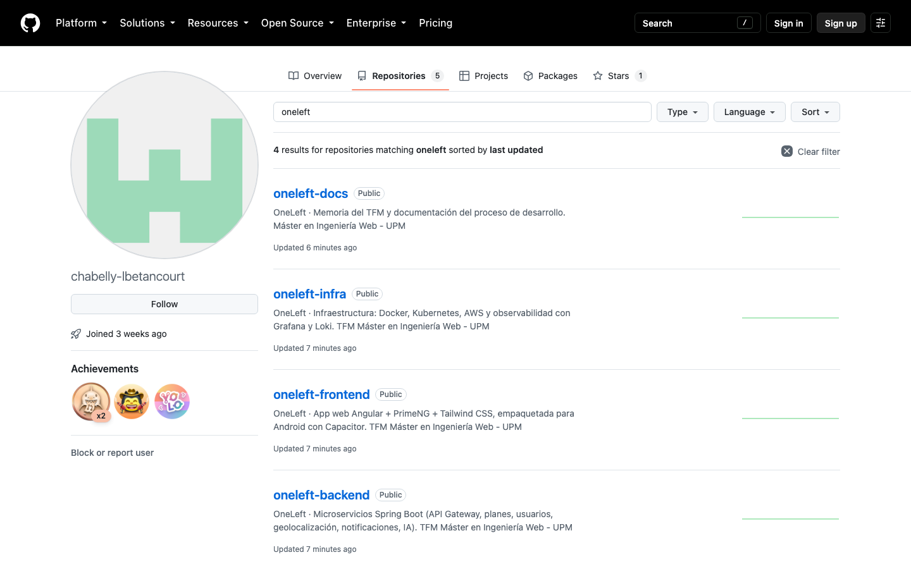
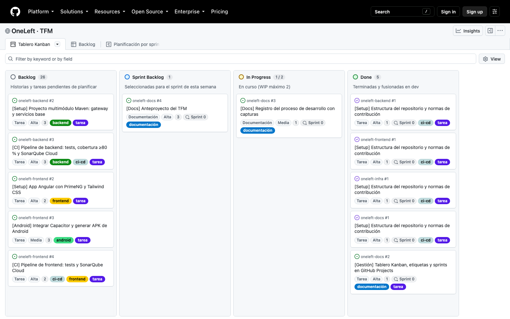
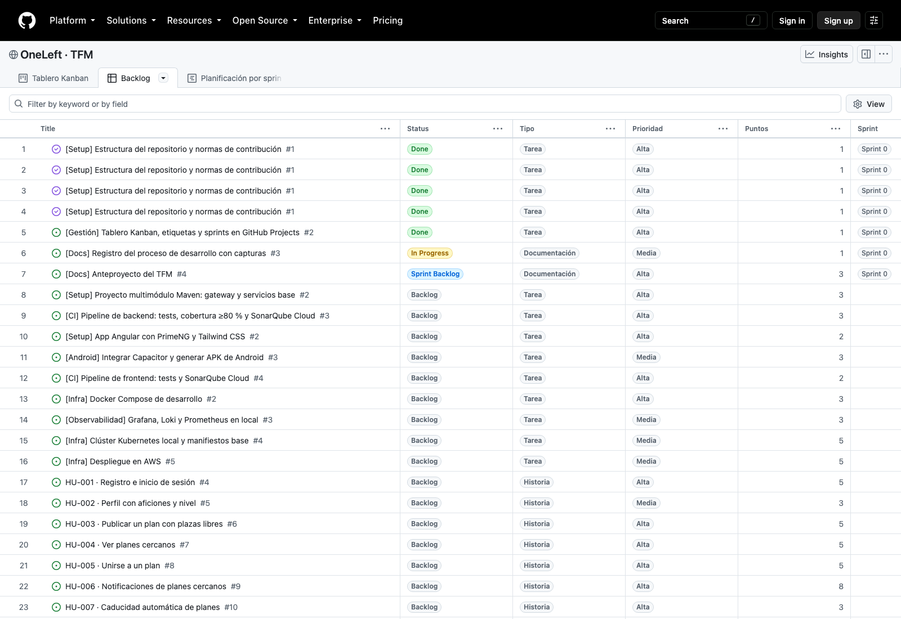
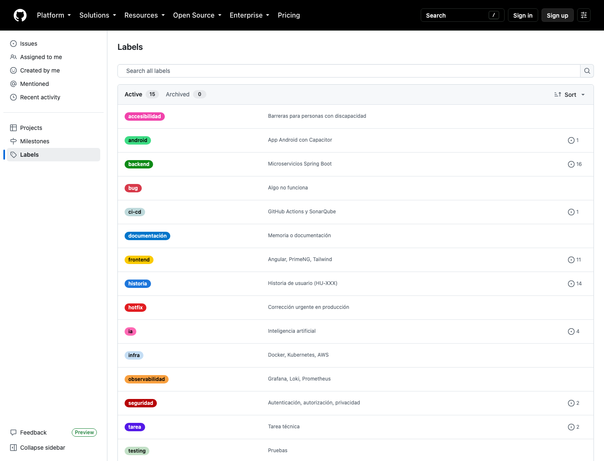
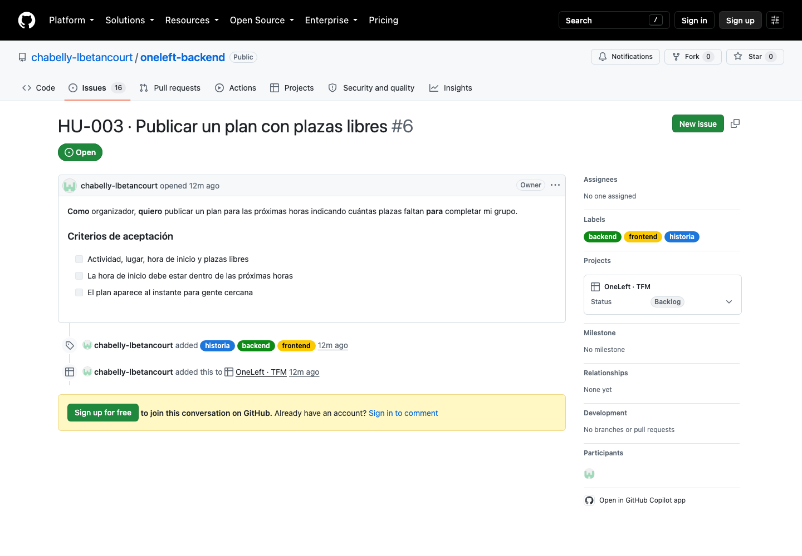
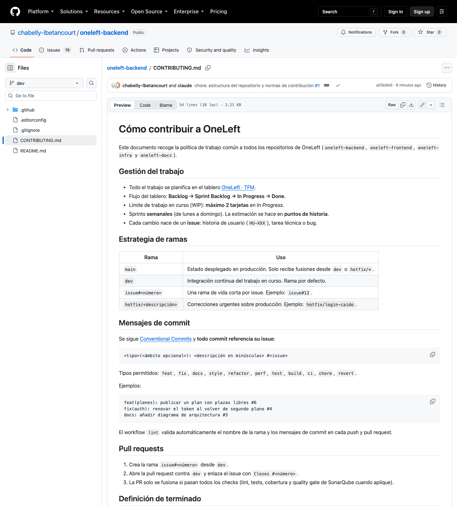
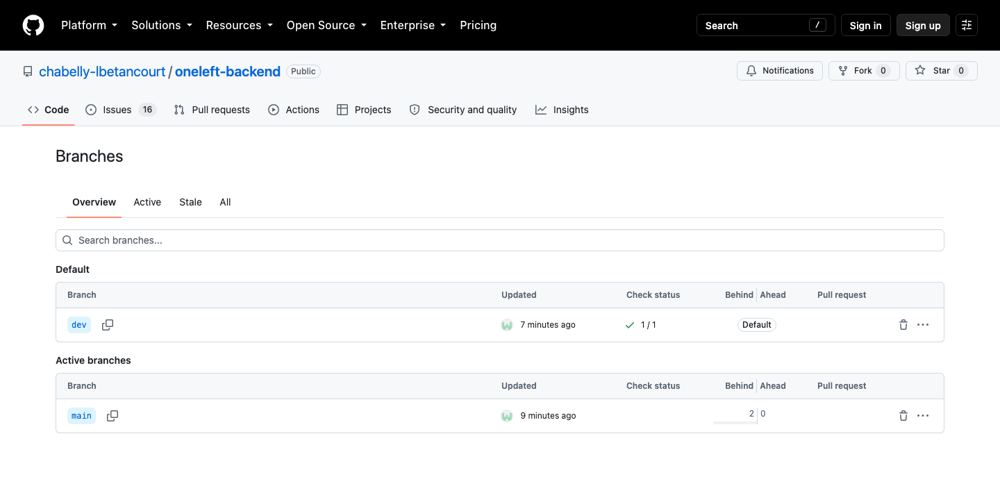
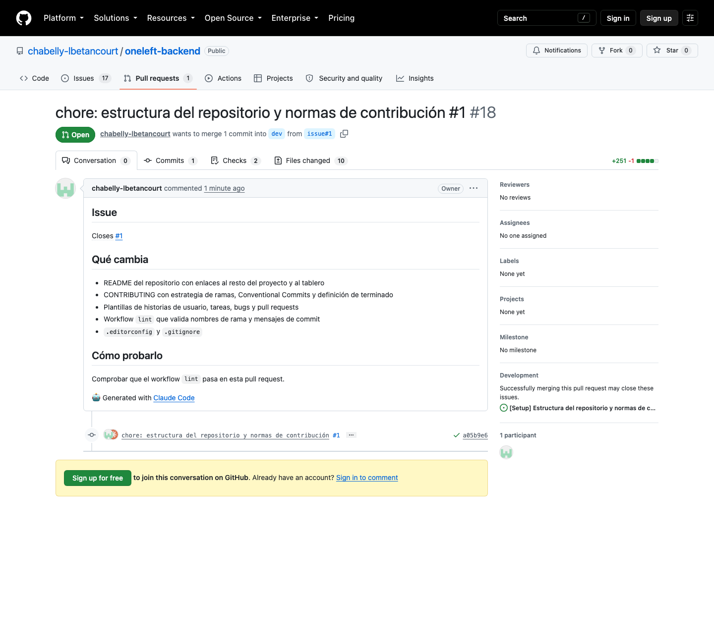
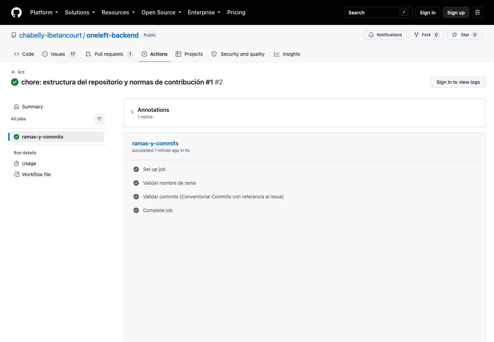
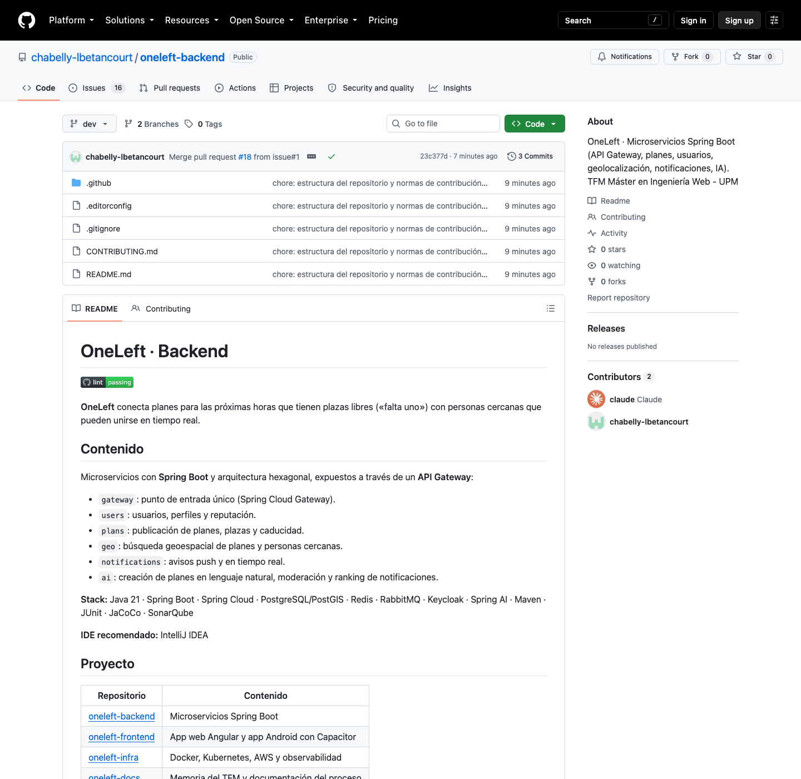

# 01 · Montaje inicial: repositorios, tablero Kanban y normas de contribución

**Fecha:** 28/09/2026 · **Sprint:** 0 · **Issues:** backend#1, frontend#1, infra#1, docs#1, docs#2, docs#3

## 1. Punto de partida: la plantilla de referencia

Para organizar el proyecto se ha tomado como referencia el TFM
[CRIApp: Plataforma web y móvil para apoyo a la crianza mediante cuestionarios y gamificación](https://oa.upm.es/97133/)
(Máster en Ingeniería Web, 2026), dirigido por el Dr. Francisco Javier Gil Rubio. Es el TFM web y móvil más
reciente de su dirección con la memoria en acceso abierto en el Archivo Digital UPM.

De esa memoria se adoptan:

- **Gestión con GitHub Projects**: Scrum ligero con sprints semanales y Kanban en el día a día, columnas
  *Backlog*, *Sprint Backlog*, *In Progress* y *Done*, y límite de 2 tarjetas en curso (WIP).
- **Estimación en puntos de historia** e historias de usuario numeradas `HU-XXX`.
- **Estrategia de ramas** `main` / `dev` / `issue#<número>` / `hotfix/<descripción>`.
- **Validación automática** de nombres de rama y de mensajes de commit con Conventional Commits y
  referencia al issue.
- **Umbral de cobertura del 80 %** en la integración continua.
- **Estructura de la memoria** (ver [../memoria/estructura.md](../memoria/estructura.md)).

## 2. Repositorios

Se ha optado por **varios repositorios**, uno por componente, igual que en la plantilla (que separa la API
y la aplicación Android). Todos son públicos, lo que permite usar SonarQube Cloud de forma gratuita.

| Repositorio | Contenido |
|---|---|
| [oneleft-backend](https://github.com/chabelly-lbetancourt/oneleft-backend) | Microservicios Spring Boot |
| [oneleft-frontend](https://github.com/chabelly-lbetancourt/oneleft-frontend) | App web Angular + PrimeNG + Tailwind CSS, empaquetada para Android con Capacitor |
| [oneleft-infra](https://github.com/chabelly-lbetancourt/oneleft-infra) | Docker Compose, AWS Lightsail, Grafana y Loki |
| [oneleft-docs](https://github.com/chabelly-lbetancourt/oneleft-docs) | Memoria y documentación del proceso |



*Figura 1. Los cuatro repositorios de OneLeft.*

Los repositorios se crearon con GitHub CLI:

```bash
gh repo create chabelly-lbetancourt/oneleft-backend --public --description "..."
```

## 3. Tablero Kanban en GitHub Projects

Se creó el proyecto público [OneLeft · TFM](https://github.com/users/chabelly-lbetancourt/projects/4),
vinculado a los cuatro repositorios, con esta configuración:

| Elemento | Configuración |
|---|---|
| Columnas (campo *Status*) | Backlog → Sprint Backlog → In Progress → Done |
| Límite WIP | 2 tarjetas en *In Progress* |
| Campo *Tipo* | Historia, Tarea, Bug, Documentación |
| Campo *Prioridad* | Alta, Media, Baja |
| Campo *Puntos* | Estimación en puntos de historia |
| Campo *Sprint* | 40 iteraciones semanales, del Sprint 0 (28/09/2026) al Sprint 39 (28/06/2027) |
| Vistas | *Tablero Kanban* (tablero), *Backlog* (tabla) y *Planificación por sprints* (roadmap) |



*Figura 2. Tablero Kanban al cierre del montaje inicial. La columna In Progress muestra el límite WIP (1/2).*



*Figura 3. Vista de backlog con tipo, prioridad, puntos, sprint y etiquetas.*

### Automatizaciones del tablero

| Evento | Acción |
|---|---|
| Se añade un issue o PR al proyecto | Pasa a *Backlog* |
| Se enlaza una PR a un issue | El issue pasa a *In Progress* |
| Se fusiona una PR | Pasa a *Done* |
| Se cierra un issue | Pasa a *Done* |
| Un issue con sub-issues | Los sub-issues se añaden al proyecto |

## 4. Etiquetas

Se definieron las mismas etiquetas en los cuatro repositorios para poder filtrar el tablero por tipo de
trabajo y por área:

- **Tipo:** `historia`, `tarea`, `bug`, `documentación`, `hotfix`
- **Área:** `backend`, `frontend`, `android`, `infra`, `observabilidad`, `ci-cd`, `ia`, `seguridad`, `testing`, `accesibilidad`



*Figura 4. Etiquetas comunes a los repositorios.*

## 5. Backlog inicial

Se cargaron 33 issues: la estructura de cada repositorio, las tareas técnicas de arranque (esqueletos de
backend y frontend, Capacitor, pipelines, Docker Compose, observabilidad y despliegue en AWS) y 17 historias
de usuario, de `HU-001 · Registro e inicio de sesión` a `HU-017 · Preparación de la defensa`.

Cada historia sigue el formato *Como… quiero… para…* con criterios de aceptación verificables.



*Figura 5. Historia de usuario HU-003 con sus criterios de aceptación.*

## 6. Normas de contribución y validación automática

Cada repositorio incluye:

- `README.md` con el propósito del repositorio y enlaces al resto del proyecto.
- `CONTRIBUTING.md` con la estrategia de ramas, el formato de commits y la definición de terminado.
- Plantillas de historia de usuario, tarea técnica, bug y pull request.
- Workflow `lint` de GitHub Actions que valida el nombre de la rama y los mensajes de commit.
- `.editorconfig` y `.gitignore` adaptados a cada tecnología.



*Figura 6. Normas de contribución comunes.*

### Estrategia de ramas

`main` y `dev` son ramas de vida larga, con `dev` como rama por defecto. Cada tarea se desarrolla en una
rama `issue#<número>` que se integra en `dev` mediante pull request.



*Figura 7. Ramas `main` y `dev` en oneleft-backend.*

### Primer uso del flujo

La propia estructura de cada repositorio se integró siguiendo el flujo definido: rama `issue#1`, commit
`chore: estructura del repositorio y normas de contribución #1` y pull request contra `dev` con
`Closes #1`. El workflow `lint` validó la rama y el commit en los cuatro repositorios.



*Figura 8. Pull request de la estructura inicial en oneleft-backend, enlazada al issue #1.*



*Figura 9. Pasos del workflow `lint`: validación del nombre de rama y de los commits.*



*Figura 10. README de oneleft-backend tras la fusión en `dev`.*

## 7. Resultado del Sprint 0 (hasta ahora)

| Issue | Estado |
|---|---|
| Estructura del repositorio y normas de contribución (×4) | Done |
| Tablero Kanban, etiquetas y sprints | Done |
| Registro del proceso con capturas | In Progress (continuo) |
| Anteproyecto del TFM | Sprint Backlog |

## Próximos pasos

- Anteproyecto del TFM (docs#4).
- Esqueleto de microservicios (backend#2) y de la app Angular (frontend#2).
- Entorno de desarrollo con Docker Compose (infra#2).
