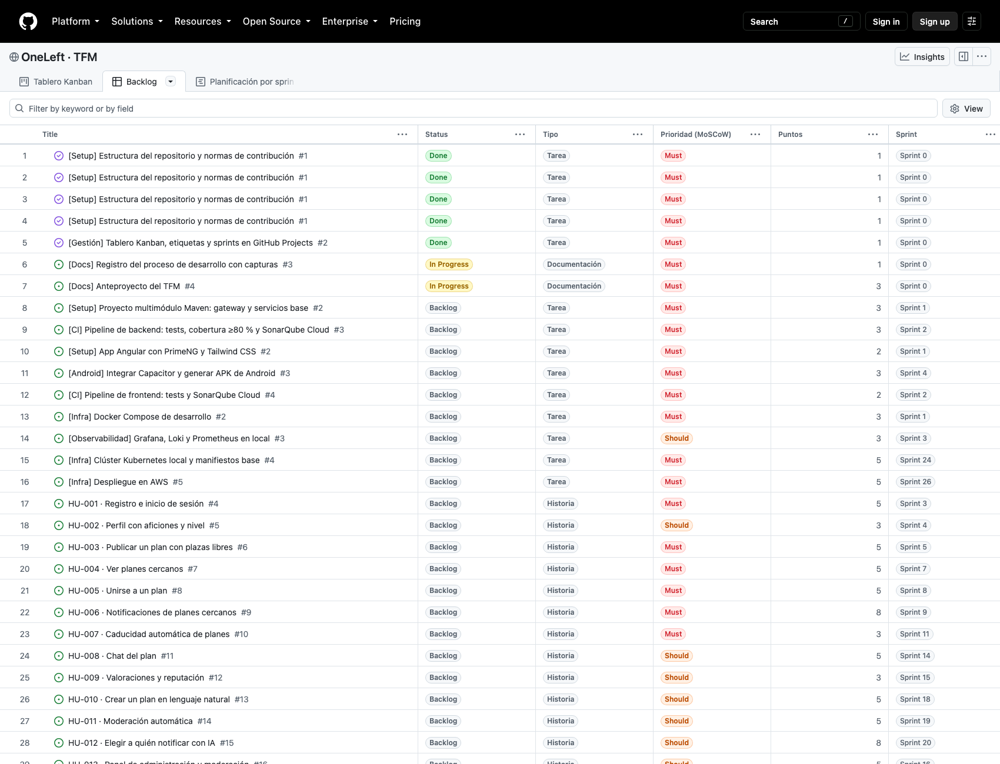
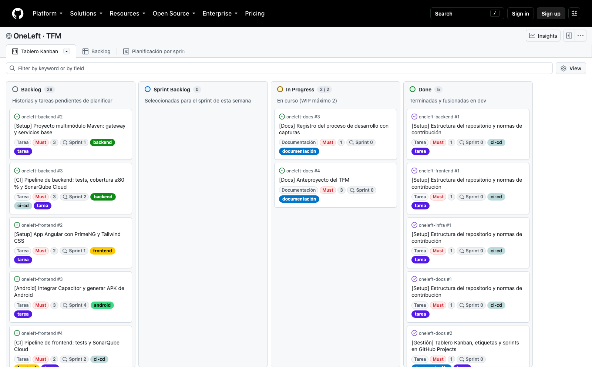
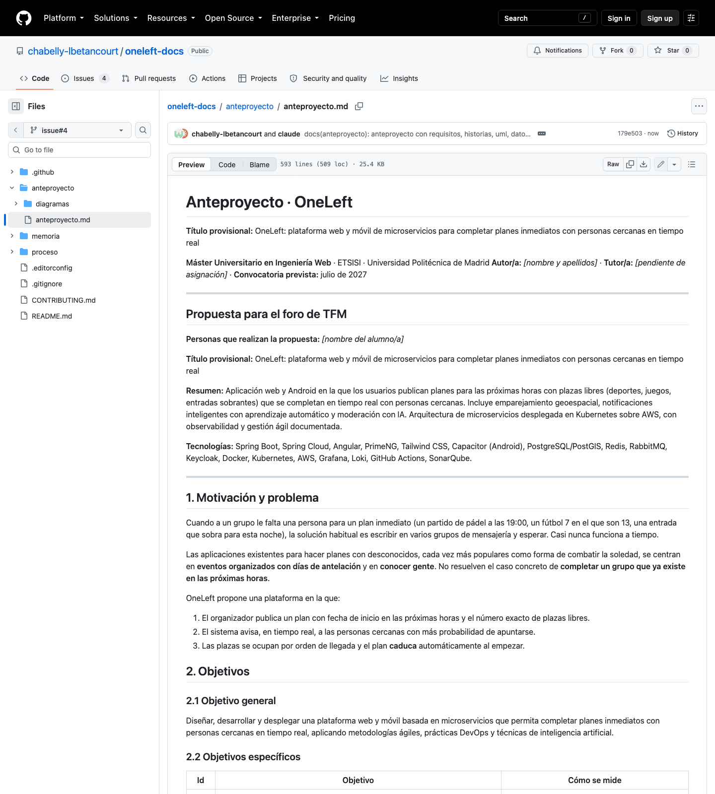
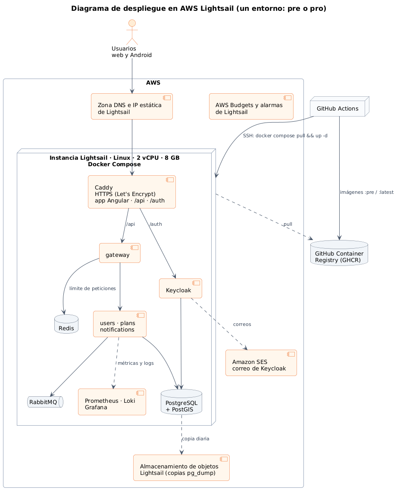
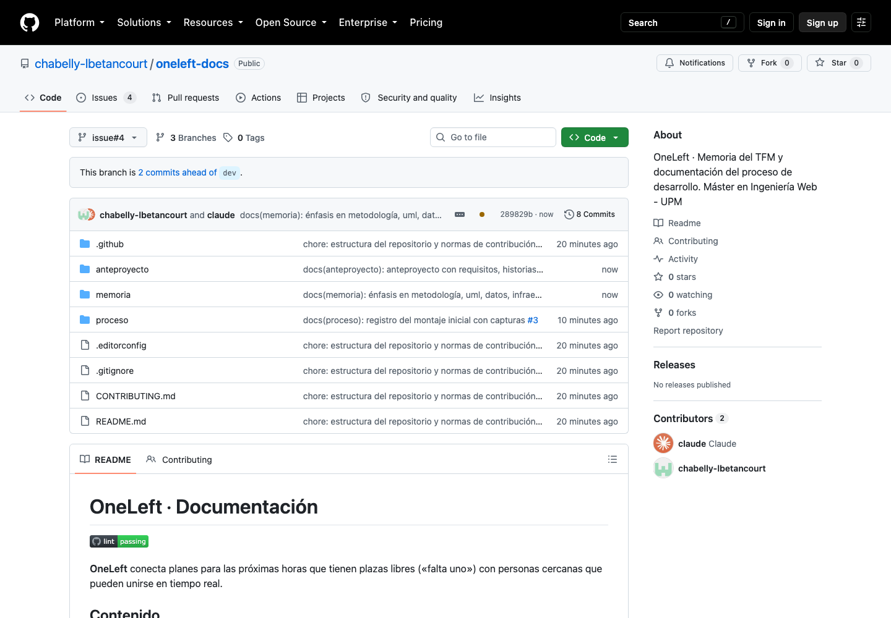

# 02 · Anteproyecto, priorización MoSCoW y plan de sprints

**Fecha:** 28/09/2026 · **Sprint:** 0 · **Issues:** docs#4, backend#19, backend#20

## 1. Priorización con MoSCoW

El campo *Prioridad* del tablero se sustituyó por **Prioridad (MoSCoW)**, más habitual en metodologías ágiles:

| Valor | Criterio | Nº de issues |
|---|---|---|
| **Must** | Imprescindible para el MVP | 23 |
| **Should** | Importante, pero el MVP funciona sin ello | 9 |
| **Could** | Deseable si hay tiempo | 1 |
| **Won't** | Fuera del alcance de esta versión | 2 |

Para dejar explícito el alcance se crearon dos historias *Won't*: **HU-018 · Pagos dentro de la app** y
**HU-019 · Reserva de pistas integrada**, con el motivo de su exclusión.

## 2. Estimación con puntos de historia

Las tareas se estiman con la serie de Fibonacci según esta referencia de esfuerzo:

| Puntos | Referencia |
|---|---|
| 1 | Cambio trivial o configuración (menos de 2 horas) |
| 2 | Tarea pequeña y conocida (media jornada) |
| 3 | Tarea acotada con alguna incertidumbre (una jornada) |
| 5 | Funcionalidad completa en una capa (2–3 jornadas) |
| 8 | Funcionalidad con varias capas e incertidumbre (una semana) |
| 13 | Demasiado grande: se divide |

## 3. Plan de sprints (release plan)

Cada issue tiene asignado su **sprint previsto** según su prioridad y sus dependencias técnicas. La capacidad
planificada es de unos 5 puntos por semana.



*Figura 11. Vista de backlog con tipo, prioridad MoSCoW, puntos y sprint previsto de cada issue.*

### Sprint 0 (28/09 – 04/10/2026)

| Issue | Tipo | MoSCoW | Puntos | Estado |
|---|---|---|---|---|
| Estructura del repositorio y normas (×4) | Tarea | Must | 4 × 1 | Done |
| Tablero Kanban, etiquetas y sprints | Tarea | Must | 1 | Done |
| Registro del proceso con capturas | Documentación | Must | 1 | In Progress (continuo) |
| Anteproyecto del TFM | Documentación | Must | 3 | In Progress |
| **Total** | | | **9** | |



*Figura 12. Tablero en el Sprint 0, con dos tarjetas en curso (límite WIP de 2).*

Se había creado también una vista de roadmap; se eliminó porque la planificación temporal queda recogida en la
columna *Sprint* del backlog y en el diagrama de Gantt del anteproyecto.

## 4. Anteproyecto

Se redactó el [anteproyecto](../anteproyecto/anteproyecto.md) con:

- Propuesta para el foro de TFM (título, resumen de unas 60 palabras y tecnologías)
- Motivación, objetivo general y 8 objetivos específicos medibles
- Estado del arte: aplicaciones similares, TFM previos del máster y alternativas tecnológicas
- Metodología: Scrum ligero + Kanban, MoSCoW, estimación en puntos y herramientas
- 13 requisitos funcionales y 11 no funcionales, trazados a las historias de usuario
- Diagramas UML, modelo de datos, arquitectura en AWS, app móvil, planificación y riesgos



*Figura 13. Anteproyecto en el repositorio oneleft-docs.*

## 5. Diagramas

> **Actualización:** los diagramas se escribieron primero en Mermaid y después se migraron a **PlantUML**, que es
> la notación UML estándar para la memoria. Ver [04 · Migración de los diagramas a PlantUML](04-diagramas-plantuml.md).

| Diagrama | Fichero |
|---|---|
| Casos de uso | [01-casos-de-uso.png](../diagramas/casos-de-uso/01-casos-de-uso.png) |
| Arquitectura de componentes | [02-arquitectura-componentes.png](../diagramas/componentes/02-arquitectura-componentes.png) |
| Clases del dominio de planes | [03-clases-dominio-planes.png](../diagramas/clases/03-clases-dominio-planes.png) |
| Estados de un plan | [04-estados-plan.png](../diagramas/estados/04-estados-plan.png) |
| Secuencia: unirse a la última plaza | [05-secuencia-unirse-plan.png](../diagramas/secuencia/05-secuencia-unirse-plan.png) |
| Modelo entidad-relación | [06-modelo-entidad-relacion.png](../diagramas/datos/06-modelo-entidad-relacion.png) |
| Despliegue en AWS | [07-despliegue-aws.png](../diagramas/despliegue/07-despliegue-aws.png) |
| Pipeline de la app móvil | [08-pipeline-app-movil.png](../diagramas/procesos/08-pipeline-app-movil.png) |
| Planificación (Gantt) | [09-planificacion-gantt.png](../diagramas/procesos/09-planificacion-gantt.png) |



*Figura 14. Diagrama de despliegue en AWS.*

## 6. Estructura de directorios



*Figura 15. Estructura de oneleft-docs en GitHub.*

```
oneleft-docs/
├── .github/
│   ├── ISSUE_TEMPLATE/          plantillas de historia, tarea y bug
│   ├── pull_request_template.md
│   └── workflows/lint.yml       validación de ramas y commits
├── anteproyecto/
│   └── anteproyecto.md
├── capturas/                    capturas por categoría (gestión, app web, API...)
├── diagramas/                   PlantUML por tipo (secuencia, clases...): src/ y PNG/SVG
├── memoria/
│   └── estructura.md            índice de la memoria y puntos de énfasis
├── proceso/
│   ├── README.md                índice del diario
│   ├── 01-montaje-inicial.md
│   └── 02-anteproyecto-priorizacion.md
├── CONTRIBUTING.md
└── README.md
```

Los repositorios `oneleft-backend`, `oneleft-frontend` y `oneleft-infra` contienen por ahora la estructura común
(`.github/`, `CONTRIBUTING.md`, `README.md`, `.editorconfig`, `.gitignore`); su código empieza en el Sprint 1.

## 7. Memoria

Se actualizó la [estructura de la memoria](../memoria/estructura.md) con una tabla de los aspectos que deben
tener más peso (metodologías ágiles, priorización y estimación, herramientas, proceso documentado, UML, bases de
datos, estado del arte, infraestructura, arquitectura, AWS, app móvil, estructura de directorios, requisitos,
historias de usuario y capturas de resultados), indicando en qué capítulo se trata cada uno y con qué evidencias.

## Pendiente

- Asignación de tutor y firma del Anexo I (docs#4 sigue abierto hasta entonces).
- Sprint 1: Docker Compose de desarrollo, esqueleto de microservicios y app Angular.
