# 03 · Sprint 1: entorno de desarrollo y esqueletos de backend y frontend

**Fecha:** 28/09/2026 (trabajo del Sprint 1 adelantado) · **Sprint:** 1 · **Issues:** infra#2, backend#2, frontend#2

## 1. Planificación del sprint

| Issue | Tipo | MoSCoW | Puntos | Resultado |
|---|---|---|---|---|
| infra#2 · Docker Compose de desarrollo | Tarea | Must | 3 | Done |
| backend#2 · Proyecto multimódulo Maven: gateway y servicios base | Tarea | Must | 3 | Done |
| frontend#2 · App Angular con PrimeNG y Tailwind CSS | Tarea | Must | 2 | Done |
| **Total** | | | **8** | **8 completados** |

Para respetar el límite WIP de 2, las tareas se abordaron **de una en una** (*In Progress* → PR → *Done*) y el
anteproyecto volvió a *Sprint Backlog* mientras espera la asignación de tutor.

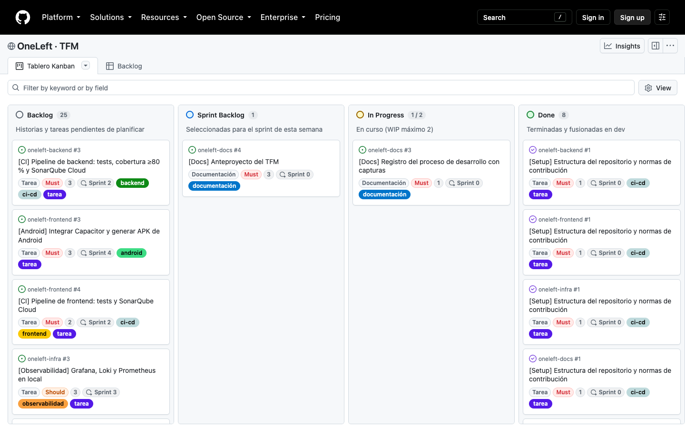

*Figura 16. Tablero al cierre del Sprint 1.*

## 2. Entorno de desarrollo con Docker Compose (infra#2)

[`oneleft-infra/docker`](https://github.com/chabelly-lbetancourt/oneleft-infra/tree/dev/docker) levanta en local
todas las dependencias de los microservicios:

| Servicio | Imagen | Uso |
|---|---|---|
| PostgreSQL + PostGIS | `imresamu/postgis:17-3.5` | Una base de datos por servicio; PostGIS en `plans` |
| Redis | `redis:8-alpine` | Posiciones en tiempo real, bloqueos y caché |
| RabbitMQ | `rabbitmq:4-management-alpine` | Eventos entre microservicios |
| Keycloak | `quay.io/keycloak/keycloak:26.5` | Identidad con OAuth2 / OpenID Connect |

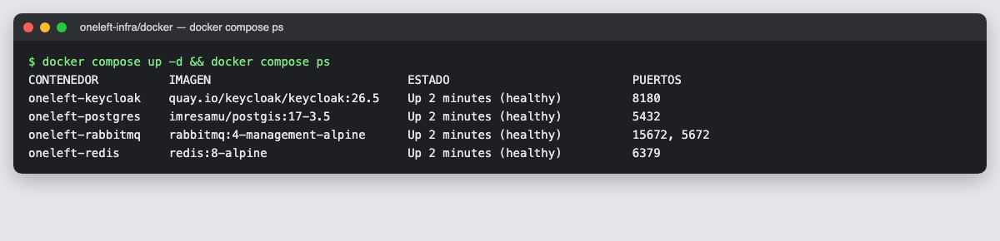

*Figura 17. Los cuatro servicios arrancados y en estado healthy.*

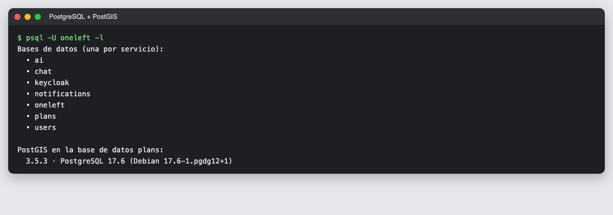

*Figura 18. Una base de datos por microservicio (patrón database per service) y PostGIS 3.5 en `plans`.*

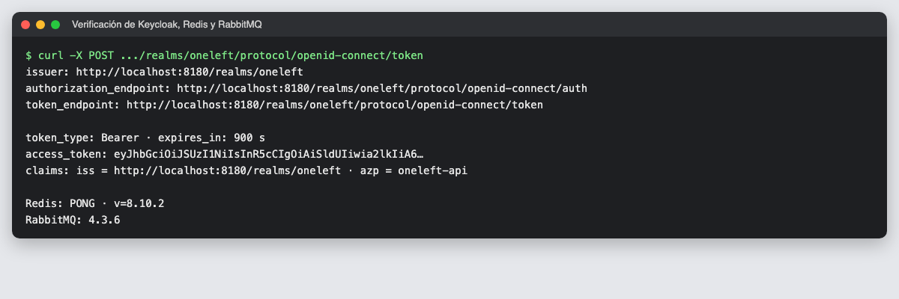

*Figura 19. Keycloak publica la configuración OpenID del realm `oneleft` y emite tokens; Redis y RabbitMQ responden.*

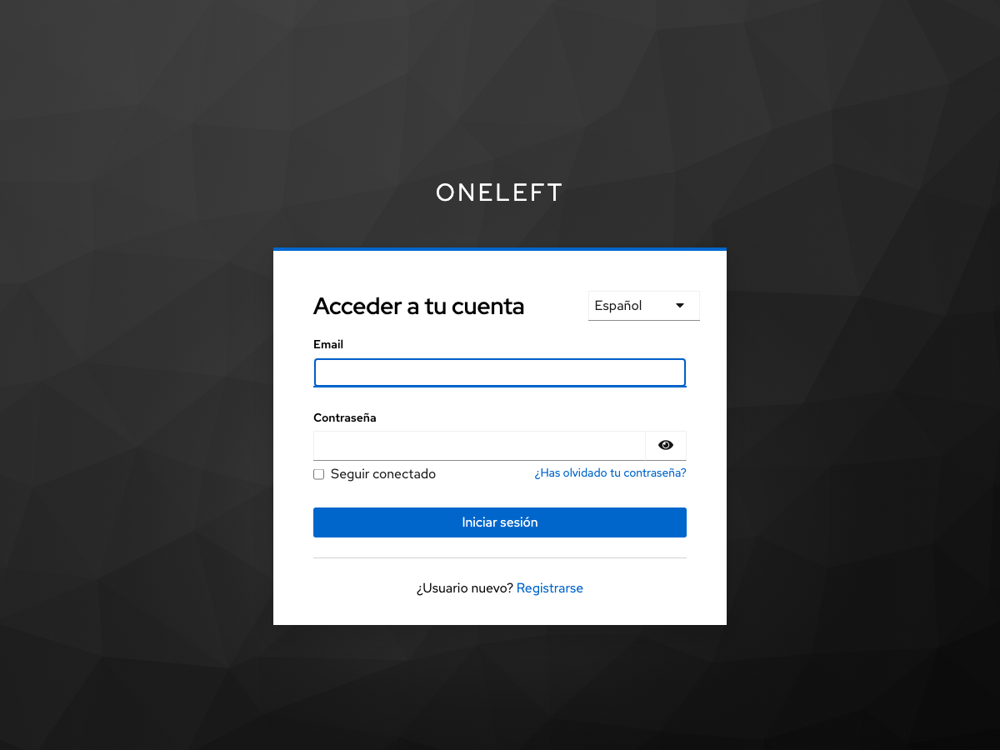

*Figura 20. Pantalla de acceso del realm `oneleft` en español, con registro de usuarios habilitado.*

### Decisiones

- **Imagen de PostGIS multiarquitectura:** la imagen oficial `postgis/postgis` solo se publica para `amd64`, y el
  equipo de desarrollo es un Mac con Apple Silicon (`arm64`). Se usa `imresamu/postgis`, la variante
  multiarquitectura que mantiene uno de los responsables de la imagen oficial.
- **Realm de Keycloak versionado** (`oneleft-realm.json`): se importa al arrancar, con roles `user` y `admin`,
  un cliente público con PKCE para la web y Android y usuarios de prueba, de modo que el entorno es reproducible.
- **Healthchecks en todos los servicios**, para que Keycloak espere a PostgreSQL y el estado sea visible con
  `docker compose ps`.

## 3. Esqueleto de microservicios (backend#2)

Proyecto Maven multimódulo con **Spring Boot 4.1.1** y **Spring Cloud 2025.1.3** (versiones compatibles obtenidas
de Spring Initializr):

| Módulo | Puerto | Contenido |
|---|---|---|
| `gateway` | 8080 | Spring Cloud Gateway: `/api/v1/users/**` → `users`, `/api/v1/plans/**` → `plans` |
| `users` | 8081 | Estructura hexagonal |
| `plans` | 8082 | Estructura hexagonal |

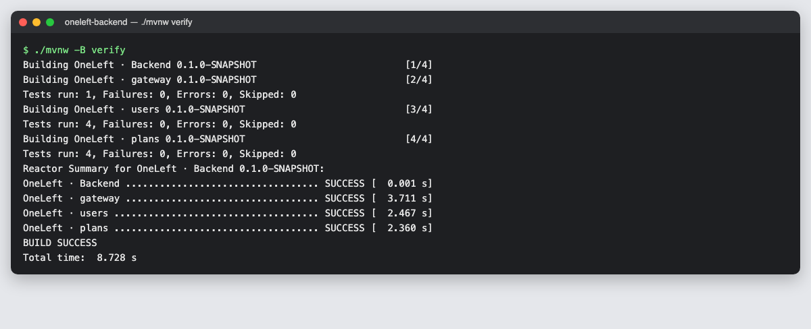

*Figura 21. `./mvnw verify`: tres módulos y 9 tests en verde.*

La **arquitectura hexagonal** no se queda en la estructura de carpetas: cada servicio incluye un test de
**ArchUnit** que falla si el dominio depende de Spring o de otras capas, o si la aplicación depende de la
infraestructura.

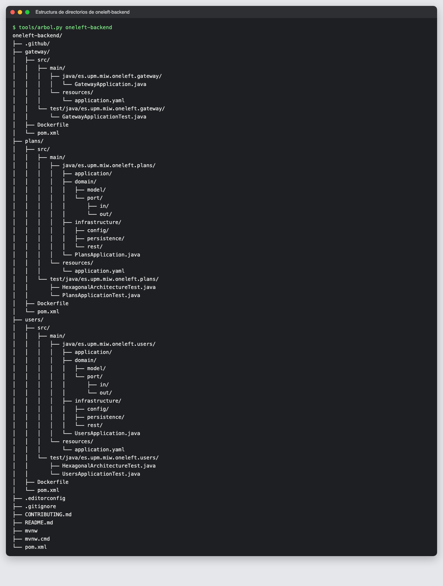

*Figura 22. Estructura de oneleft-backend: capas `domain`, `application` e `infrastructure` en cada servicio.*

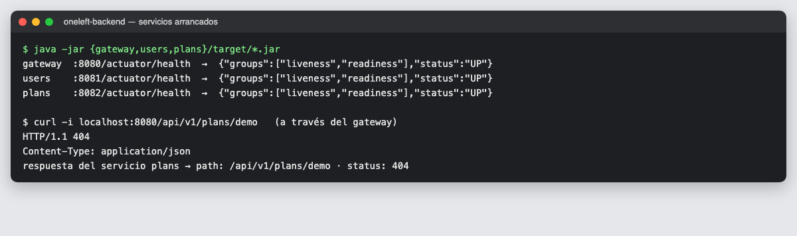

*Figura 23. Los tres servicios responden a `/actuator/health` y el gateway reenvía `/api/v1/plans/**` al servicio de planes.*

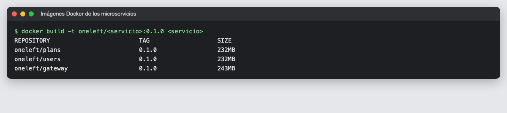

*Figura 24. Imagen Docker por servicio, ejecutada con un usuario sin privilegios.*

## 4. App Angular con PrimeNG y Tailwind (frontend#2)

| Elemento | Versión | Notas |
|---|---|---|
| Angular | 22.2 | Componentes standalone, sin Zone.js (signals), tests con Vitest |
| PrimeNG | 22.1 | Tema propio basado en Aura con el naranja de marca |
| Tailwind CSS | 4.3 | Con `tailwindcss-primeui` para usar los colores de PrimeNG como utilidades |
| Node | 24 LTS | Fijado en `.nvmrc` |

La primera pantalla es la de inicio, diseñada *mobile-first*, con planes de ejemplo que se sustituirán por la API
en la HU-004.

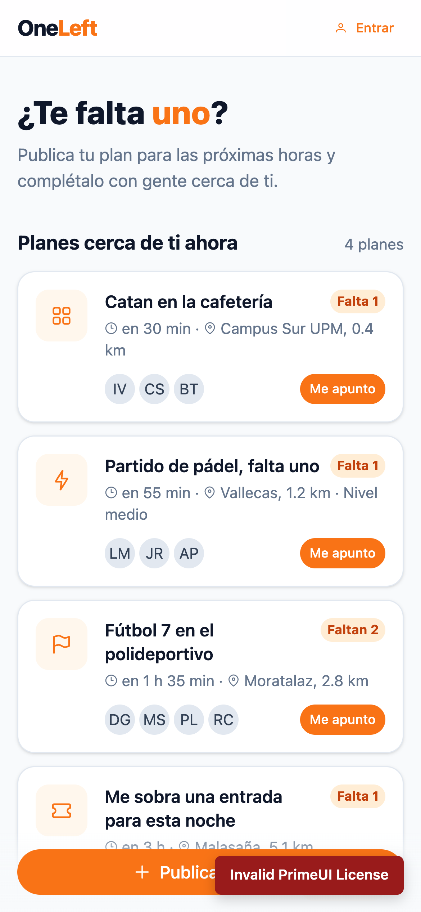

*Figura 25. Pantalla de inicio en un móvil de 390 × 844 px.*

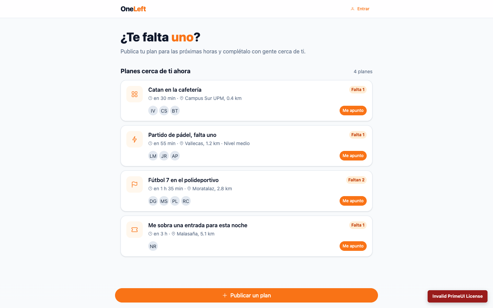

*Figura 26. La misma pantalla en escritorio.*

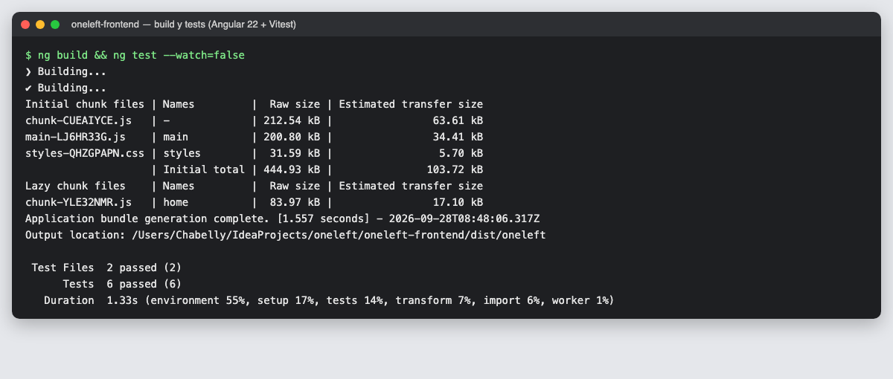

*Figura 27. Build de producción (con carga diferida de la pantalla de inicio) y 6 tests en verde.*

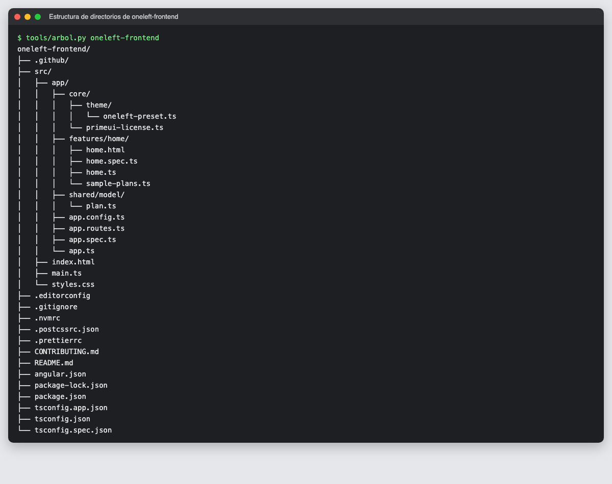

*Figura 28. Estructura de oneleft-frontend: `core/`, `features/` y `shared/`.*

### Decisiones e incidencias

- **Node 24.7 no era compatible con Angular 22** (pide 24.15 o superior). Se instaló Node 24 LTS con nvm, sin
  modificar la instalación de Homebrew, y se fijó la versión en `.nvmrc`.
- **npm 11 bloquea los scripts de instalación por defecto.** Solo se autorizó el de `esbuild`, que necesita el
  compilador de Angular (`allowScripts` en `package.json`).
- **PrimeNG 22 ya no tiene licencia MIT.** Desde esta versión necesita una clave de la *PrimeUI Community
  License*, gratuita para estudiantes en proyectos propios; sin ella se muestra el aviso «Invalid PrimeUI
  License» que aparece en las capturas. Se valoraron tres opciones (licencia Community, volver a Angular 21 +
  PrimeNG 21 MIT o cambiar de librería) y se eligió la licencia Community para mantener las versiones actuales.
  La clave no se guarda en el repositorio público: se inyecta al compilar con
  `--define PRIMEUI_LICENSE` desde una variable de entorno o un secreto de GitHub Actions.
- **Maquetación:** en la primera versión las iniciales de los avatares se solapaban y la etiqueta «Faltan 2» se
  partía en dos líneas; se corrigió tras revisar las capturas en tamaño móvil.

## 5. Herramientas de documentación

Para que todas las evidencias tengan el mismo aspecto se añadieron tres herramientas a `oneleft-docs/tools`:

| Herramienta | Uso |
|---|---|
| `capture-terminal.sh` | Convierte la salida de un comando en una captura con aspecto de terminal |
| `capture-web.mjs` | Captura una página emulando un móvil o un escritorio (Puppeteer + Chrome) |
| `tree.py` | Genera el árbol de directorios compactando los paquetes Java, como IntelliJ |

## Pendiente

- Configurar la clave de la PrimeUI Community License (la solicita el autor en primeui.store).
- Sprint 2: pipelines de CI con tests, cobertura ≥ 80 % y SonarQube Cloud (backend#3, frontend#4).
