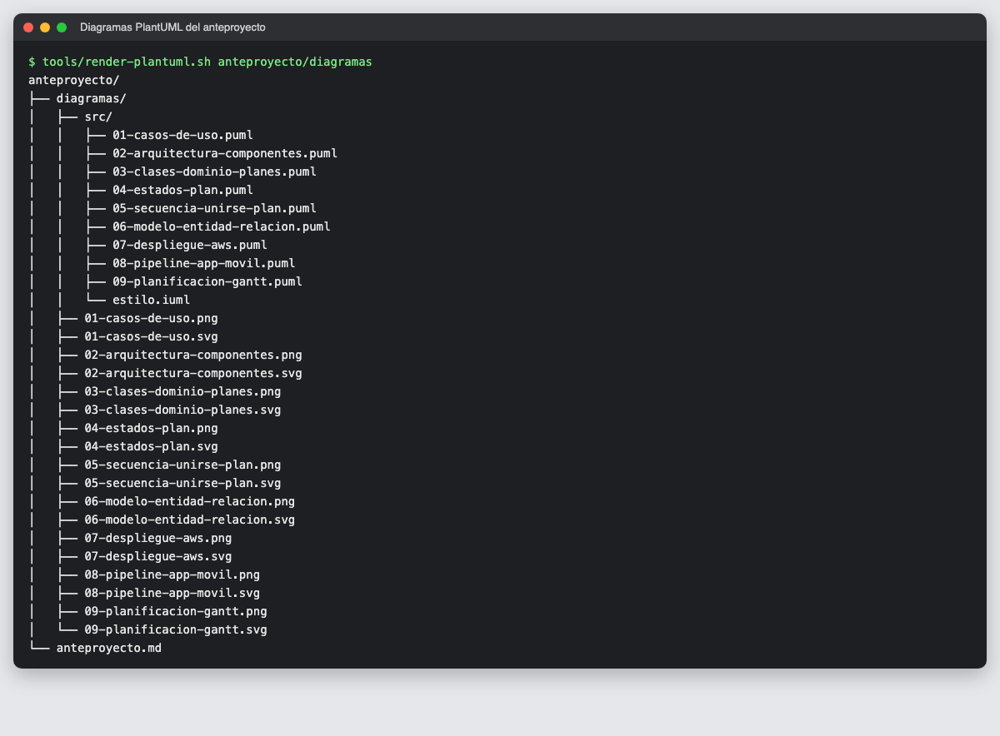
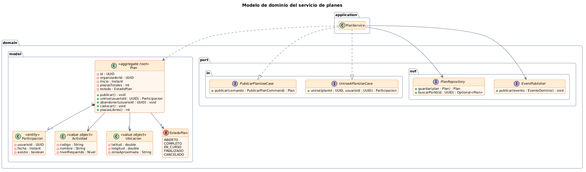
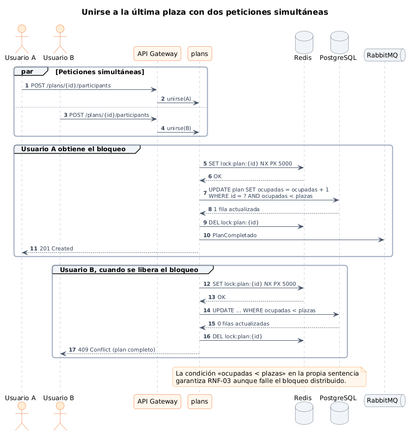
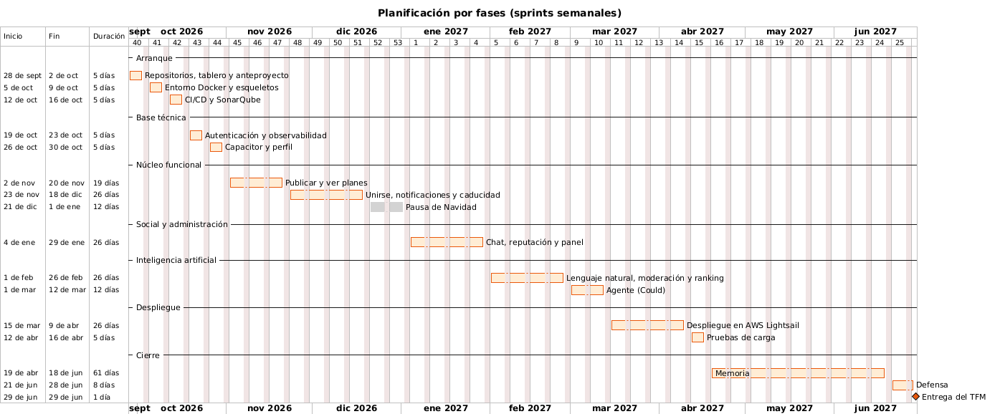

# 04 · Migración de los diagramas a PlantUML

**Fecha:** 28/09/2026 · **Sprint:** 1 · **Issues:** docs#4, docs#3

## 1. Motivo

Los diagramas del anteproyecto se habían escrito en Mermaid. Se decidió migrarlos a **PlantUML** porque:

- Es la herramienta de referencia para **UML estándar** en ingeniería del software (estereotipos, notación de
  clases, casos de uso con `<<extend>>`, diagramas de despliegue con nodos, entidad-relación con cardinalidades).
- Permite un **estilo común** para todos los diagramas mediante un fichero incluido (`estilo.iuml`).
- Genera **SVG vectorial** para la memoria, que no pierde calidad al imprimir.

## 2. Organización

Las fuentes están separadas de las imágenes generadas:



*Figura 29. Fuentes `.puml` en `src/` y PNG/SVG generados en `diagramas/`.*

| Fichero | Contenido |
|---|---|
| `src/estilo.iuml` | Estilo común: tipografía, colores de marca (naranja), bordes y flechas |
| `src/*.puml` | Un fichero por diagrama |
| `*.png` | Para verlos en GitHub y en el Markdown |
| `*.svg` | Para la memoria (vectorial) |

## 3. Renderizado sin instalar nada

El script [`tools/render-plantuml.sh`](../tools/render-plantuml.sh) usa la **imagen Docker oficial de PlantUML**
(versión fijada 1.2026.8), que incluye Graphviz y funciona en `arm64`. No hace falta instalar Java, PlantUML ni
Graphviz en el equipo:

```bash
tools/render-plantuml.sh diagramas/secuencia   # o sin argumentos: todos los tipos
```

## 4. Diagramas

| Nº | Diagrama | Tipo UML |
|---|---|---|
| 01 | Casos de uso | Casos de uso, con generalización de actores y `<<extend>>` |
| 02 | Arquitectura de componentes | Componentes |
| 03 | Modelo de dominio del servicio de planes | Clases, con estereotipos DDD y puertos de la arquitectura hexagonal |
| 04 | Ciclo de vida de un plan | Máquina de estados |
| 05 | Unirse a la última plaza | Secuencia, con fragmentos `par` y `group` |
| 06 | Modelo entidad-relación | Entidad-relación (notación de pata de gallo) |
| 07 | Despliegue en AWS | Despliegue |
| 08 | Generación de la app web y Android | Actividad, con bifurcación |
| 09 | Planificación por fases | Gantt |



*Figura 30. Diagrama de clases: el agregado `Plan`, los puertos de entrada y salida y el servicio de aplicación.*



*Figura 31. Diagrama de secuencia del control de concurrencia al ocupar la última plaza.*


*Figura 32. Diagrama de despliegue en AWS.*



*Figura 33. Diagrama de Gantt de la planificación por fases.*

## 5. Mejoras respecto a la versión en Mermaid

- El diagrama de clases muestra ahora los **puertos** (`domain.port.in` y `domain.port.out`) y el servicio de
  aplicación que los implementa, reflejando la arquitectura hexagonal real del backend.
- El diagrama de casos de uso usa **generalización** (el organizador es un usuario) y `<<extend>>`.
- El de secuencia marca explícitamente las **peticiones simultáneas** con un fragmento `par`.
- El modelo entidad-relación incluye los tipos de PostgreSQL y PostGIS (`geography(Point)`, `timestamptz`).

## Convención a partir de ahora

Todos los diagramas de la documentación y de la memoria se escriben en **PlantUML** y se generan con
`tools/render-plantuml.sh`.
