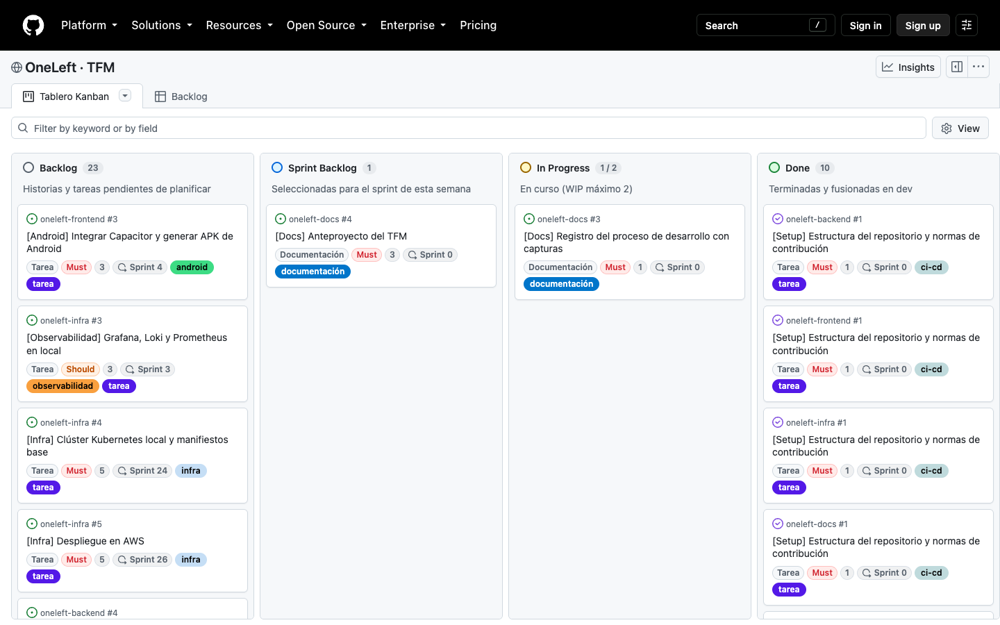
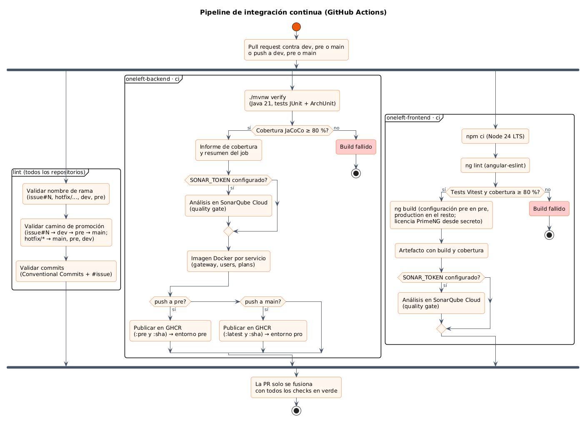
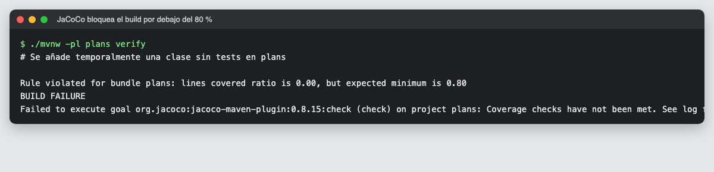
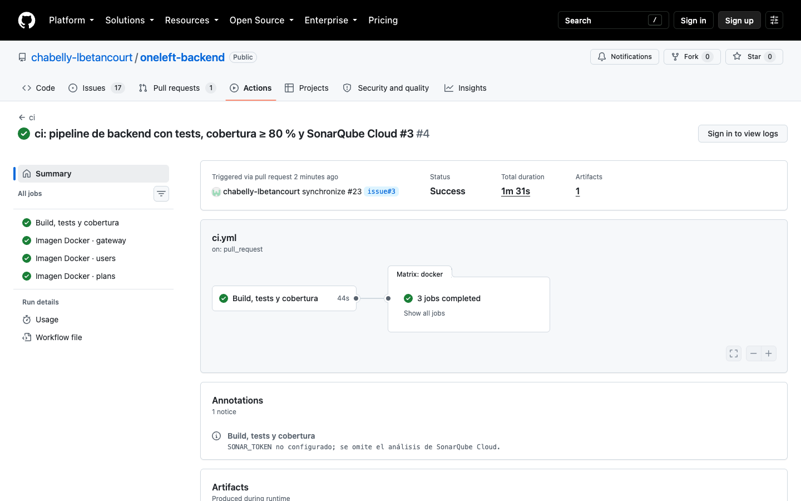
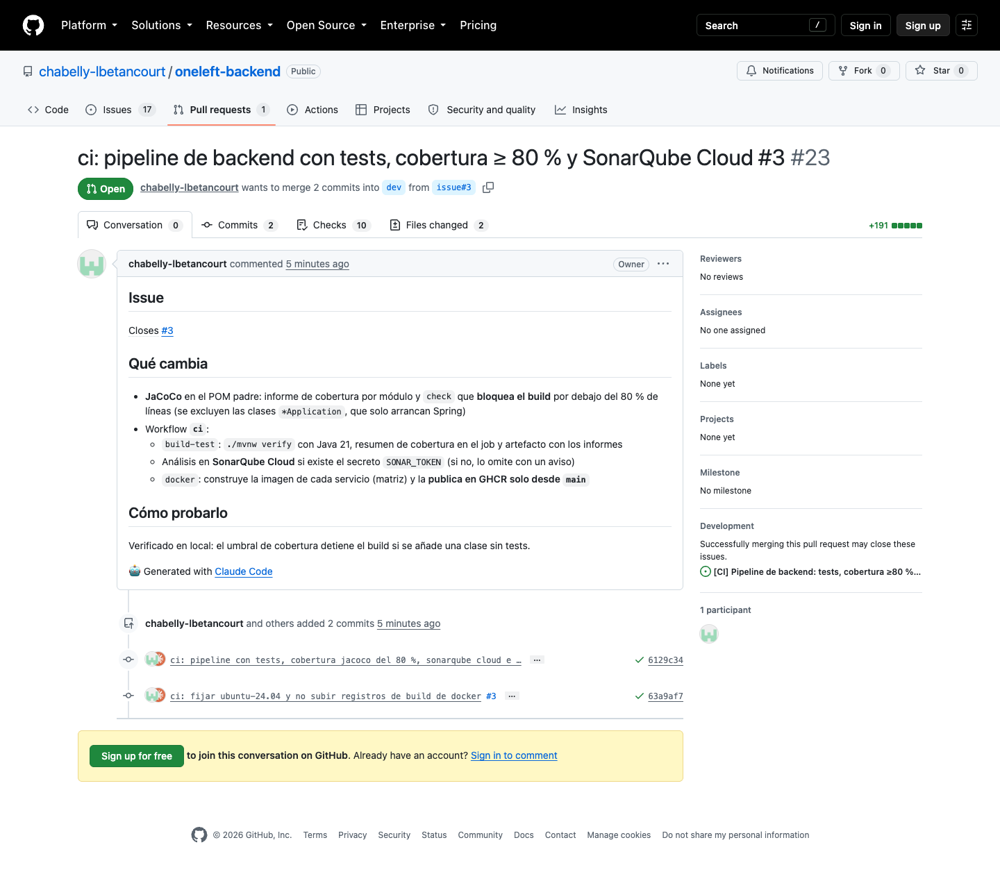
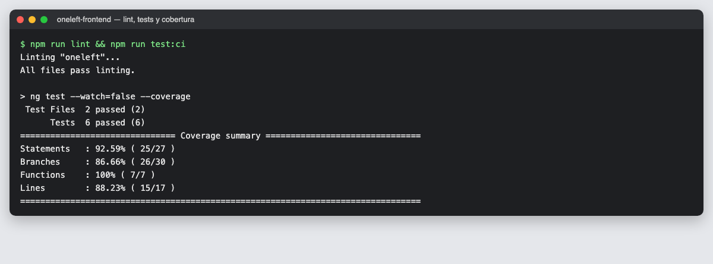
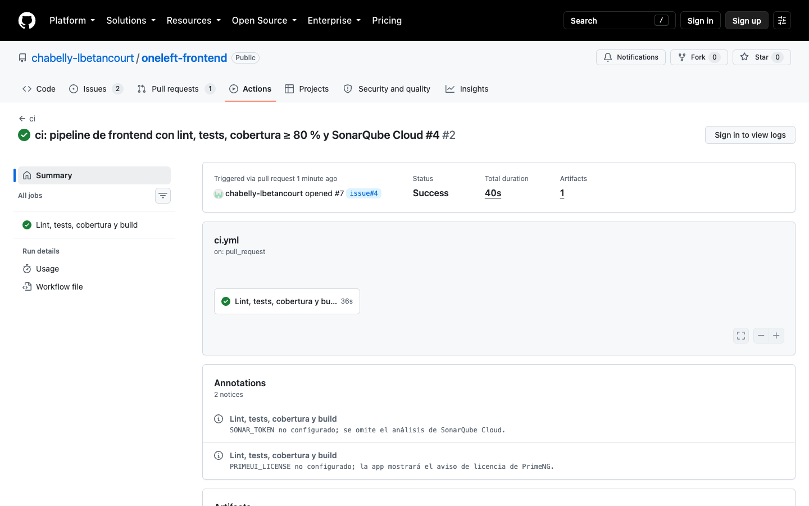

# 05 · Sprint 2: integración continua con cobertura y SonarQube

**Fecha:** 28/09/2026 (trabajo del Sprint 2 adelantado) · **Sprint:** 2 · **Issues:** backend#3, frontend#4

## 1. Planificación del sprint

| Issue | Tipo | MoSCoW | Puntos | Resultado |
|---|---|---|---|---|
| backend#3 · Pipeline de backend: tests, cobertura ≥ 80 % y SonarQube Cloud | Tarea | Must | 3 | Done |
| frontend#4 · Pipeline de frontend: tests y SonarQube Cloud | Tarea | Must | 2 | Done |
| **Total** | | | **5** | **5 completados** |

*Figura 34. Tablero al cierre del Sprint 2.*

## 2. Flujo de integración continua

Cada repositorio de código tiene ahora dos workflows: `lint` (común a los cuatro repositorios, valida ramas y
commits) y `ci` (compila, prueba, mide la cobertura y analiza la calidad). Una pull request solo se fusiona con
todos los checks en verde.

*Figura 35. Pipeline de integración continua. Fuente PlantUML:
[`diagramas/procesos/src/10-pipeline-ci.puml`](../diagramas/procesos/src/10-pipeline-ci.puml).*

## 3. Backend (backend#3)

### Cobertura con JaCoCo

El POM padre configura **JaCoCo 0.8.15** para todos los módulos:

- `prepare-agent` instrumenta los tests, `report` genera el informe (HTML, XML y CSV) y `check` **detiene el
  build** si la cobertura de líneas baja del 80 %.
- Se excluyen las clases `*Application`, que solo arrancan Spring.

Para comprobar que el umbral funciona de verdad se añadió temporalmente una clase sin tests:

*Figura 36. Con una clase sin tests, JaCoCo detecta un 0 % de cobertura en `plans` y el build falla.*

### Workflow `ci`

| Job | Qué hace |
|---|---|
| **Build, tests y cobertura** | `./mvnw verify` con Java 21, resumen de cobertura por módulo en el job, artefacto con los informes y análisis en SonarQube Cloud si existe el secreto `SONAR_TOKEN` |
| **Imagen Docker** (matriz: `gateway`, `users`, `plans`) | Construye la imagen de cada servicio con caché de GitHub Actions; desde `main` la publica en GitHub Container Registry con las etiquetas `latest` y `sha` |

*Figura 37. Ejecución del workflow `ci` del backend: el job de build y la matriz de imágenes Docker.*

*Figura 38. Pull request con todos los checks en verde.*

## 4. Frontend (frontend#4)

- **angular-eslint** para el lint de TypeScript y plantillas (`npm run lint`).
- **Cobertura con Vitest** (`@vitest/coverage-v8`) y umbrales del **80 %** en sentencias, ramas, funciones y
  líneas definidos en `angular.json`: si no se alcanzan, `npm run test:ci` falla.
- Se excluyen de la cobertura los ficheros de configuración (`app.config.ts`, `app.routes.ts`).
- El build de producción inyecta la licencia de PrimeNG desde el secreto `PRIMEUI_LICENSE` si existe.

*Figura 39. Lint sin errores, 6 tests y cobertura: 92,6 % de sentencias, 86,7 % de ramas, 100 % de funciones y
88,2 % de líneas.*

*Figura 40. Ejecución del workflow `ci` del frontend.*

## 5. SonarQube Cloud

Los dos repositorios tienen la configuración preparada:

| Repositorio | Clave del proyecto | Configuración |
|---|---|---|
| oneleft-backend | `chabelly-lbetancourt_oneleft-backend` | Propiedades `sonar.*` en el POM padre; se ejecuta con `./mvnw sonar:sonar` |
| oneleft-frontend | `chabelly-lbetancourt_oneleft-frontend` | `sonar-project.properties`; se ejecuta con `SonarSource/sonarqube-scan-action` |

El análisis se activa en cuanto existe el secreto `SONAR_TOKEN`. Hasta entonces, el pipeline lo omite y deja un
aviso en la ejecución.

## 6. Decisiones

- **Runner fijado a `ubuntu-24.04`:** GitHub avisó de que `ubuntu-latest` pasará a Ubuntu 26 el 19/10/2026; fijar
  la versión evita cambios inesperados en mitad del proyecto.
- **Imágenes en GitHub Container Registry** mientras no exista la infraestructura de AWS; cuando se despliegue
  en AWS se publicarán también en ECR.
- **Sin artefactos `.dockerbuild`:** la acción de Docker los sube por defecto; se desactivaron porque no aportan
  nada al proyecto.

## Pendiente (a cargo del autor)

1. Entrar en [sonarcloud.io](https://sonarcloud.io) con la cuenta de GitHub e importar la organización
   `chabelly-lbetancourt` (gratuito para repositorios públicos).
2. Analizar `oneleft-backend` y `oneleft-frontend`, desactivando el *Automatic Analysis* (el análisis lo lanza el pipeline).
3. Generar un token y guardarlo como secreto `SONAR_TOKEN` en los dos repositorios.
4. Solicitar la PrimeUI Community License y guardarla como secreto `PRIMEUI_LICENSE` en `oneleft-frontend`.
