# 06 · Sprint 3: inicio de sesión con Keycloak y observabilidad

**Fecha:** 28/09/2026 (trabajo del Sprint 3 adelantado) · **Sprint:** 3 ·
**Issues:** backend#4 (HU-001) con su sub-issue frontend#8, infra#3 con su sub-issue backend#25

## 1. Planificación del sprint

| Issue | Tipo | MoSCoW | Puntos | Resultado |
|---|---|---|---|---|
| backend#4 · HU-001 Registro e inicio de sesión (backend) | Historia | Must | 5 | Done |
| frontend#8 · HU-001 Inicio de sesión en la app web (sub-issue) | Historia | Must | 3 | Done |
| infra#3 · Grafana, Loki y Prometheus en local | Tarea | Should | 3 | Done |
| backend#25 · Métricas y logs en los microservicios (sub-issue) | Tarea | Should | 2 | Done |
| **Total** | | | **13** | **13 completados** |

Al empezar a implementar se vio que HU-001 e infra#3 afectaban a varios repositorios. Como las ramas deben
referirse a un issue del mismo repositorio, se crearon **sub-issues** enlazados a la historia original
(funcionalidad de *sub-issues* de GitHub), que el tablero añade automáticamente. Esto amplió la estimación
inicial del sprint de 8 a 13 puntos.

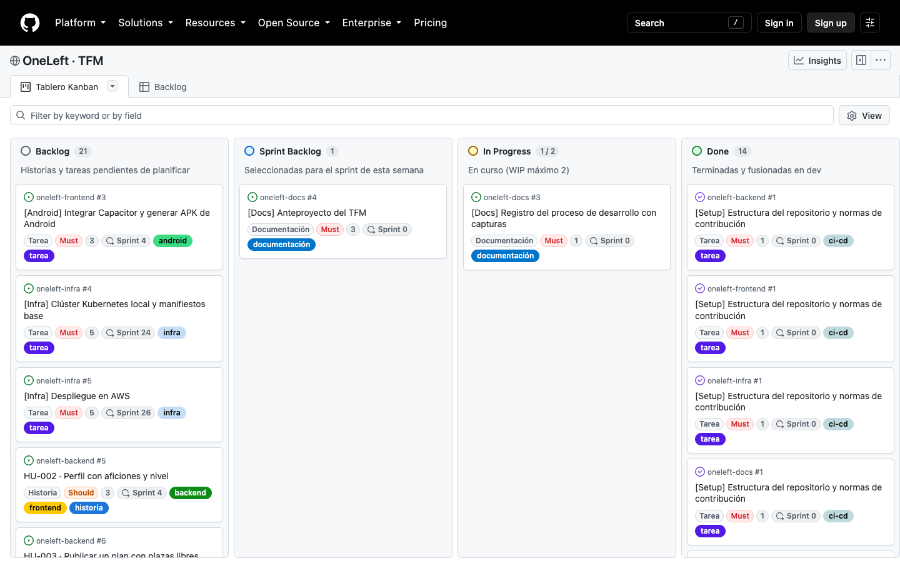

*Figura 41. Tablero al cierre del Sprint 3.*

## 2. HU-001 · Registro e inicio de sesión

### Diseño

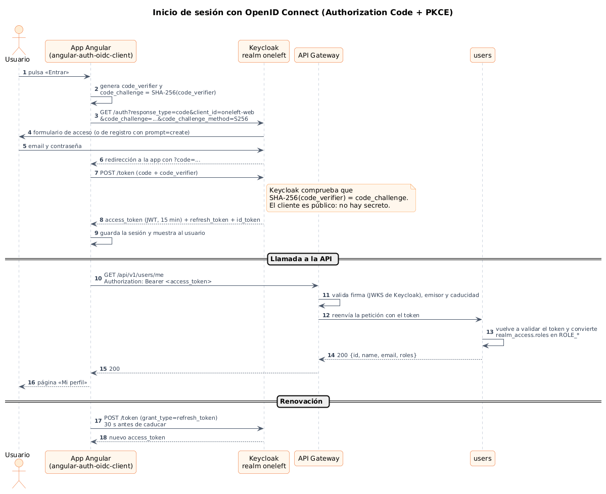

*Figura 42. Inicio de sesión con OpenID Connect, Authorization Code + PKCE. Fuente:
[`diagramas/secuencia/src/11-secuencia-login-oidc.puml`](../diagramas/secuencia/src/11-secuencia-login-oidc.puml).*

- **Cliente público con PKCE:** la app web y la app Android no pueden guardar secretos, así que usan
  Authorization Code con PKCE (S256), el flujo recomendado para aplicaciones SPA y móviles.
- **Defensa en profundidad:** el gateway rechaza cualquier petición a `/api/**` sin un token válido y cada
  microservicio vuelve a validarlo. Así, un servicio no queda expuesto aunque alguien llegue a él sin pasar por el gateway.
- **El registro lo gestiona Keycloak:** «Crear cuenta» abre su formulario de registro (`prompt=create`); OneLeft
  no almacena contraseñas.

### Backend

En el servicio `users` aparece el primer caso de uso real con arquitectura hexagonal:

| Capa | Clases |
|---|---|
| Dominio | `User`, `Role`, `Identity` y el puerto `GetCurrentUserUseCase` |
| Aplicación | `CurrentUserService`: traduce la identidad de Keycloak a un usuario de OneLeft y descarta los roles desconocidos |
| Infraestructura | `UserController` (`GET /api/v1/users/me`), `KeycloakJwt` (lee `realm_access.roles` y los convierte en `ROLE_*`) y `SecurityConfig` |

El gateway valida los tokens, deniega las rutas desconocidas y resuelve CORS para la app web
(`http://localhost:4200`) y Android (`https://localhost`, `capacitor://localhost`).

**Pruebas:** 22 tests en `users` (100 % de cobertura de líneas) y 6 en el gateway, con tokens simulados, de forma
que la integración continua no necesita un Keycloak real. La verificación con Keycloak real se hizo en local:

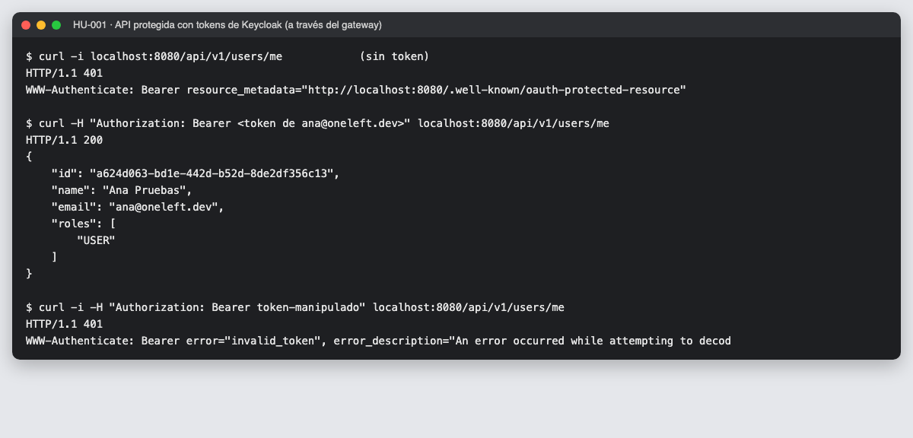

*Figura 43. Sin token: 401. Con el token de un usuario de prueba: 200 y su perfil. Con un token manipulado: 401 por firma inválida.*

### App web

- `angular-auth-oidc-client` 22 (librería con certificación OpenID) con renovación por *refresh token* y
  comprobación de la sesión al arrancar.
- Servicio `Session` que expone la sesión como *signals* y oculta la librería al resto de la app.
- El interceptor añade el token **solo** a las peticiones a la API de OneLeft.
- `/perfil` protegido con un guard y cargado con `httpResource` desde `GET /api/v1/users/me`.
- 17 tests; cobertura del 94 % de sentencias, 92 % de ramas, 100 % de funciones y 91 % de líneas.

El flujo completo se recorrió en un navegador real contra Keycloak con una herramienta automática
([`tools/capture-login.mjs`](../tools/capture-login.mjs)), que toma las credenciales de prueba de variables de entorno:

| | | |
|---|---|---|
| 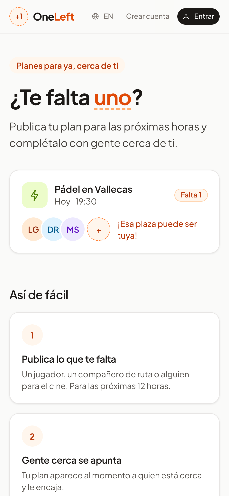 | 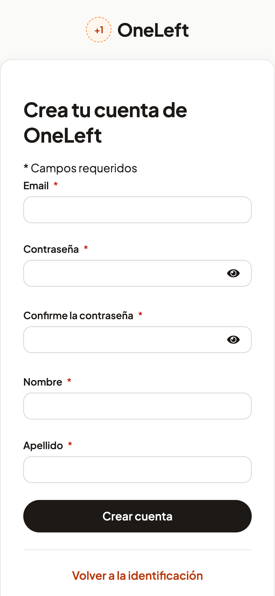 | 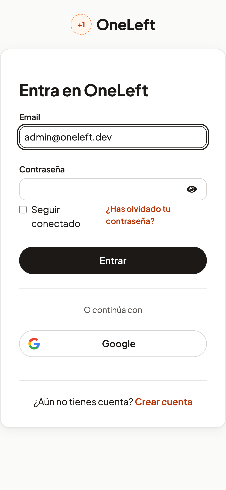 |
| *1. Sin sesión* | *2. «Crear cuenta»: registro* | *3. «Entrar»: login* |
| 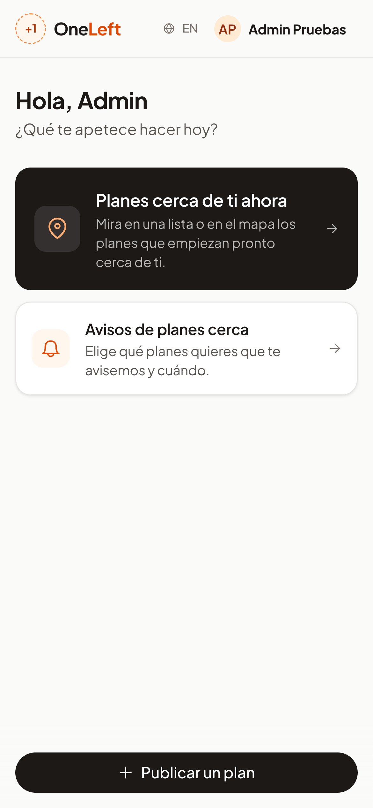 | 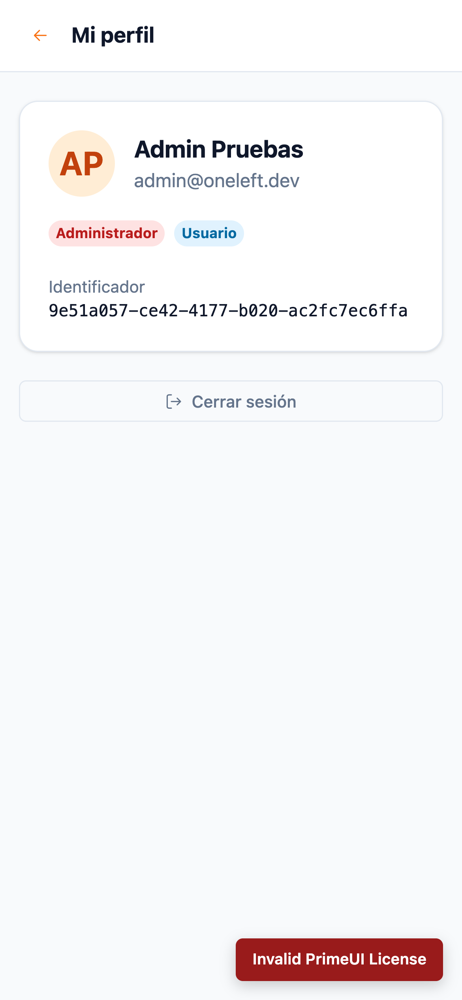 | 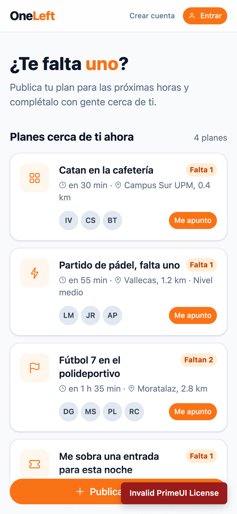 |
| *4. De vuelta con sesión* | *5. Perfil desde la API* | *6. Tras cerrar sesión* |

*Figura 44. Recorrido de HU-001 en un móvil de 390 × 844 px. Al recargar el perfil, la sesión se mantiene
([captura](../capturas/app-web/38-hu001-6-perfil-tras-recargar.png)).*

**Criterio pendiente:** la sesión en Android se validará al integrar Capacitor (frontend#3). El CORS del gateway y
las URIs de redirección del realm ya incluyen los orígenes de Capacitor.

### Incidencias

- **Tailwind 4 cambió el modificador `!important`:** ahora va al final (`bg-primary-100!`), no al principio.
- **PrimeNG 22 declara obsoleto `styleClass` en algunos componentes:** en el avatar hay que usar `class`.
- Ambas se detectaron al revisar las capturas: el avatar salía gris en lugar de naranja.

## 3. Observabilidad (infra#3 y backend#25)

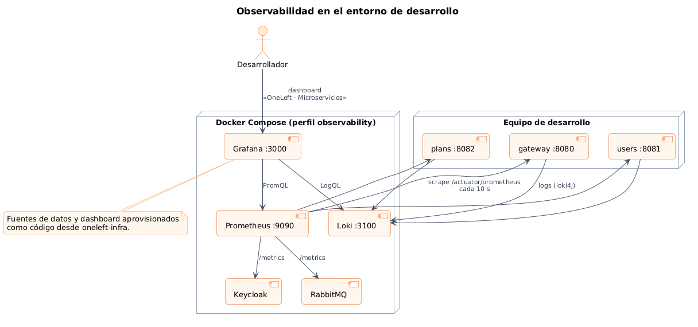

*Figura 45. Observabilidad en el entorno de desarrollo. Fuente:
[`diagramas/componentes/src/12-observabilidad.puml`](../diagramas/componentes/src/12-observabilidad.puml).*

- **Métricas:** los microservicios exponen `/actuator/prometheus` con histogramas de latencia HTTP. Prometheus
  los rasca cada 10 segundos, junto con Keycloak y RabbitMQ.
- **Logs:** con el perfil `observability`, los servicios envían sus logs a Loki con las etiquetas `app`, `level` y `host`.
  En producción se recogerán de la salida estándar de los contenedores.
- **Grafana como código:** fuentes de datos y dashboard aprovisionados desde `oneleft-infra`, sin configuración manual.

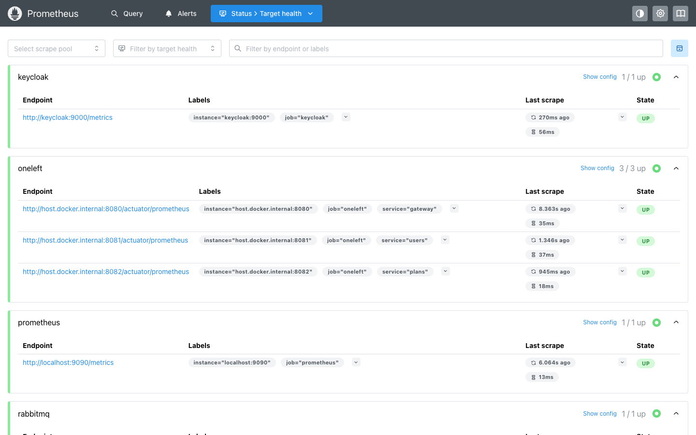

*Figura 46. Los seis destinos de Prometheus activos.*

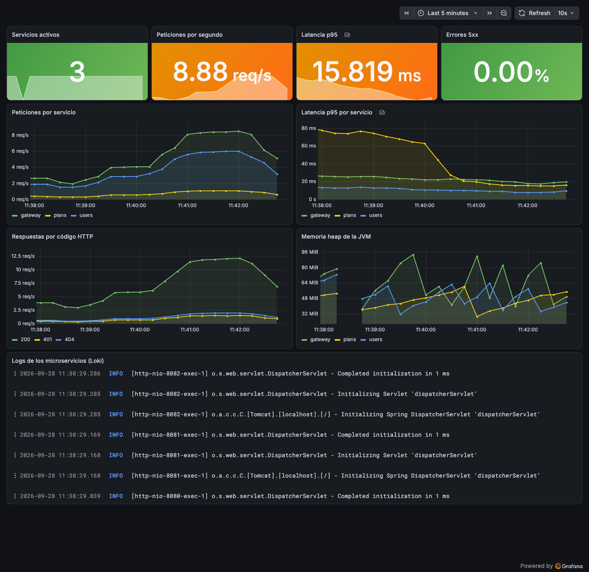

*Figura 47. Dashboard «OneLeft · Microservicios» con tráfico real a través del gateway: tres servicios activos,
unas 9 peticiones por segundo, latencia p95 de 16 ms, 0 % de errores 5xx, respuestas 200, 401 y 404 y los logs de Loki.*

### Incidencias

- **Captura antes de tiempo:** la primera captura del dashboard se hizo justo después de reiniciar los servicios y
  mostraba 0 servicios activos. Se repitió tras dos minutos y medio de tráfico.
- **«No data» en errores 5xx:** sin errores, la consulta no devolvía series; se añadió `or vector(0)` para mostrar 0 %.
- **Nivel duplicado en los logs:** el nivel ya es una etiqueta de Loki, así que se quitó del patrón del mensaje.
- La herramienta de capturas pasó a esperar `networkidle2`, porque Grafana y Prometheus mantienen conexiones abiertas.
