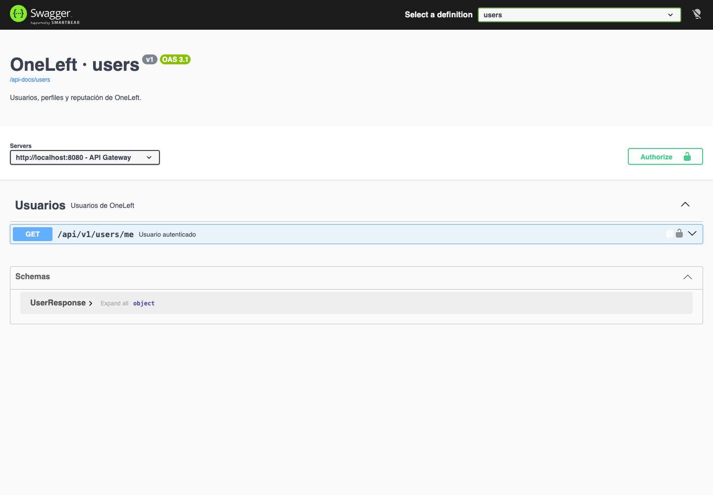
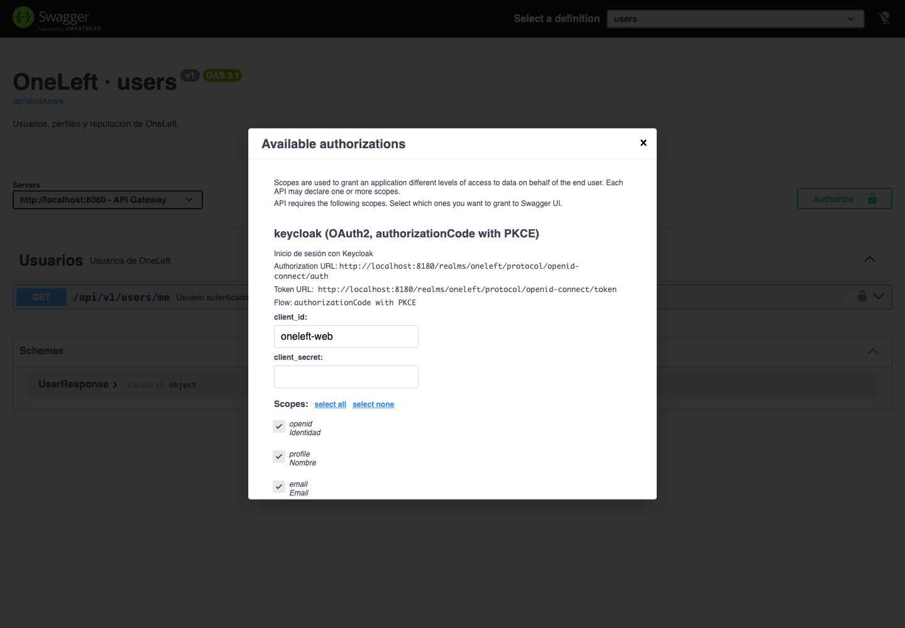
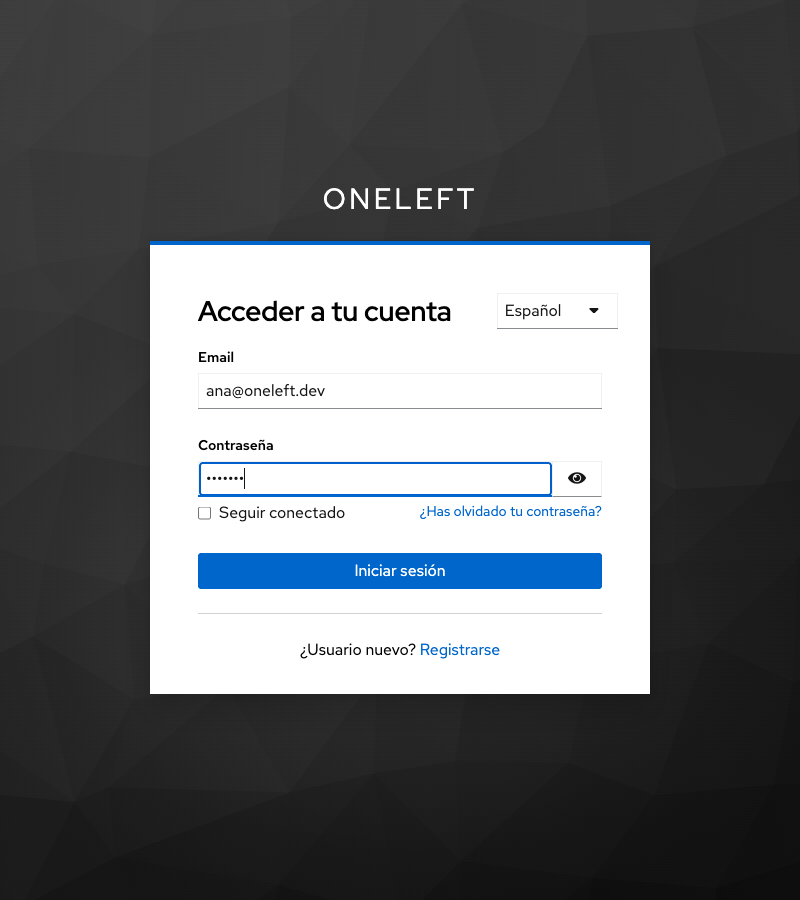
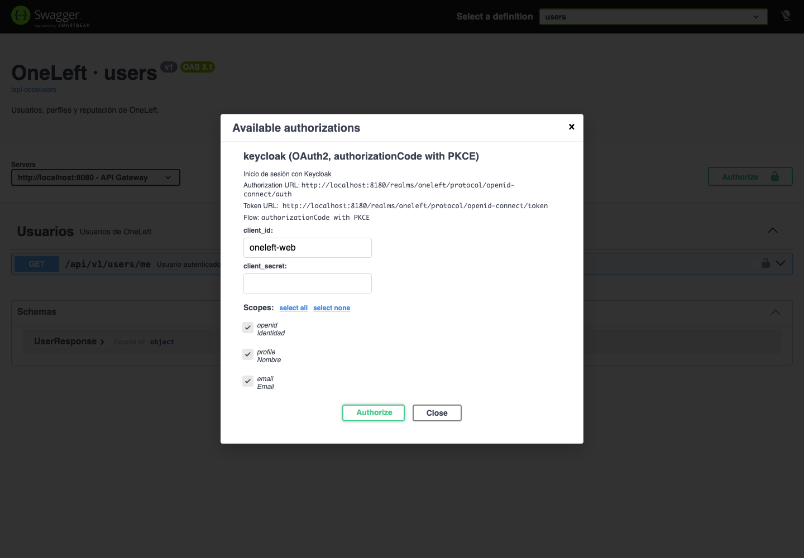
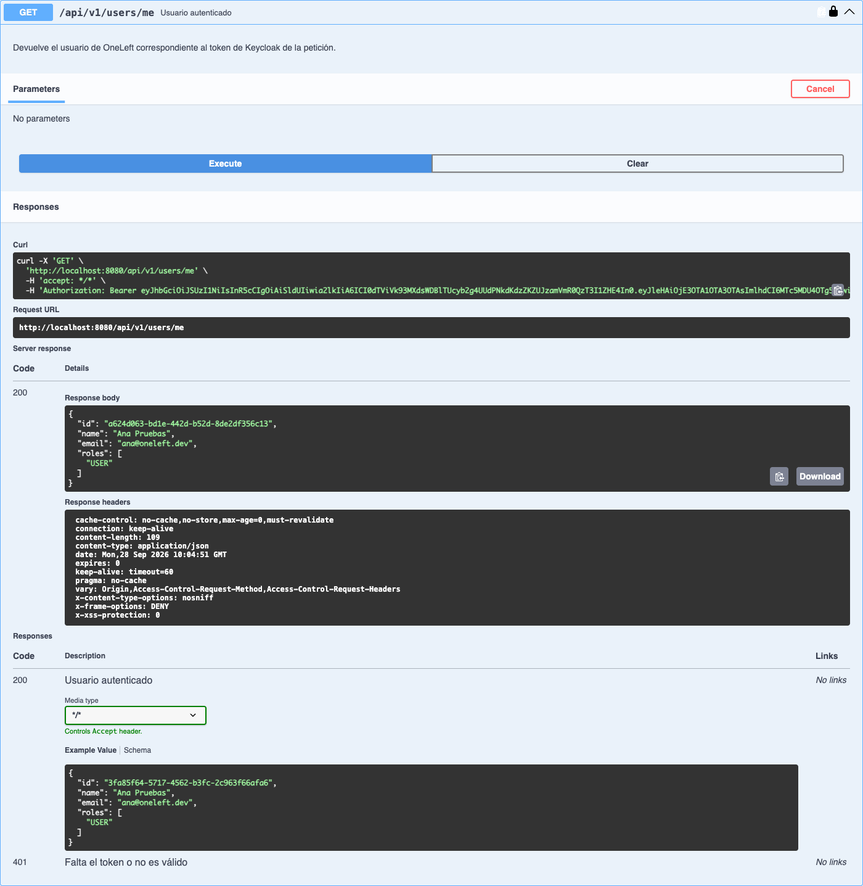
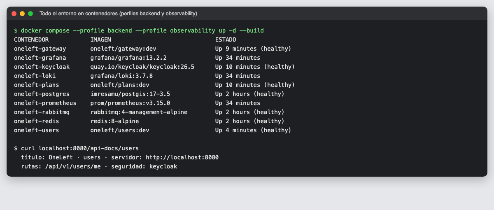
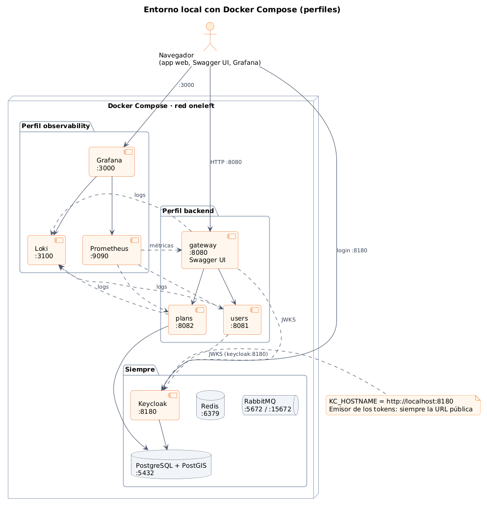

# 07 · Documentación OpenAPI con Swagger UI y microservicios en contenedores

**Fecha:** 28/09/2026 · **Sprint:** 4 · **Issues:** backend#27 (con su sub-issue infra#10)

## 1. Origen de la tarea

Durante el Sprint 4 surgió la necesidad de consultar y probar la API desde el navegador con el backend
ejecutándose en contenedores. Se añadió al tablero como tarea nueva del sprint, antes de continuar con HU-002:

| Issue | Tipo | MoSCoW | Puntos | Resultado |
|---|---|---|---|---|
| backend#27 · Documentación OpenAPI con Swagger UI en el gateway | Tarea | Must | 3 | Done |
| infra#10 · Microservicios en Docker Compose (sub-issue) | Tarea | Must | 2 | Done |

## 2. Swagger UI en el gateway

- Cada microservicio publica su especificación **OpenAPI 3.1** en `/v3/api-docs` con **springdoc-openapi 3.1**.
- El gateway sirve **Swagger UI** en <http://localhost:8080/swagger-ui.html> y agrupa las APIs de todos los
  servicios a través de las rutas `/api-docs/users` y `/api-docs/plans`.
- El servidor declarado en la especificación es el propio gateway, así que las pruebas desde Swagger UI siguen el
  mismo camino que la app.
- **Seguridad:** Keycloak aparece como esquema OAuth2 (Authorization Code). Desde *Authorize* se inicia sesión con
  el cliente `oneleft-web` y PKCE, igual que la app web.

| | |
|---|---|
|  |  |
| *1. Swagger UI con la API de users* | *2. «Authorize» con Keycloak* |
|  |  |
| *3. Login en Keycloak* | *4. Sesión iniciada en Swagger UI* |

*Figura 48. `GET /api/v1/users/me` desde Swagger UI: la petición lleva el token y la respuesta es 200 con el
usuario. Se ven también las respuestas documentadas (200 con ejemplo y 401 sin cuerpo).*

El recorrido se automatizó con [`tools/captura-swagger.mjs`](../tools/captura-swagger.mjs).

## 3. Microservicios en contenedores

Nuevo perfil **`backend`** en Docker Compose con gateway, users y plans, además de los perfiles anteriores:

*Figura 49. Los diez contenedores del entorno en marcha y la especificación OpenAPI servida a través del gateway.*

*Figura 50. Entorno local con Docker Compose y sus perfiles. Fuente:
[`memoria/diagramas/src/13-despliegue-local.puml`](../memoria/diagramas/src/13-despliegue-local.puml).*

### Problema resuelto: el emisor de los tokens dentro de Docker

Desde el navegador, Keycloak está en `localhost:8180`; desde los contenedores, en `keycloak:8180`. Si cada uno usa
su URL, el emisor (`iss`) del token no coincide con el que espera el servicio y todas las peticiones fallan con 401.

Solución:

1. Keycloak se configura con `KC_HOSTNAME=http://localhost:8180`, así que **los tokens siempre llevan la URL pública
   como emisor**, y con `KC_HOSTNAME_BACKCHANNEL_DYNAMIC=true` para aceptar peticiones internas.
2. Los servicios validan el emisor público (`KEYCLOAK_ISSUER`) pero **descargan las claves por la red interna**
   (`KEYCLOAK_JWKS=http://keycloak:8180/.../certs`).

### Otros detalles

- **Realm ya importado:** Keycloak solo importa el realm en el primer arranque. Para añadir la URI de redirección
  de Swagger UI a un Keycloak existente se creó `keycloak/sincronizar-cliente-web.sh`, que usa la API de administración.
- **Respuesta 401 documentada sin cuerpo:** springdoc usaba el tipo de retorno del método como ejemplo de todas
  las respuestas; se indicó `content = @Content` para el 401.
- **«Try it out» activado por defecto** en la configuración, para probar sin un clic adicional.
