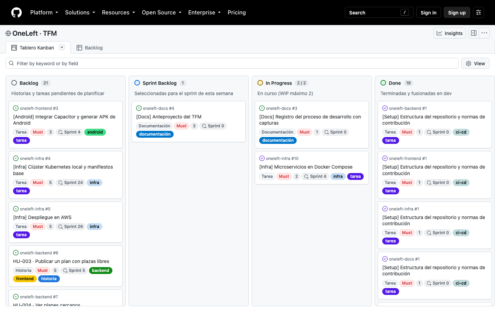
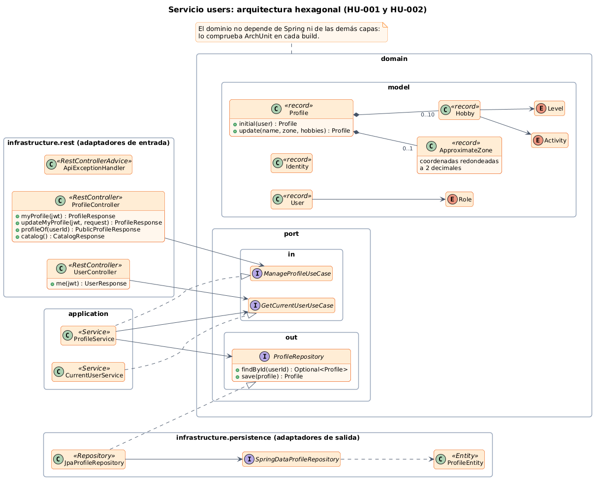
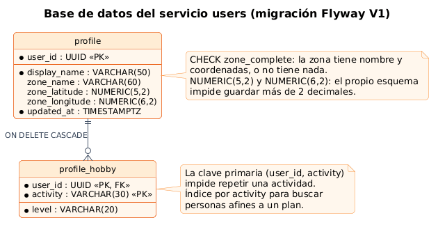
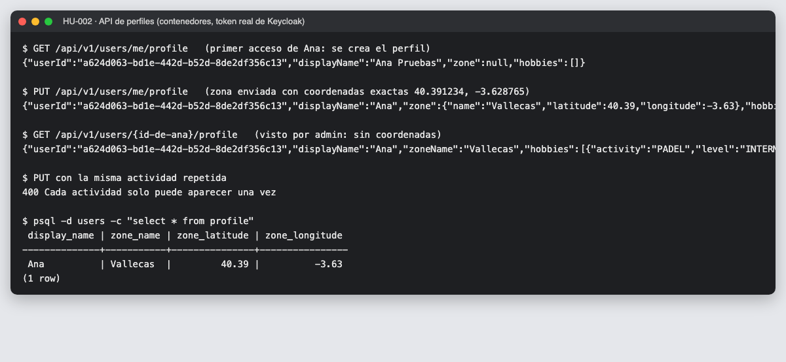
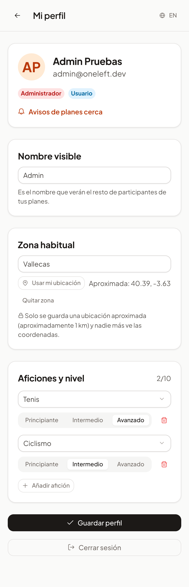
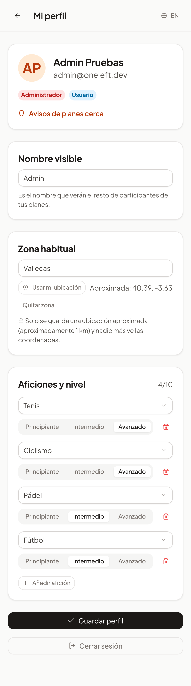
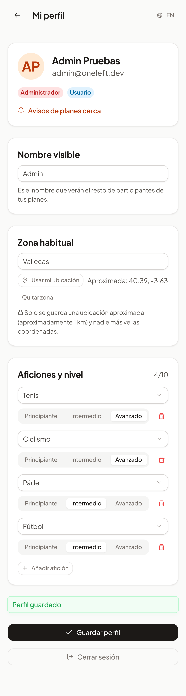
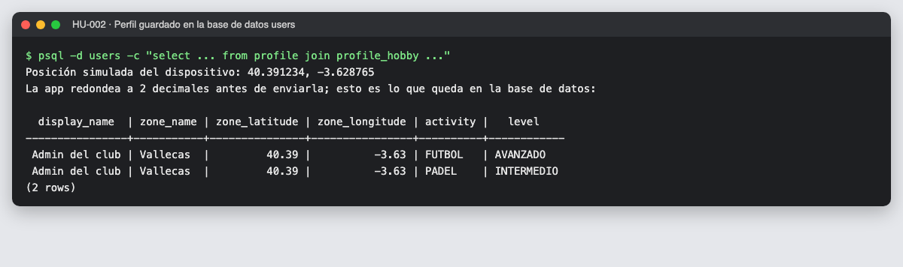

# 08 · Sprint 4: HU-002 · Perfil con aficiones y nivel

**Fecha:** 28/09/2026 · **Sprint:** 4 · **Issues:** backend#5 (HU-002) con sus sub-issues infra#12 y frontend#10

## 1. Estado del sprint

| Issue | Tipo | MoSCoW | Puntos | Resultado |
|---|---|---|---|---|
| backend#27 · Documentación OpenAPI con Swagger UI (+ infra#10) | Tarea | Must | 3 + 2 | Done ([entrada 07](07-openapi-y-contenedores.md)) |
| backend#5 · HU-002 Perfil con aficiones y nivel (backend) | Historia | Should | 3 | Done |
| infra#12 · Base de datos de users en Docker Compose (sub-issue) | Tarea | Should | 1 | Done |
| frontend#10 · HU-002 Edición del perfil en la app web (sub-issue) | Historia | Should | 3 | Done |
| frontend#3 · Capacitor y APK de Android | Tarea | Must | 3 | Pendiente: requiere Android Studio |
| backend#30 · HU-020 Foto de perfil (nueva) | Historia | Should | 3 | Planificada en el Sprint 26 (fase AWS) |

*Figura 51. Tablero durante el Sprint 4.*

**Cambio de alcance:** el criterio «foto visible para otros participantes» necesita almacenamiento de objetos
(Amazon S3), así que se separó de HU-002 en una historia nueva, **HU-020 · Foto de perfil**, planificada para la
fase de despliegue en AWS.

## 2. Diseño

*Figura 52. Clases del servicio users: adaptadores de entrada (REST), dominio con sus puertos, aplicación y
adaptadores de salida (JPA). Fuente: [`14-clases-users-hexagonal.puml`](../diagramas/clases/src/14-clases-users-hexagonal.puml).*

### Privacidad de la ubicación

La zona habitual nunca se guarda con precisión. La protección está en tres capas:

1. **En el dispositivo:** `ApproximateLocation` redondea las coordenadas a 2 decimales (≈ 1,1 km) antes de enviarlas.
2. **En el dominio:** `ApproximateZone` vuelve a redondear, así que aunque otro cliente enviara coordenadas exactas no se guardarían.
3. **En la base de datos:** las columnas `NUMERIC(5,2)` y `NUMERIC(6,2)` no admiten más de 2 decimales.

Además, el perfil que ven otros participantes (`GET /api/v1/users/{id}/profile`) solo incluye el **nombre** de la zona.

### Base de datos

*Figura 53. Tablas del servicio users, creadas con la migración Flyway `V1__perfiles.sql`. Fuente:
[`15-esquema-users.puml`](../diagramas/datos/src/15-esquema-users.puml).*

- **Base de datos por servicio:** `users` tiene su propia base de datos en PostgreSQL.
- **Flyway** gestiona el esquema y Hibernate solo lo valida (`ddl-auto: validate`).
- Las restricciones del dominio también están en el esquema: clave primaria que impide repetir actividad y
  `CHECK` de zona completa.

## 3. Backend

| Elemento | Detalle |
|---|---|
| Endpoints | `GET` y `PUT /api/v1/users/me/profile`, `GET /api/v1/users/{id}/profile`, `GET /api/v1/users/activities` |
| Errores | Problem Details (RFC 9457): 400 con el motivo y 404 si el perfil no existe |
| Tests | 47 en `users` con **PostgreSQL real vía Testcontainers**; cobertura 100 % de líneas y 98,6 % de ramas |
| Test de aplicación | `ProfileService` se prueba con un repositorio en memoria, gracias al puerto de salida |

*Figura 54. API de perfiles con los contenedores y un token real: creación en el primer acceso, zona redondeada,
perfil público sin coordenadas y rechazo de actividades repetidas.*

### Incidencia: un `.gitignore` que ocultaba parte de la arquitectura

En local todo funcionaba, pero la integración continua falló al compilar: faltaba el paquete `domain/port/out`.
La regla `out/` del `.gitignore`, pensada para la carpeta de compilación de IntelliJ, ignoraba también cualquier
paquete llamado `out`, incluido el de los **puertos de salida** de la arquitectura hexagonal. Se acotó a `/out/` y
`/*/out/` y se subieron los ficheros que faltaban (entre ellos, un `package-info.java` de `plans` perdido desde el
Sprint 1). Es un buen ejemplo del valor de la integración continua: detecta lo que en local pasa desapercibido.

## 4. App web

- Formulario reactivo con nombre visible, zona habitual («Usar mi ubicación») y aficiones con nivel
  (`Select` y `SelectButton` de PrimeNG). Cada fila solo ofrece las actividades que no se han usado.
- Validaciones en cliente coherentes con las del servidor, y mensajes con el motivo que devuelve la API.
- 31 tests; cobertura del 98 % de sentencias, 94 % de ramas, 100 % de funciones y 98 % de líneas.

| | | |
|---|---|---|
|  |  |  |
| *1. Perfil creado en el primer acceso* | *2. Zona aproximada y aficiones* | *3. Guardado* |

*Figura 55. Recorrido de HU-002 en móvil, automatizado con [`tools/capture-profile.mjs`](../tools/capture-profile.mjs)
y una posición simulada del dispositivo (40.391234, −3.628765).*

*Figura 56. En la base de datos solo quedan las coordenadas redondeadas y las aficiones con su nivel.*

### Incidencias

- **Sin Zone.js, los formularios no refrescan la vista solos:** los cambios de un `FormArray` no son *signals*.
  Un test lo detectó (las filas añadidas no aparecían). Se resolvió marcando el componente para revisión en cada
  cambio del formulario.
- **PrimeNG 22:** `p-message` ya no tiene la entrada `text` (el texto va como contenido) y las opciones de
  `SelectButton` son elementos `p-togglebutton` con `aria-label`.
- **Presupuesto del bundle:** la carga inicial pesa 594 kB (132 kB transferidos), sobre todo por la librería OIDC y
  el núcleo de PrimeNG. Se ajustó el presupuesto de 500 a 700 kB; el perfil se carga bajo demanda.
- Diseño en móvil: el botón de quitar afición pasó a la misma línea que el nivel.
