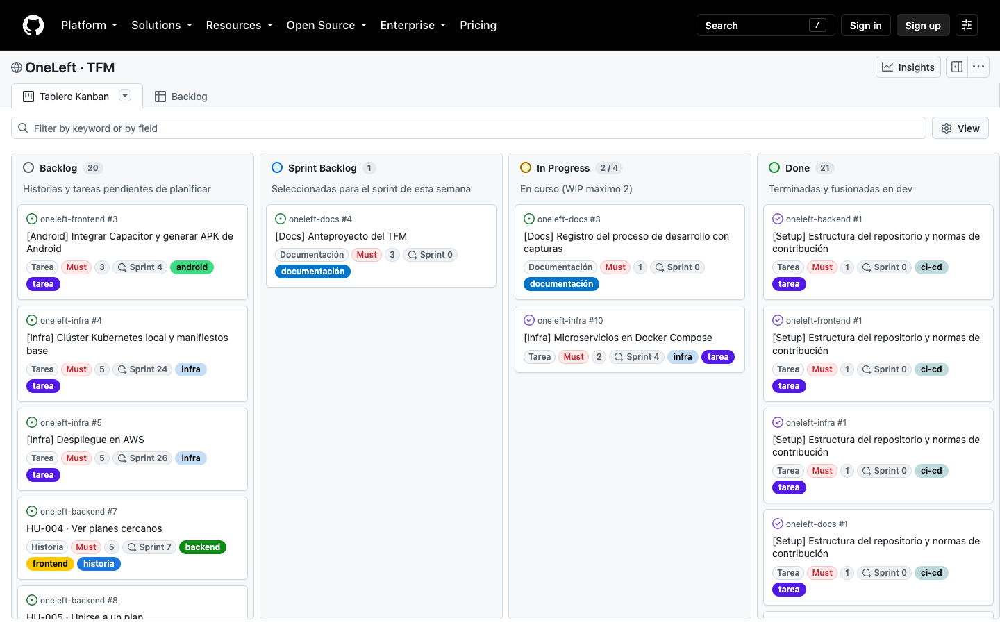
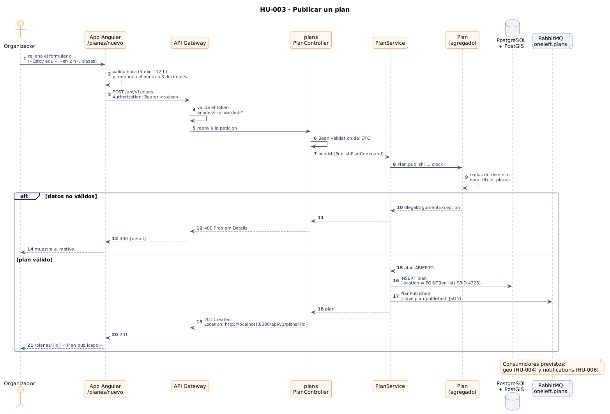
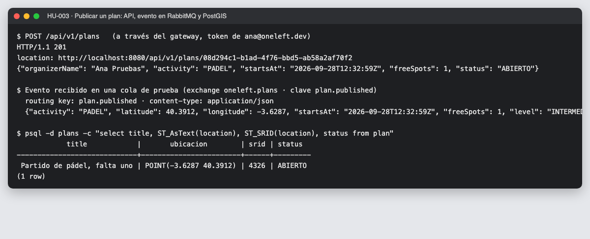
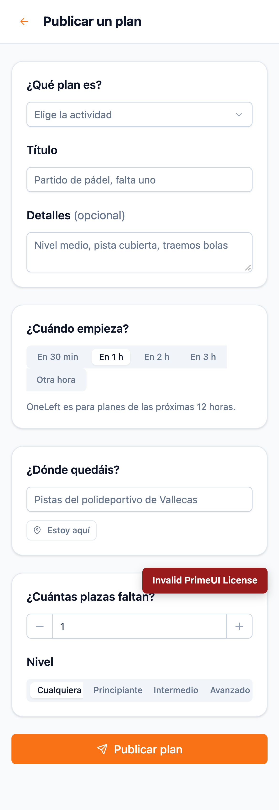
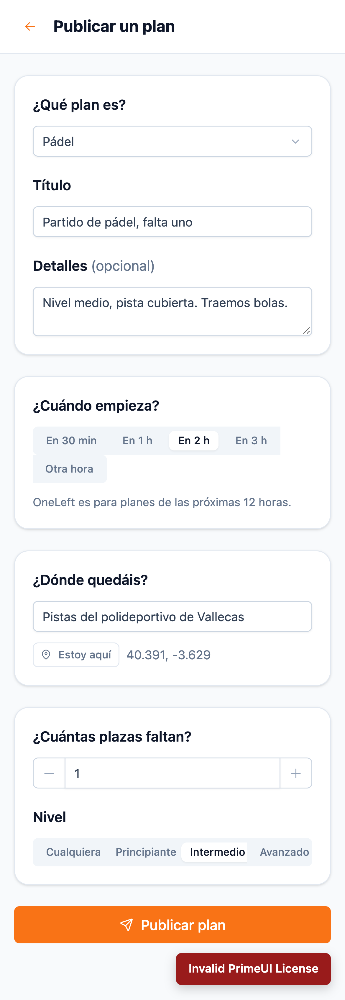
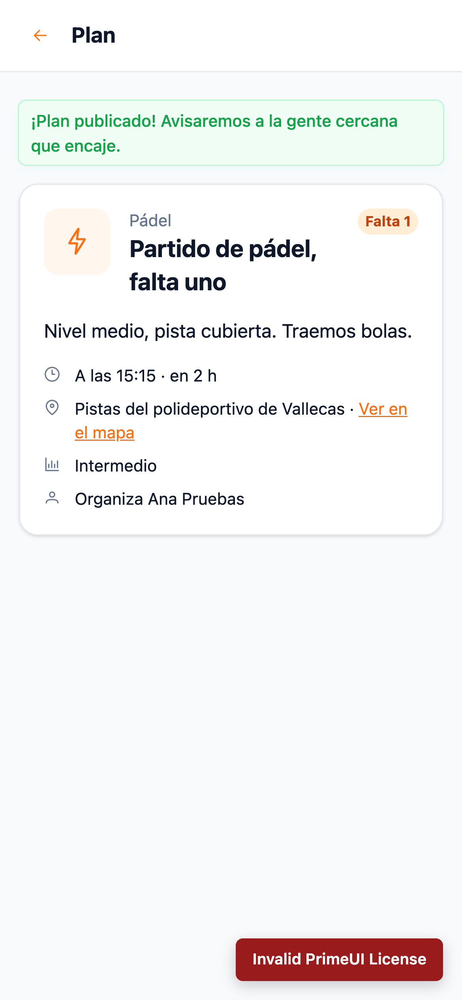
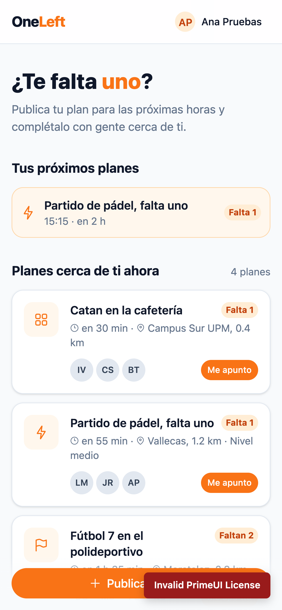

# 09 · Sprint 5: HU-003 · Publicar un plan con plazas libres

**Fecha:** 28/09/2026 (trabajo del Sprint 5 adelantado) · **Sprint:** 5 ·
**Issues:** backend#6 (HU-003) con sus sub-issues infra#14 y frontend#12

## 1. Planificación

| Issue | Tipo | MoSCoW | Puntos | Resultado |
|---|---|---|---|---|
| backend#6 · HU-003 Publicar un plan (backend) | Historia | Must | 5 | Done |
| infra#14 · PostGIS y RabbitMQ para plans (sub-issue) | Tarea | Must | 1 | Done |
| frontend#12 · HU-003 Publicar un plan desde la app (sub-issue) | Historia | Must | 5 | Done |

*Figura 57. Tablero tras HU-003.*

HU-003 es el **núcleo de OneLeft**: con ella el servicio `plans` pasa de esqueleto a servicio real, con PostGIS y
el primer evento de dominio en RabbitMQ.

## 2. Diseño

*Figura 58. Secuencia de HU-003. Fuente:
[`16-secuencia-publicar-plan.puml`](../memoria/diagramas/src/16-secuencia-publicar-plan.puml).*

| Decisión | Motivo |
|---|---|
| El plan empieza entre **5 minutos y 12 horas** desde ahora | Es la esencia del producto: planes «para ya». La regla está en el agregado `Plan` y se repite en la app para avisar antes de enviar |
| **Reloj inyectable** (`Clock`) | Las reglas temporales se prueban con un reloj fijo, sin depender de la hora real |
| Punto de encuentro como **`geometry(Point, 4326)`** con índice GiST | Prepara la búsqueda por proximidad de HU-004 |
| Punto de encuentro con **3 decimales** (~110 m) | Suficiente para quedar sin exponer la casa del organizador; la zona del perfil usa 2 decimales |
| **Evento `PlanPublished`** en un exchange *topic* | Los servicios de búsqueda y notificaciones reaccionarán sin acoplarse a `plans` |
| Catálogo de actividades **duplicado** en `users` y `plans` | Cada contexto es independiente: el contrato son los códigos, no una librería compartida |
| `@Version` en la entidad | Bloqueo optimista para cuando varias personas ocupen la última plaza (HU-005) |

## 3. Backend

- Agregado `Plan` con `Organizer`, `MeetingPoint`, `Activity`, `Level` y `PlanStatus`, y los puertos
  `PublishPlanUseCase`, `QueryPlansUseCase`, `PlanRepository` y `PlanEventPublisher`.
- API: `POST /api/v1/plans` (201 con `Location`), `GET /api/v1/plans/{id}` y `GET /api/v1/plans/mine`.
- **24 tests** en `plans` con **PostGIS y RabbitMQ reales (Testcontainers)**; 100 % de cobertura de líneas.
  Incluye un test que recibe el evento desde una cola real y otro que comprueba el punto con `ST_AsText` y `ST_SRID`.

*Figura 59. Prueba de extremo a extremo con los contenedores: 201 con `Location` pública, evento `plan.published`
en JSON recibido en una cola de prueba y el punto guardado en PostGIS con SRID 4326.*

## 4. App web

| | | |
|---|---|---|
|  |  |  |
| *1. Formulario* | *2. Relleno* | *3. Plan publicado* |

*Figura 60. Pantalla de inicio con «Tus próximos planes». Recorrido automatizado con
[`tools/capture-plan.mjs`](../tools/capture-plan.mjs).*

- Hora de inicio con **accesos rápidos** («en 30 min», «en 1 h», «en 2 h», «en 3 h») u otra hora. Si esa hora ya ha
  pasado hoy, se entiende que es la de mañana; y tiene que caer dentro de las próximas 12 horas.
- Detalle con hora, tiempo restante, lugar con enlace a OpenStreetMap, nivel y organizador.
- 47 tests; cobertura del 98,5 % de sentencias y 93,9 % de ramas.

## 5. Errores encontrados en la prueba de extremo a extremo

1. **`Location` con el host interno.** La respuesta apuntaba a `http://plans:8082/...`, una dirección que solo existe
   dentro de Docker. Tenía dos causas:
   - Los servicios no tenían en cuenta las cabeceras `X-Forwarded-*`. Se corrigió con `server.forward-headers-strategy: framework`.
   - El gateway no las enviaba, porque Spring Cloud Gateway las desactiva si no se configuran los *proxies* de
     confianza. Se añadió `trusted-proxies`, limitado a redes privadas (Docker en local, la VPC en AWS).

   Se añadió un test que simula una petición detrás de un proxy.
2. **Integración continua duplicada.** Cada `push` a una rama `issue#N` lanzaba la CI dos veces (por el `push` y por la PR)
   y una cancelaba a la otra. Ahora el `push` solo la lanza en `dev` y `main`, lo que además ahorra la mitad de los minutos.
3. **RabbitMQ 4 ya no permite colas temporales no exclusivas.** Las colas de prueba se crean duraderas y se borran al terminar.
