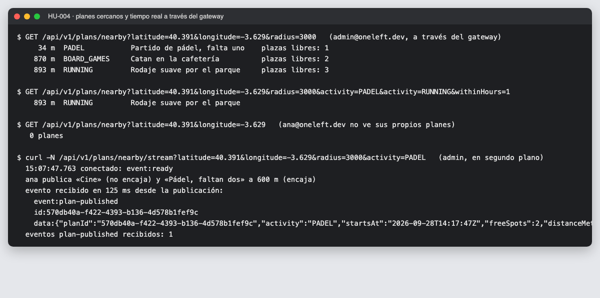
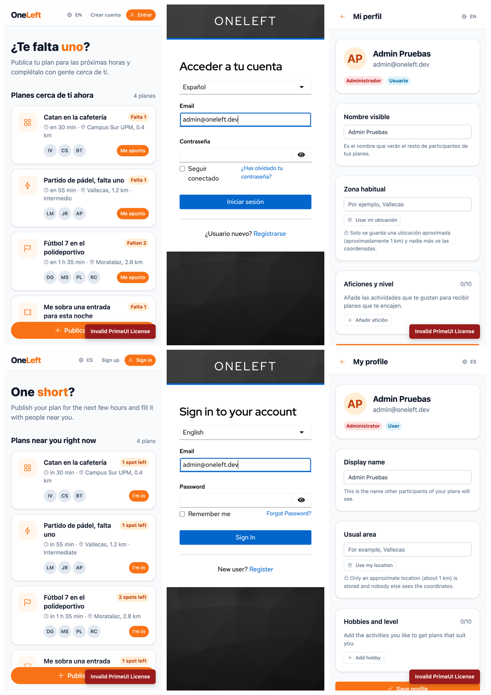
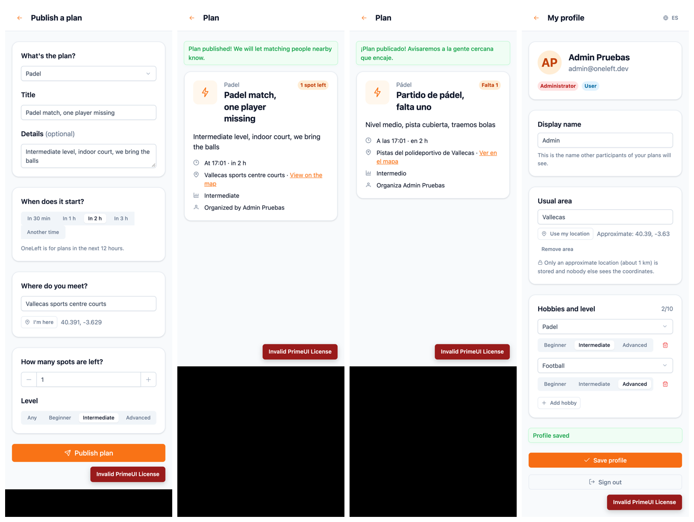
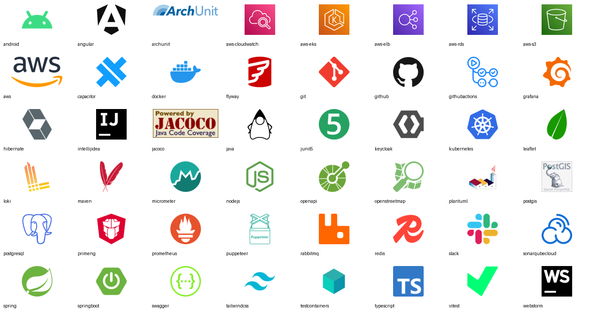
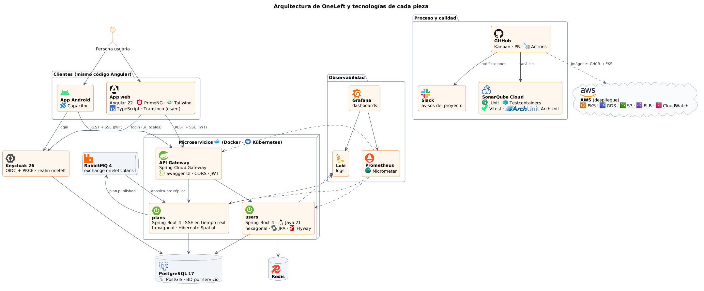

# 10 · Sprint 7: HU-004 (backend), código en inglés, HU-022 · Idiomas, logos y control de tiempos

**Fecha:** 28/09/2026 (trabajo del Sprint 7 adelantado) · **Sprint:** 7 (16–22/11/2026)

## 1. Planificación y cambios de alcance

| Issue | Tipo | MoSCoW | Puntos | Resultado |
|---|---|---|---|---|
| backend#7 · HU-004 Ver planes cercanos (backend) | Historia | Must | 5 | PR #32 en revisión |
| frontend#15 · HU-004 Lista y mapa (sub-issue) | Historia | Must | 5 | Pendiente: se hará ya traducida |
| backend#33 · Código del backend en inglés | Tarea | Must | 5 | PR #34 |
| infra#18, frontend#16, docs#18 · Refactor al inglés (sub-issues) | Tarea | Must | 2 + 3 + 1 | PR abiertas |
| frontend#17 · HU-022 Elegir el idioma (es/en) | Historia | Should | 5 | PR #19 |
| infra#20 · Login de Keycloak en es/en (sub-issue) | Historia | Should | 1 | Done (ya estaba configurado) |
| docs#17 · Logos de las tecnologías | Tarea | Should | 2 | Esta entrada |
| infra#17 · Canal de Slack | Tarea | Should | 2 | Pendiente de la autora (ver §6) |
| infra#16 + frontend#14 · HU-021 Inicio de sesión con Google | Historia | Should | 3 + 3 | Planificada en el Sprint 6 |

**Cambios de alcance pedidos durante el sprint:**

- **Google como proveedor de identidad** (HU-021). La web y la app Android comparten el flujo de Keycloak con
  `kc_idp_hint=google`. Google no permite OAuth dentro de un WebView, así que en Android el login se abre en el
  navegador del sistema y vuelve a la app por *deep link* (criterio añadido a frontend#3).
- **Todo el código en inglés** y **la app en dos idiomas**. HU-022 se adelantó del Sprint 8 al 7 para que la pantalla
  de HU-004 nazca ya traducida.
- **Control de tiempos** en el tablero (§5) y **canal de Slack** (§6).

## 2. HU-004 · Planes cercanos (backend)

| Decisión | Motivo |
|---|---|
| `ST_DWithin` sobre `geography` + índice GiST **de expresión** (`V2__nearby_search.sql`) | Mide en metros sobre la esfera y usa el índice; el GiST sobre `geometry` no sirve para esa expresión. Un test lee el `EXPLAIN` para comprobarlo |
| Orden con el operador `<->` y límite de 50 | Lista legible en el móvil y en el mapa |
| `NearbySearch` en el dominio (radio 500 m–25 km, actividades, ventana de 1–12 h) | Las reglas se prueban sin base de datos y se reutilizan en el tiempo real |
| **Server-Sent Events** (`/nearby/stream`) | Flujo unidireccional servidor → cliente sobre HTTP: pasa por el gateway y por los balanceadores sin WebSockets |
| Cola **anónima por réplica** enlazada a `plan.published` | Reparto en abanico: con varias réplicas de `plans`, todas avisan a sus clientes |
| Latido cada 20 s y métrica `oneleft_plans_nearby_subscriptions` | Evita cortes de proxies; las conexiones abiertas se ven en Grafana |

*Figura 61. Búsqueda por distancia con filtros y aviso en tiempo real. El evento llega en unos 125 ms.*

**Incidencia investigada:** tras cortar un cliente, la suscripción tardaba en desaparecer. No era una fuga: la
primera escritura hacia un socket cerrado no falla (queda en el búfer de TCP) y la segunda sí, así que se libera en
dos latidos (unos 40 s, algo más a través del gateway). El *timeout* de 30 min del emisor acota el peor caso.

## 3. Código en inglés

- **Backend:** comentarios, Javadoc, textos OpenAPI, logs y nombres de jobs de la CI. Enumerados en inglés
  (`OPEN`, `INTERMEDIATE`, `BOARD_GAMES`…) y migraciones renombradas (`V1__plans.sql`…). Como aún no hay ningún
  entorno desplegado, las migraciones se reescribieron en vez de añadir migraciones de datos; en local se vacían con
  `postgres/reset-service-database.sh`.
- **Errores con código estable:** `ValidationException` de dominio. Los Problem Details incluyen `code`
  (`plan.startsTooLate`, `search.radius`…), que la web traduce.
- **Frontend e infraestructura:** rutas `/profile`, `/plans/new`, `/plans/:id`; scripts, paneles de Grafana y
  herramientas de docs (`capture-*.mjs`, `tree.py`).
- **Se quedan en español** la memoria, el diario y los diagramas.

## 4. HU-022 · La app en español e inglés

- **Transloco** (MIT) con cambio de idioma en tiempo de ejecución: un único bundle para la web y Android, a diferencia
  de `@angular/localize`, que genera una compilación por idioma.
- **Idioma inicial:** el que se eligió antes; si no, el del dispositivo; y si no, español. Se recuerda en
  `localStorage`. El título de la página y `<html lang>` siguen al idioma.
- **Keycloak** recibe `ui_locales`, así que su pantalla de login sale en el mismo idioma.
- 62 tests en el frontend, con un 97,8 % de cobertura de sentencias.

*Figura 62. Inicio, login de Keycloak y perfil en los dos idiomas. Capturas automáticas con
`ONELEFT_LANG=es|en node tools/capture-login.mjs`.*

*Figura 63. Publicar un plan en inglés, detalle en inglés y en español, y perfil guardado. En la base de datos solo
hay códigos (`PADEL`, `INTERMEDIATE`, `OPEN`).*

## 5. Control de tiempos en el tablero

Nuevos campos en GitHub Projects: **Tiempo invertido**, **Fecha inicio** y **Fecha fin**.

- Las fechas de cada tarea caen **dentro de su sprint** y se reparten en proporción a los puntos.
- El tiempo invertido se compara con la estimación (en la misma unidad) y se desvía como mucho ±1. Solo se rellena
  al terminar la tarea, porque una tarea sin empezar no tiene tiempo consumido.
- Lo automatiza el script del tablero (`tiempos.py`) al cerrar cada tarea.

## 6. Canal de Slack (infra#17)

Tareas de la autora, que es quien crea las cuentas:

1. Crear el espacio de trabajo y el canal `#oneleft`.
2. Instalar la app **GitHub** para Slack y, en el canal:
   `/github subscribe chabelly-lbetancourt/oneleft-backend issues pulls reviews workflows:{branch:"dev,main"}`
   y lo mismo para `oneleft-frontend`, `oneleft-infra` y `oneleft-docs`.
3. Hacer una captura del canal para la memoria.

No hace falta tocar los workflows: la suscripción `workflows` de la app ya avisa cuando la CI falla.

## 7. Logos de las tecnologías (docs#17)

`tools/fetch-logos.mjs` descarga los 48 logos del stack en SVG (con su color de marca) y en PNG para PlantUML, y
genera `assets/logos/SOURCES.md` con el origen y la licencia de cada uno. Las fuentes son Simple Icons (CC0),
gilbarbara/logos (CC0; incluye AWS y Slack, que Simple Icons ya no publica) y los repositorios oficiales de PostGIS,
Loki, Testcontainers, ArchUnit, JaCoCo, Micrometer y PlantUML.

*Figura 64. Logos de las tecnologías de OneLeft.*

*Figura 65. Arquitectura y tecnologías de cada pieza. Fuente:
[`17-arquitectura-tecnologias.puml`](../diagramas/componentes/src/17-arquitectura-tecnologias.puml).
`render-plantuml.sh` monta ahora todo el repositorio para que los diagramas incrusten `assets/logos/png`.*
