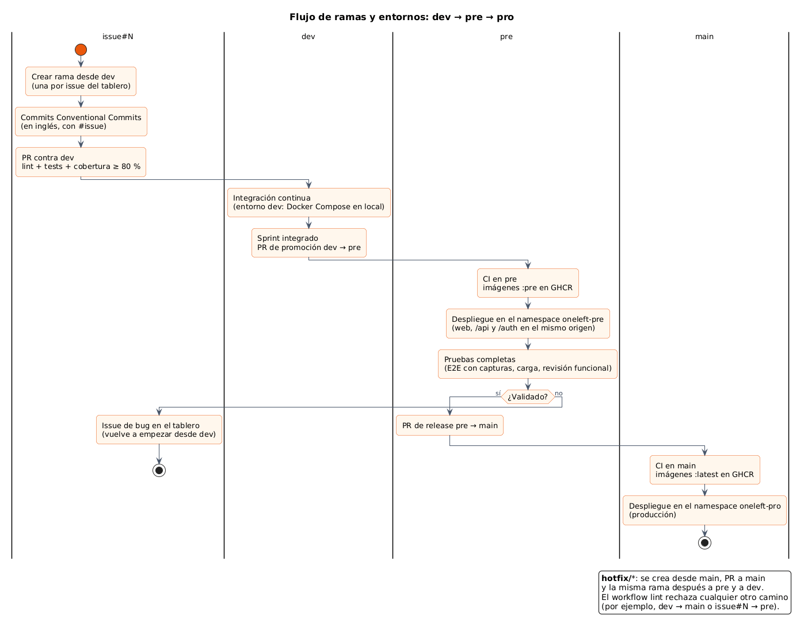
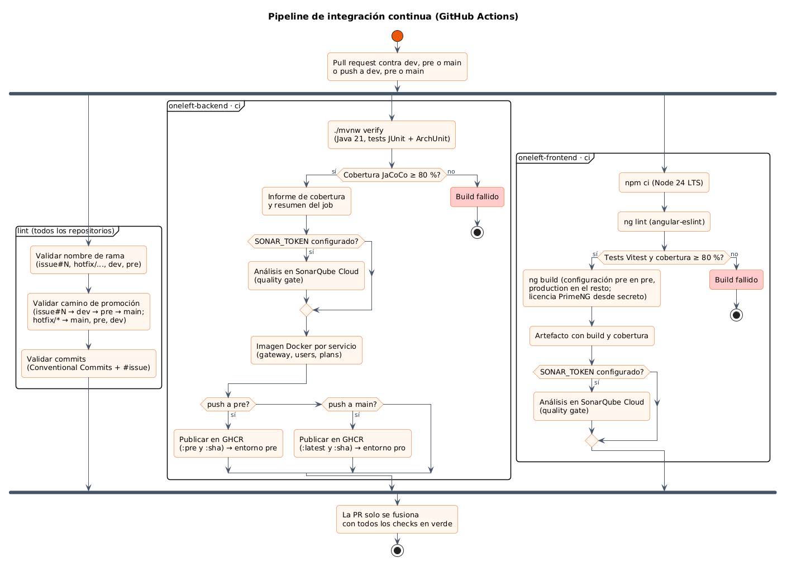

# 11 · Entorno pre (*staging*) y documentación al día

**Fecha:** 28/09/2026 (Sprint 7) · **Issues:** infra#21 con sus sub-issues backend#35, frontend#20 y docs#21

## 1. Motivo

Hasta ahora había dos ramas de larga vida: `dev` (integración) y `main` (producción). Se añade una capa de
**staging**, `pre`: todo lo integrado en `dev` se sube a `pre`, se prueba completo sobre las mismas imágenes y
manifiestos que irán a producción, y solo después pasa a `main`. Es la práctica habitual para no descubrir en
producción problemas que solo aparecen con la infraestructura real (dominios, balanceador, datos, escalado).

| Issue | Tipo | MoSCoW | Puntos |
|---|---|---|---|
| infra#21 · Entorno pre entre dev y pro | Tarea | Must | 2 |
| backend#35 · CI e imágenes de pre (sub-issue) | Tarea | Must | 2 |
| frontend#20 · Configuración pre de la web (sub-issue) | Tarea | Must | 2 |
| docs#21 · Entornos y documentación al día (sub-issue) | Tarea | Must | 3 |

## 2. Flujo de ramas y entornos

*Figura 66. Flujo `issue#N → dev → pre → main`. Fuente:
[`18-flujo-ramas-entornos.puml`](../memoria/diagramas/src/18-flujo-ramas-entornos.puml).*

| Decisión | Motivo |
|---|---|
| `pre` se crea desde `main` | `pre` nunca va por detrás de producción; recibe `dev` mediante una PR de promoción |
| El workflow `lint` valida el **camino de promoción** | Solo se admiten `issue#N → dev`, `dev → pre`, `pre → main` y `hotfix/* → main, pre, dev`; se rechaza, por ejemplo, `dev → main` |
| Imágenes `:pre` desde `pre` y `:latest` desde `main` | Lo que se prueba en pre es exactamente lo que se promociona (además, todas llevan la etiqueta `:sha-…`) |
| Namespaces `oneleft-pre` y `oneleft-pro` en el mismo clúster EKS (overlays de Kustomize) | Control de costes: un clúster, dos entornos aislados, con su propia base de datos y su propio realm |
| Web, `/api` y `/auth` en el **mismo origen** | La web de pre no lleva ningún host compilado (`environment.pre.ts`); la app Android recibe el host con `--define ONELEFT_ORIGIN` |

*Figura 67. Pipeline de CI actualizado con la validación de la promoción y la publicación por entorno.*

## 3. Revisión de la documentación

Al revisar si la documentación estaba al día aparecieron estos desfases, corregidos en esta tarea:

| Documento | Estaba | Ahora |
|---|---|---|
| `CONTRIBUTING.md` (los cuatro repositorios) | Solo `dev` y `main`, sin convención de idioma | Entornos dev/pre/pro, promoción, hotfix, código en inglés, campos de tiempo del tablero |
| README del backend | `users` y `plans` como «esqueletos» y un servicio `geo` que no existe | Historias implementadas, convenciones (errores con `code`) y entornos con sus imágenes |
| README del frontend | Sin i18n ni rutas; estructura incompleta | Idiomas (HU-022), estructura real, rutas y configuraciones de build por entorno |
| README de infra | Carpetas `k8s/`, `aws/` y `observability/` que no existen | Contenido real y tabla de entornos con namespaces |
| Plantillas de PR | Sin promociones | Casilla de promoción validada en el entorno anterior |
| Anteproyecto | Ramas `main`/`dev` | Incluye `pre` (aún se puede cambiar: falta la firma del Anexo I) |
| infra#4 e infra#5 | Sin entornos | Overlays `pre`/`pro`, Ingress con `/auth` y despliegue por rama |

Las entradas anteriores del diario no se reescriben: describen el estado de cada momento.

## 4. Siguientes pasos

1. Mezclar las PR pendientes en el orden indicado en cada una (dependen del refactor al inglés).
2. Primera **promoción `dev → pre`** cuando HU-004 esté completa (backend y web).
3. El despliegue real de `pre` y `pro` llega con infra#4 (Kubernetes) e infra#5 (AWS).
