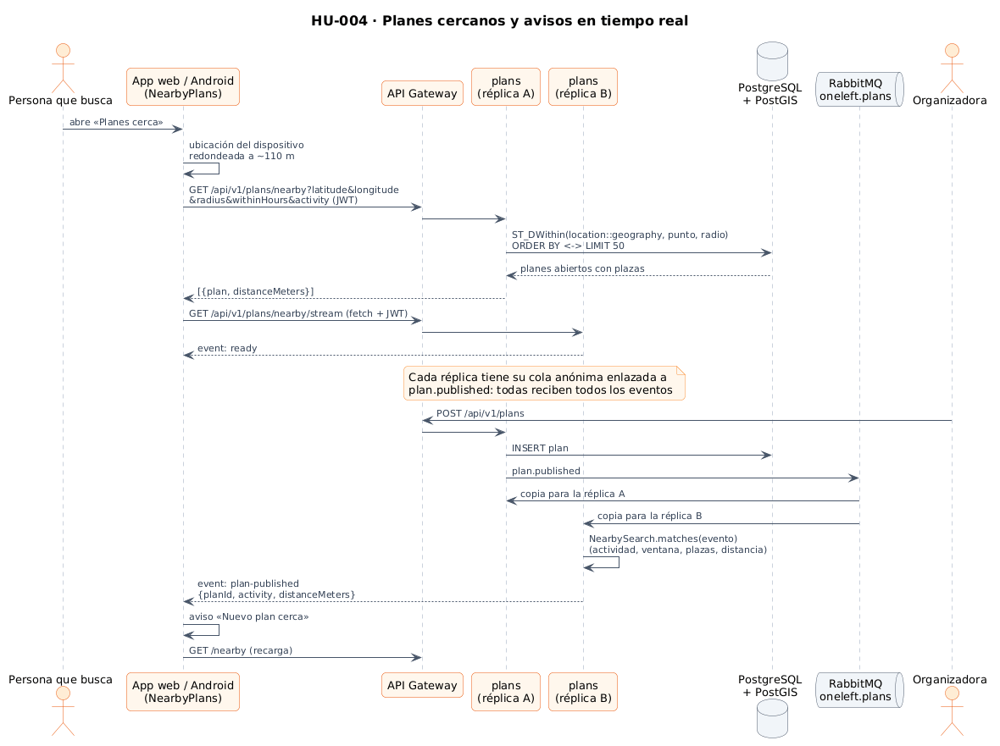
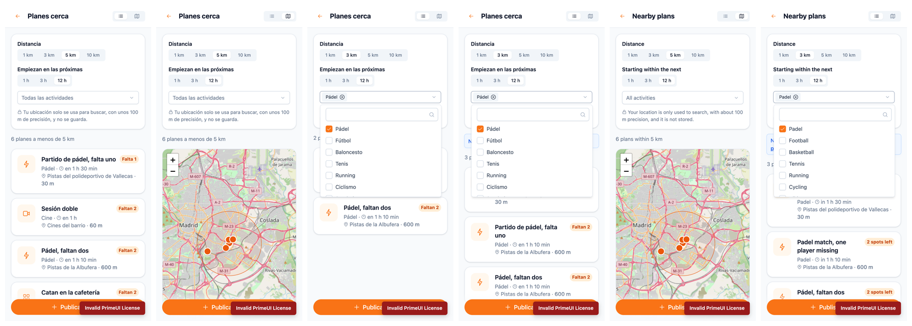
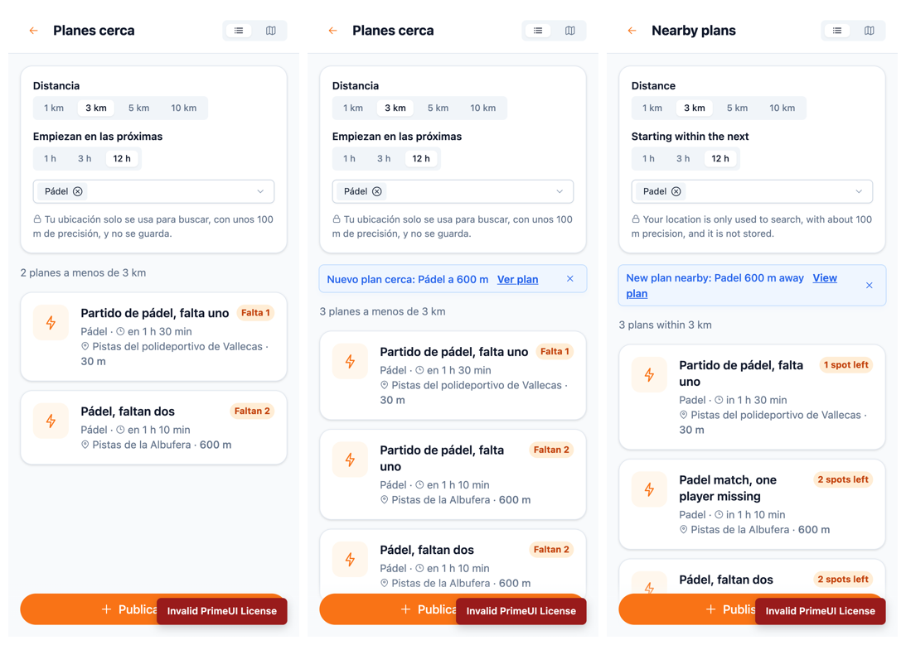

# 12 · HU-004 · Planes cercanos en la app (lista, mapa y tiempo real)

**Fecha:** 28/09/2026 (Sprint 7) · **Issues:** backend#7 (HU-004) con sus sub-issues frontend#15 y docs#23

## 1. Planificación

| Issue | Tipo | MoSCoW | Puntos | Resultado |
|---|---|---|---|---|
| backend#7 · HU-004 Ver planes cercanos (backend) | Historia | Must | 5 | Mezclada (PR #32, [entrada 10](10-sprint7-cercanos-idiomas-y-codigo-en-ingles.md)) |
| frontend#15 · Planes cercanos en lista y mapa (sub-issue) | Historia | Must | 5 | PR #22 |
| docs#23 · Documentación y capturas (sub-issue) | Historia | Must | 2 | Esta entrada |

Con esto se cumplen los tres criterios de HU-004: **búsqueda geoespacial por distancia**, **filtros por actividad y
hora** y **actualización en tiempo real**.

## 2. Diseño

*Figura 68. Búsqueda y avisos en tiempo real con dos réplicas de `plans`. Fuente:
[`19-secuencia-planes-cercanos.puml`](../diagramas/secuencia/src/19-secuencia-planes-cercanos.puml).*

| Decisión | Motivo |
|---|---|
| **SSE leído con `fetch`** en vez de `EventSource` | `EventSource` no permite enviar la cabecera `Authorization`; poner el token en la URL lo dejaría en los logs del gateway |
| Parser SSE propio e incremental | Los fragmentos de red cortan los mensajes en cualquier punto; ignora los latidos (`:ping`) |
| Reconexión cada 5 s | El servidor cierra el stream a los 30 min y la red móvil se corta; al volver, el aviso sigue funcionando |
| Un stream por búsqueda | Al cambiar un filtro se cierra el stream anterior (`effect` con `onCleanup`) y se abre otro con los filtros nuevos |
| **Leaflet + OpenStreetMap** | Sin clave ni coste (Google Maps necesita facturación); licencia BSD-2; se carga solo en esta pantalla (chunk de 58 kB comprimido) |
| Popups con nodos DOM | El título del plan lo escriben otras personas: nunca se interpreta como HTML (test con ``) |
| Posición con 3 decimales (~110 m) | Suficiente para buscar; el servidor no la guarda |

## 3. Resultado

*Figura 69. Lista con la distancia de cada plan, mapa con el área de búsqueda (5 km), filtro de 3 km y pádel, y las
mismas pantallas en inglés. Capturas automáticas con [`tools/capture-nearby.mjs`](../tools/capture-nearby.mjs).*

*Figura 70. Otra persona publica un plan de pádel a 600 m: aparece el aviso «Nuevo plan cerca» con enlace y la lista
pasa de 2 a 3 planes sin recargar la página (en español y en inglés).*

- 79 tests en el frontend (antes 62), con un 98,2 % de cobertura de sentencias. Leaflet se prueba de verdad sobre
  jsdom (capas, atribución de OpenStreetMap y popups).
- Incidencia en las pruebas: `whenStable()` esperaba a que terminasen las peticiones HTTP pendientes, que en los
  tests contesta el propio test, y se quedaba bloqueado. Se renderiza con una vuelta del bucle de eventos.
- Incidencia en las capturas: una página con un stream abierto nunca llega a `networkidle0`. El login del script
  espera a `load` en esas pantallas.
