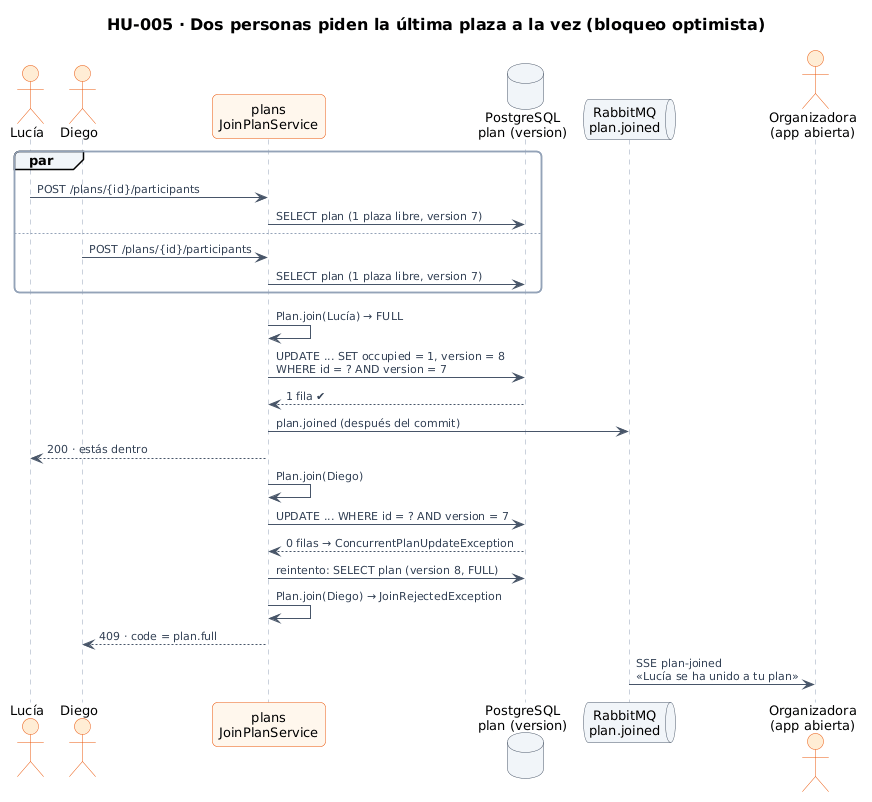
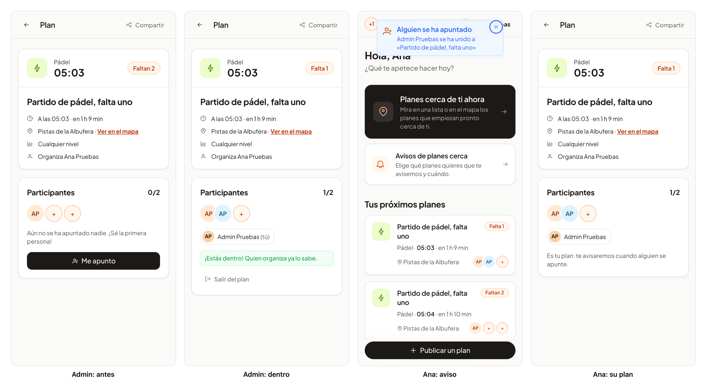

# 13 · Seed de demostración y HU-005 · Unirse a un plan

**Fecha:** 28/09/2026 · **Issues:** backend#40 (seed) con infra#25; backend#8 (HU-005) con frontend#26 y docs#26

## 1. Planificación

| Issue | Tipo | MoSCoW | Puntos | Estado |
|---|---|---|---|---|
| backend#40 · Seed de datos de demostración | Tarea | Should | 3 | PR #41 |
| infra#25 · Seed en Docker Compose (sub-issue) | Tarea | Should | 1 | PR #26 |
| backend#8 · HU-005 Unirse a un plan (backend) | Historia | Must | 5 | PR #42 |
| frontend#26 · Unirse desde la app (sub-issue) | Historia | Must | — | PR #27 |
| docs#26 · Documentación de HU-005 (sub-issue) | Historia | Must | — | Esta entrada |

## 2. Seed de demostración (dev y pre)

Los entornos arrancaban vacíos y cada prueba empezaba creando datos a mano. Ahora el perfil de Spring **`seed`**
crea contenido realista:

- **users:** perfiles de `ana@oneleft.dev` (Vallecas: pádel, running y juegos de mesa) y `admin@oneleft.dev`.
- **plans:** 8 planes de 5 organizadores alrededor de Vallecas, de 30 m a 10 km y de 45 min a 10 h vista.

| Decisión | Motivo |
|---|---|
| Clases Java con los casos de uso, no un `.sql` | Los planes solo valen si empiezan en las próximas 12 h: las horas se calculan en cada arranque y los datos cumplen las mismas reglas que la API |
| `@Profile("seed & !pro")` | Solo se activa a propósito y nunca junto a producción (hay un test de la expresión) |
| Idempotente | Los perfiles existentes no se tocan, para conservar los cambios hechos en la app; los planes se regeneran cuando los anteriores ya han empezado |
| Ids fijos de los usuarios en el realm | Para enlazar sus perfiles y planes con sus cuentas de Keycloak |

## 3. HU-005 · Unirse a un plan

*Figura 71. Dos personas piden la última plaza a la vez. Fuente:
[`20-secuencia-unirse-plan.puml`](../diagramas/secuencia/src/20-secuencia-unirse-plan.puml).*

| Criterio | Cómo se cumple |
|---|---|
| Si dos personas piden la última plaza a la vez, solo entra una | **Bloqueo optimista** con la columna `version`: el segundo `UPDATE` no encuentra la versión que leyó, se reintenta con datos frescos y el dominio ve el plan completo (`409 plan.full`). Test con **6 hilos** contra PostgreSQL real: exactamente uno entra |
| El plan se cierra al completarse | `Plan.join()` pasa el estado a `FULL` con la última plaza; la búsqueda de cercanos ya no lo muestra |
| El organizador recibe un aviso | Evento `plan.joined` en RabbitMQ y **stream SSE personal**: aviso al instante con la app abierta. Las notificaciones push con la app cerrada llegan con HU-006 |

- **Por qué optimista y no un `SELECT … FOR UPDATE`:** unirse a un plan casi nunca compite. El bloqueo optimista
  no retiene filas ni conexiones, y el caso raro de conflicto se resuelve con un reintento.
- El evento se publica **después del commit**: una unión que se revierte nunca se anuncia.
- En la app, el botón «Me apunto» solo aparece cuando se puede usar, y los rechazos se traducen a partir del `code`
  de la API. El aviso al organizador es un *toast* que se carga de forma diferida (`@defer`), y el detalle del plan
  y «Tus próximos planes» se actualizan solos.

*Figura 72. Admin se apunta al plan de Ana (antes y después), Ana recibe el aviso en tiempo real con su lista
actualizada, y al tocarlo ve al nuevo participante. Capturas con dos
navegadores a la vez: [`tools/capture-join.mjs`](../tools/capture-join.mjs).*

**Pruebas:** plans pasa de 46 a 63 tests (100 % de líneas) y el frontend de 79 a 87 (96 % de sentencias).

## 4. App Android (frontend#3), en curso

La app se compila con Capacitor 8 y el login se abre en Chrome (Custom Tabs) con vuelta por el *deep link*
`oneleft://callback`. Para probarla se instalaron las Command-line Tools del SDK y un emulador Pixel 7 con Android 16
(API 36). La prueba se detuvo en la pantalla de bienvenida de Chrome, cuyas condiciones debe aceptar la autora.
