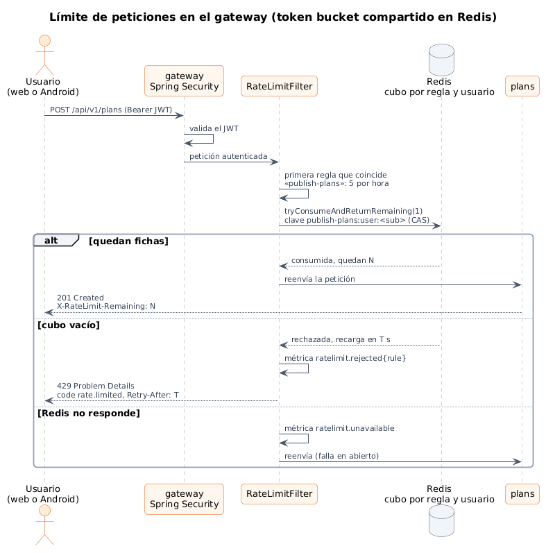
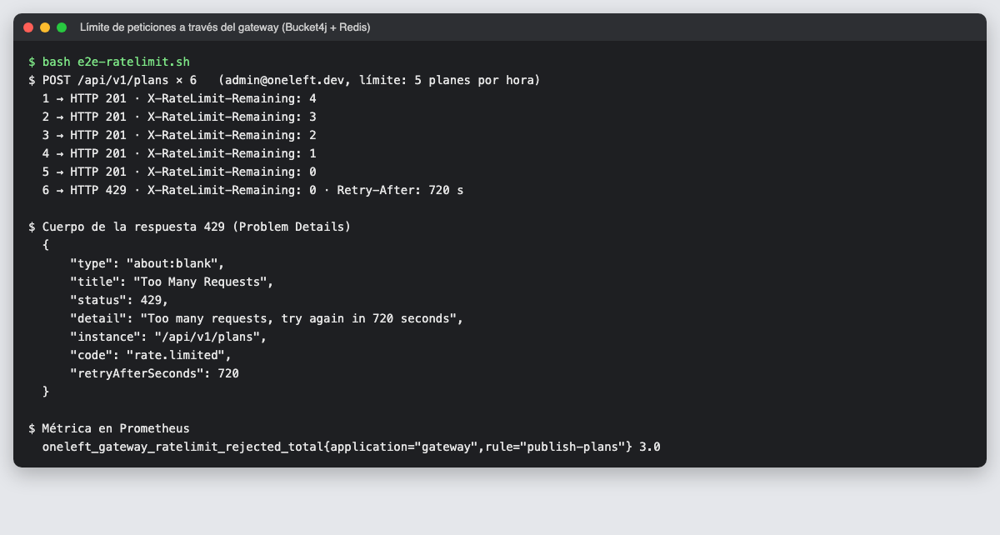
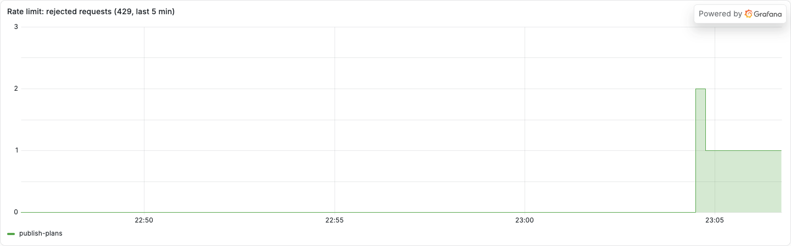
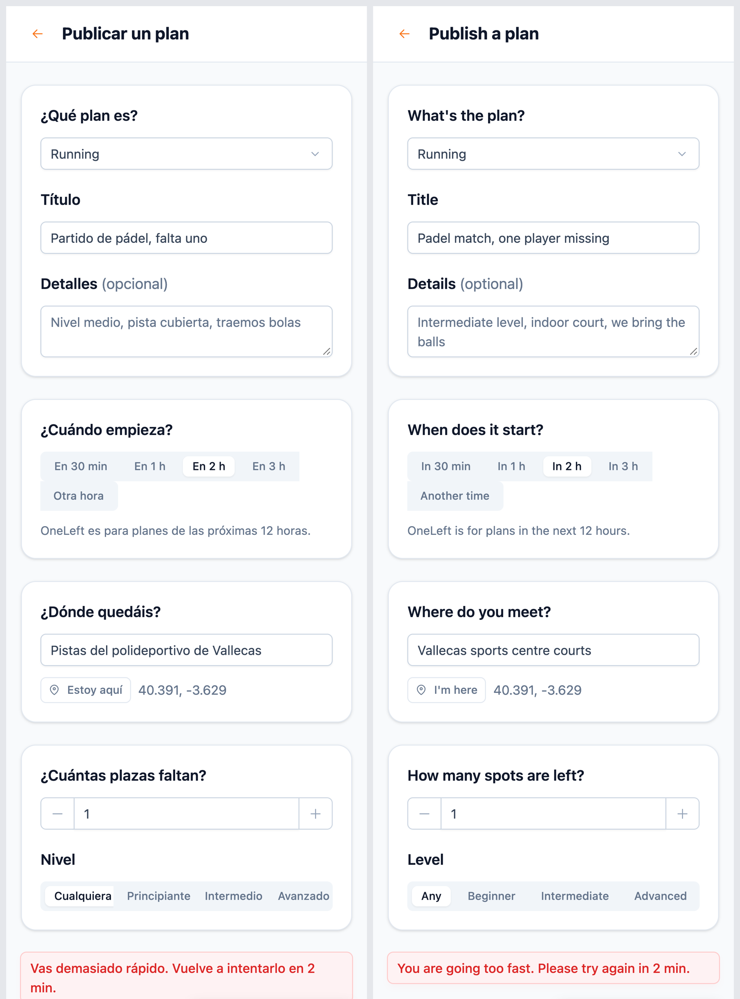

# 14 · Sprint 6: límite de peticiones y anti-spam en el gateway

**Fecha:** 28/09/2026 (trabajo del Sprint 6 adelantado) · **Sprint:** 6 (09–15/11/2026)

## 1. Planificación

| Issue | Tipo | MoSCoW | Puntos | Resultado |
|---|---|---|---|---|
| backend#63 · Límite de peticiones y anti-spam | Tarea | Should | 3 | PR #84 |
| infra#29 · Redis para el gateway y panel de Grafana (sub-issue) | Tarea | Should | 1 | PR #30 |
| frontend#36 · Mensaje traducido al superar el límite (sub-issue) | Tarea | Should | 1 | PR #37 |
| docs#29 · Documentación (sub-issue) | Tarea | Should | 1 | Esta entrada |

**Objetivo:** que nadie pueda inundar el mapa de planes falsos ni saturar la API. El límite se aplica en el
**gateway**, que es la única puerta de entrada tanto para la web como para la app Android.

## 2. Decisiones

| Decisión | Motivo |
|---|---|
| **Bucket4j** (*token bucket*) con estado en **Redis** (Lettuce, operaciones CAS) | Todas las réplicas del gateway comparten el mismo contador. Un límite en memoria se multiplicaría por el número de réplicas |
| Filtro **dentro de la cadena de Spring Security**, después de validar el JWT | La clave es el `sub` del usuario, así que cambiar de red no esquiva el límite. Sin sesión se usa la IP |
| Reglas en `application.yaml`; se aplica la primera que coincide | `publish-plans`: 5 planes por hora; `api`: 120 peticiones por minuto. Se ajustan por variables de entorno en cada entorno (`dev`, `pre`, `pro`) |
| **429 con Problem Details** y `code: rate.limited`, `retryAfterSeconds` | Mismo formato que el resto de errores de la API; la web lo traduce y dice cuántos minutos esperar |
| Cabeceras `Retry-After` y `X-RateLimit-Remaining` | Estándar HTTP; los clientes pueden adaptarse sin leer el cuerpo |
| **Falla en abierto** si Redis cae | Un anti-spam no debe dejar la aplicación sin servicio. Se cuenta en `oneleft.gateway.ratelimit.unavailable` y el *health* de Redis no marca el gateway como caído |
| Métrica `oneleft.gateway.ratelimit.rejected{rule}` | Panel de rechazos por regla en Grafana |

*Figura 73. Recorrido de una petición por el límite del gateway. Fuente:
[`21-secuencia-limite-peticiones.puml`](../diagramas/secuencia/src/21-secuencia-limite-peticiones.puml).*

## 3. Pruebas

- **Integración:** Redis real con Testcontainers (`redis:8-alpine`): límite por usuario y por IP, cabeceras y
  métrica. **Unitarias:** *fail-open* y validación de reglas. 14 tests en el gateway.
- **Extremo a extremo** con Docker Compose: cinco publicaciones devuelven 201 y la sexta, 429.

*Figura 74. Sexta publicación en la misma hora: 429 con `Retry-After` (12 min, lo que tarda en recargarse una
ficha) y la métrica en Prometheus.*

*Figura 75. Panel «Rate limit: rejected requests» del dashboard de microservicios.*

*Figura 76. La web explica cuánto esperar, en español y en inglés, y conserva lo escrito en el formulario. Captura
con `ONELEFT_LANG=es|en node tools/capture-rate-limit.mjs`.*

## 4. Incidencias

- **Grafana no cargaba el panel nuevo:** tras cambiar de rama, los montajes del contenedor apuntaban a las carpetas
  anteriores y aparecían vacíos. Se resuelve recreando el contenedor (`docker compose up -d --force-recreate grafana`).
- **Valores decimales en el panel:** `increase()` extrapola y daba 1,2 o 2,2 rechazos. Se redondea y se dibuja en
  escalones.
- **Salidas de compilación de Android en `dev`:** entraron por error con el commit de HU-005 del frontend (la carpeta
  `android/` de `dev` solo contiene archivos generados). Queda pendiente borrarlas con un commit propio.
