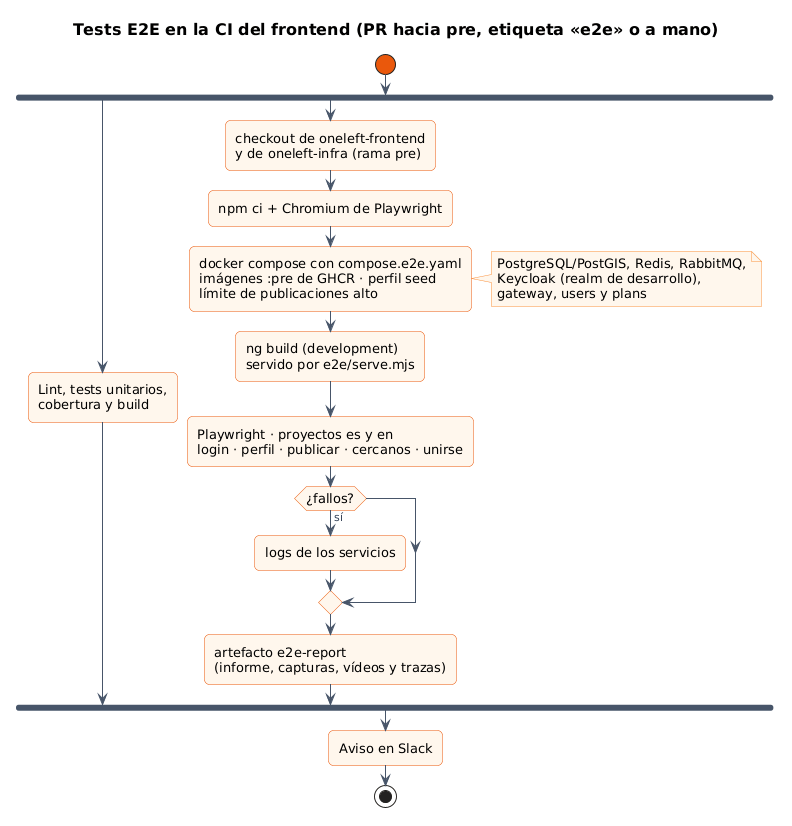
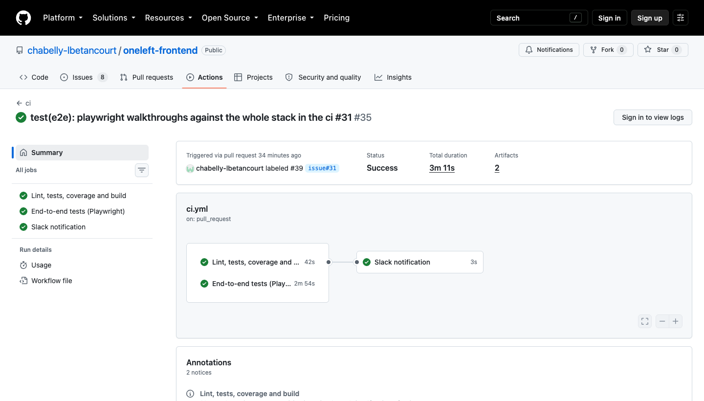
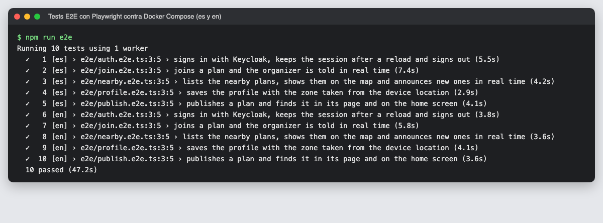
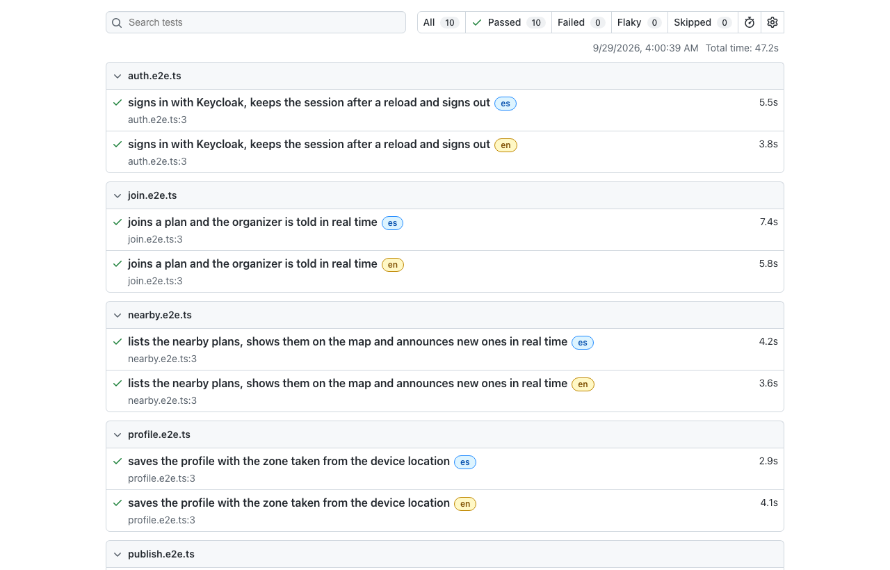
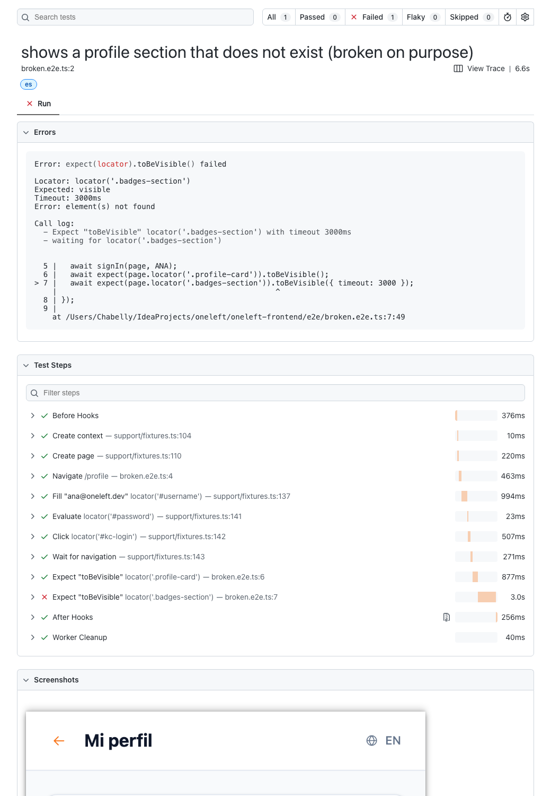

# 16 · Sprint 6: tests de extremo a extremo con Playwright

**Fecha:** 29/09/2026 (trabajo del Sprint 6 adelantado) · **Sprint:** 6 (09–15/11/2026)

## 1. Planificación

| Issue | Tipo | MoSCoW | Puntos | Resultado |
|---|---|---|---|---|
| frontend#31 · Tests E2E en la CI con Playwright | Tarea | Should | 5 | PR #39 y #41 |
| docs#34 · Documentación (sub-issue) | Tarea | Should | 1 | Esta entrada |

**Objetivo:** convertir los recorridos que hasta ahora se capturaban con Puppeteer para la memoria en tests
automáticos. Así cada promoción a `pre` comprueba la aplicación completa, y no solo cada pieza por separado.

## 2. Decisiones

| Decisión | Motivo |
|---|---|
| **Playwright** (`@playwright/test`) | Espera automática a los elementos, varios contextos de navegador en un mismo test (organizadora y participante a la vez), geolocalización simulada y captura, vídeo y traza de los fallos sin código extra |
| Tests contra el **stack real** (Docker Compose de `oneleft-infra`) | Recorren Keycloak, el gateway (con el límite de peticiones), los microservicios, RabbitMQ y los Server-Sent Events. Un fallo de integración entre servicios aparece aquí y no en `pre` |
| Un **proyecto por idioma** (`es`, `en`) | Los mismos 5 recorridos en los dos idiomas (10 tests). Los textos se leen de `public/i18n`, así que un test no se rompe al cambiar una traducción |
| Selectores por **rol y texto traducido** o por clases estables | `getByRole('button', { name: t('auth.login') })` comprueba a la vez que el texto está traducido |
| Datos creados por la API y **títulos únicos** | Cada test publica sus propios planes; no depende del orden ni de lo que haya dejado el seed |
| Usuarios del **realm de desarrollo** | Ninguna credencial en el repositorio del frontend; el test las lee de `oneleft-infra` |
| `e2e/compose.e2e.yaml` | Imágenes `:pre` de GHCR, solo el perfil `seed` (sin Loki) y el límite de publicaciones alto para que los tests no lo alcancen |
| Build de desarrollo servido por `e2e/serve.mjs` | Un servidor estático mínimo con *fallback* a `index.html`, sin dependencias. En local se reutiliza `ng serve` si está en marcha |

Los recorridos son:

1. **Login**: Keycloak, la sesión sobrevive a una recarga y se cierra.
2. **Perfil**: zona desde la ubicación del dispositivo y guardado.
3. **Publicar**: el plan aparece en su página y en «Tus próximos planes».
4. **Planes cercanos**: lista, mapa y aviso en tiempo real de un plan publicado con la página abierta.
5. **Unirse**: la organizadora, en otra sesión del navegador, recibe el aviso en tiempo real.

## 3. En la CI

*Figura 77. Job `e2e` del frontend. Fuente: [`22-tests-e2e-ci.puml`](../memoria/diagramas/src/22-tests-e2e-ci.puml).*

- Se ejecuta en las PR hacia `pre`, a mano (`workflow_dispatch`, eligiendo la etiqueta de las imágenes) y en
  cualquier PR con la etiqueta **`e2e`**. La etiqueta hizo falta para probar el propio job en su PR, que iba a `dev`.
- Corre en paralelo con el lint, los tests unitarios y el build: unos 3 minutos en total.

*Figura 78. Primera ejecución del job en la PR #39, en verde a la primera.*

## 4. Resultados

*Figura 79. Los 10 tests en local (47 s) contra las imágenes compiladas desde `dev`.*

*Figura 80. Informe HTML de Playwright, con la etiqueta del idioma de cada test.*

*Figura 81. Un test roto a propósito: error, pasos con su duración, captura de la pantalla y, más abajo, la traza y
el vídeo de la sesión. En la CI todo esto se descarga del artefacto `e2e-report`.*

## 5. Incidencias

- **Las imágenes de GHCR no se descargaban en local** (`denied`), aunque el paquete es público y con `curl`
  anónimo sí se podía. Docker enviaba unas credenciales antiguas de `ghcr.io`. En vez de tocarlas, el override
  admite `ONELEFT_IMAGES=oneleft/ ONELEFT_IMAGE_TAG=dev` para usar las imágenes compiladas en local.
- **La contraseña del usuario de prueba salía en el informe** (paso `Fill`). Ahora se escribe en la página con
  `evaluate`, que no aparece en los pasos (PR #41). La traza sigue guardando el formulario enviado, como cualquier
  traza de un login; son credenciales de desarrollo que ya están en el realm público, y los artefactos caducan a
  los 14 días.
- **Dos fallos falsos en local:** cambiar de rama con `ng serve` en marcha recompila y recarga la página en mitad
  del test. En la CI no ocurre porque se sirve un build fijo.
