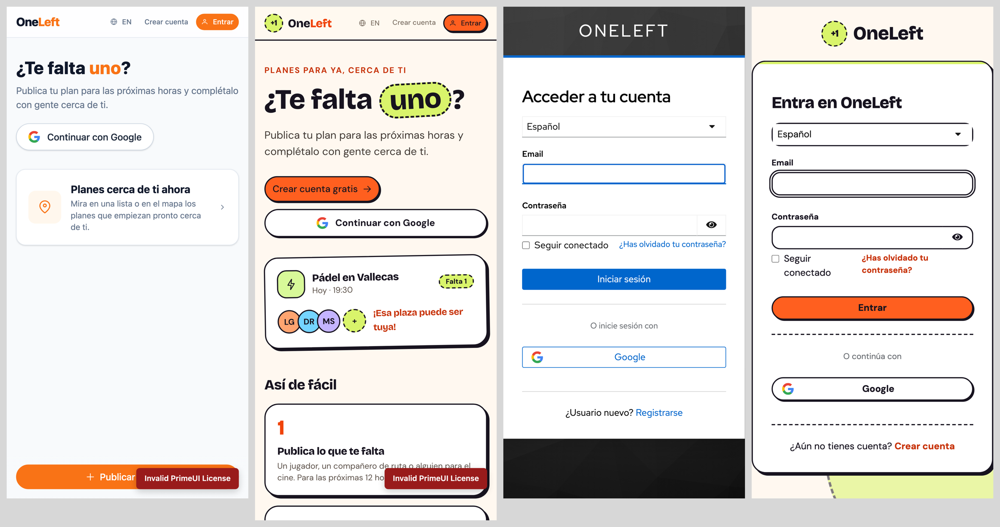
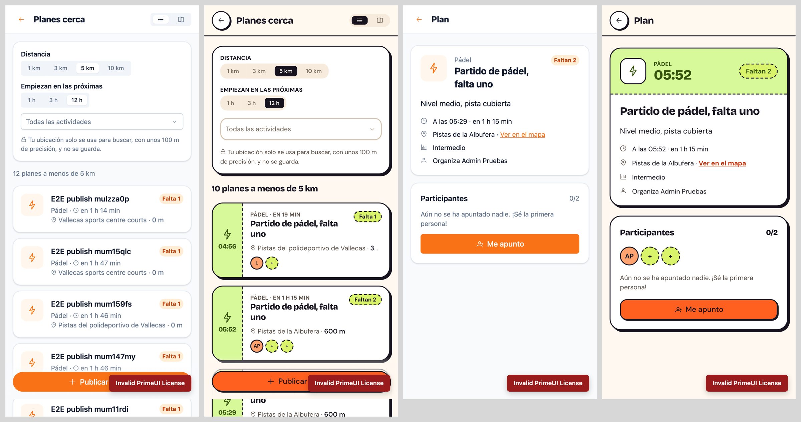
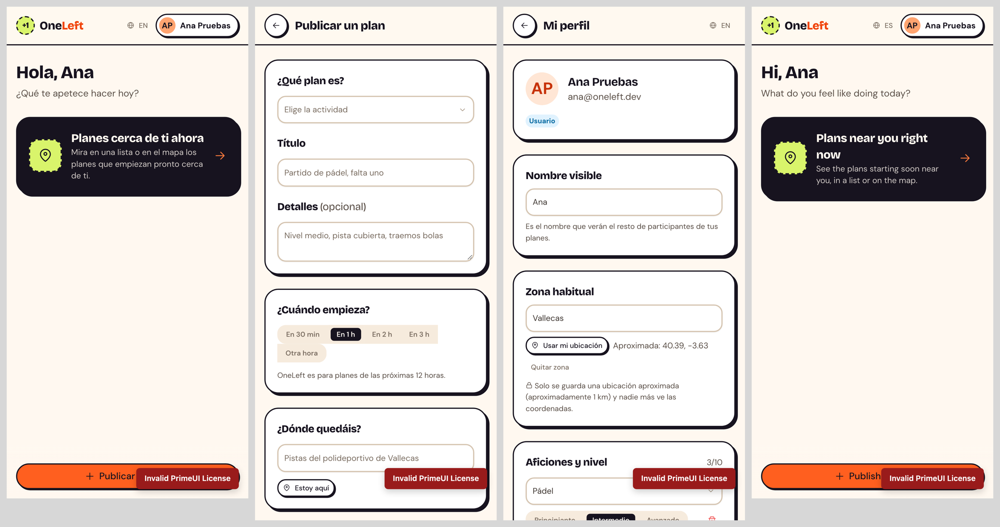
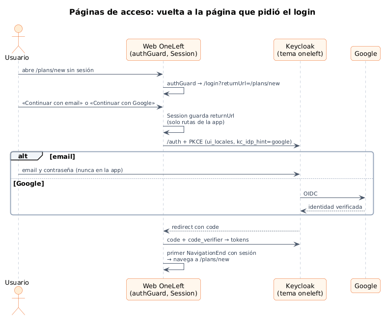
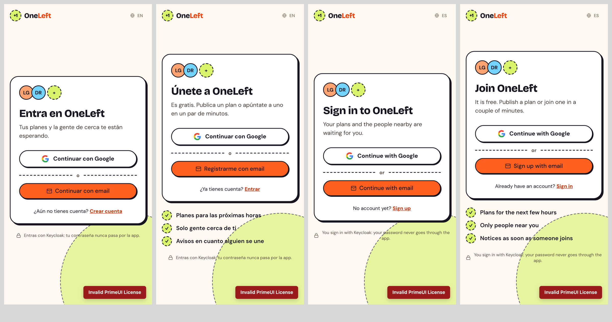
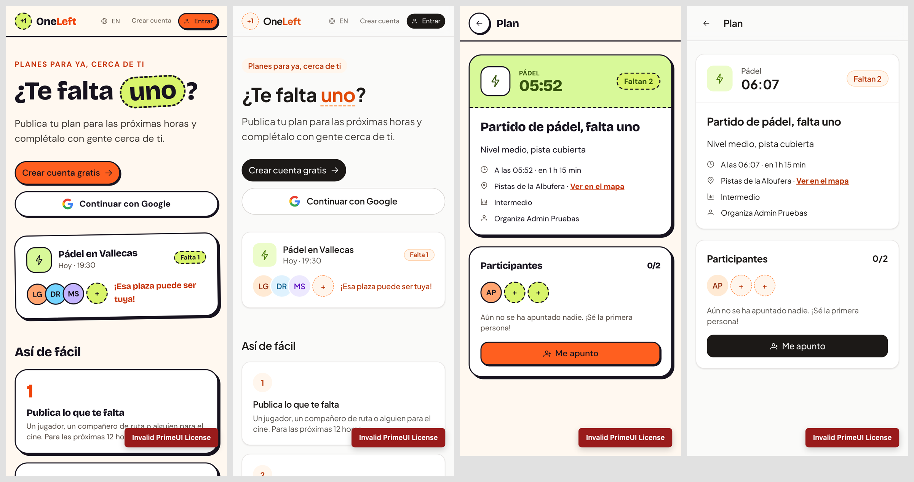
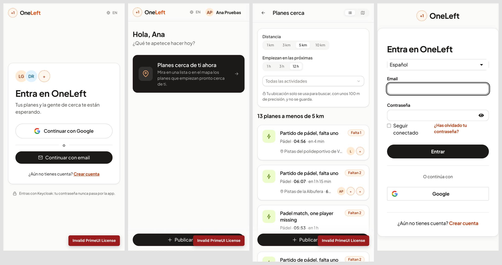

# 17 · Sprint 7: rediseño de la identidad visual y páginas de acceso

**Fecha:** 29/09/2026 (trabajo del Sprint 7 adelantado) · **Sprint:** 7 (16–22/11/2026)

## 1. Planificación

| Issue | Tipo | MoSCoW | Puntos | Resultado |
|---|---|---|---|---|
| frontend#42 · Clave de PrimeUI en el desarrollo local | Tarea | Must | 1 | PR #45 |
| frontend#43 · Rediseño de la identidad visual | Tarea | Should | 8 | PR #46 |
| frontend#44 · Páginas de inicio de sesión y registro | Historia | Should | 3 | PR #47 |
| infra#33 · Tema de Keycloak con la identidad de OneLeft (sub-issue) | Tarea | Should | 3 | PR #34 |
| docs#36 · Documentación (sub-issue) | Tarea | Should | 1 | Esta entrada |

**Motivo:** la web se veía genérica (el tema Aura de PrimeNG sin tocar) y el login era la pantalla estándar de
Keycloak, en negro, que parecía otra aplicación.

## 2. Sistema visual

| Pieza | Decisión | Motivo |
|---|---|---|
| Tipografía | **Bricolage Grotesque** (títulos) y **DM Sans** (texto) | Carácter deportivo y cercano; se sirven desde la app (`@fontsource`), sin CDN, para que Android funcione sin conexión |
| Color | Tinta `#17131f` sobre crema `#fff8f0`, **mandarina** para las acciones y **lima** para lo que falta | La mandarina es el naranja de la marca, más vivo; con texto en tinta el contraste es mayor que con blanco |
| Superficies | «Cromos»: borde de tinta de 2 px y sombra desplazada que se hunde al pulsar | Evoca una entrada o un cromo; da identidad sin imágenes |
| Elemento de marca | La **plaza libre**: círculo discontinuo lima | Es la idea de OneLeft («te falta uno»). Aparece en el logo, en la palabra «uno» del titular y en los huecos de cada plan |
| Actividades | Un color por actividad | Se distinguen de un vistazo en la lista y en el detalle |

Componentes compartidos nuevos:

- `BrandLogo`: el logo.
- `PageHeader`: la cabecera de las páginas interiores.
- `PlanTicket`: el plan como una entrada de partido, con la hora en la matriz.
- `SpotSlots`: quién está y cuántas plazas quedan.

Los ajustes de PrimeNG van **fuera de capas CSS**, porque PrimeNG inyecta su capa en tiempo de ejecución, después de
la hoja de estilos, y la suya ganaría.

*Figura 82. Antes y después de la portada sin sesión y del login de Keycloak.*

*Figura 83. Antes y después de «Planes cerca» y del detalle de un plan.*

*Figura 84. Inicio con sesión, publicar y perfil con el nuevo sistema (también en inglés).*

## 3. Páginas de acceso

- `/login` y `/register` con la identidad de OneLeft: «Continuar con Google», «Continuar con email» y enlace entre
  ambas; el registro muestra además qué ofrece la app.
- La **contraseña se sigue pidiendo solo en Keycloak** (Authorization Code + PKCE). Pedirla en la app obligaría al
  flujo *password grant*, desaconsejado en OAuth 2.1, y rompería Google y el login de Android en el navegador del
  sistema. Para que ese paso no parezca otra aplicación, Keycloak tiene un **tema propio** (`oneleft`, hereda de
  `keycloak.v2`) con las mismas tipografías, colores y logo.
- **Vuelta a la página de origen:** las páginas protegidas llevan a `/login?returnUrl=…`, `Session` guarda la ruta y
  la abre al volver de Keycloak. Solo acepta rutas de la app (nada de `https://…` ni `//…`), para no abrir una
  redirección a otros sitios.

*Figura 85. Acceso desde una página protegida. Fuente:
[`23-secuencia-paginas-acceso.puml`](../memoria/diagramas/src/23-secuencia-paginas-acceso.puml).*

*Figura 86. Entrar y crear cuenta, en español y en inglés.*

## 4. Pruebas

- 103 tests unitarios (97 % de sentencias). Hay tests nuevos para los componentes, los *guards*, la vuelta a la
  página de origen (incluidos los intentos de redirigir fuera) y el funcionamiento sin `sessionStorage`.
- Los 10 tests E2E pasan por la página nueva y comprueban que, tras el login, se vuelve a `/profile`,
  `/plans/new`, etc.

## 5. Licencia de PrimeUI

El aviso «Invalid PrimeUI License» de las capturas no se puede quitar desde el código: la licencia de PrimeNG 22
prohíbe eliminar sus mecanismos de licencia. Hace falta una clave de la *Community License* (gratuita para
estudiantes). Queda preparado:

- `npm start` y `npm run build` la leen de `PRIMEUI_LICENSE` o de un `.env` ignorado por Git (PR #45).
- La CI la lee del secreto con el mismo nombre.

**Actualización (29/09/2026, docs#46):** la autora obtuvo la *Community License* (tipo *dev*, válida hasta el
29/09/2027) y la configuró en el `.env` local y en el secreto `PRIMEUI_LICENSE` de `oneleft-frontend`. Las capturas
de HU-023 (figura 90) y HU-024 (figuras 94 y 95) se repitieron ya sin el aviso; las anteriores lo conservan.

## 6. Incidencias

- **El logo y los círculos de las personas no se pintaban.** En la misma etiqueta convivían `class="… {{ }}"` y
  `[class]`, y una anulaba a la otra. Ahora se usa una sola expresión.
- **Página de Keycloak en blanco.** En `keycloak.v2` el `<body>` tiene el id `keycloak-bg`; al ocultar «la imagen de
  fondo» se ocultaba la página entera.
- **Tras el login no se volvía a la página de origen.** La navegación se lanzaba antes que la navegación inicial del
  router, que la pisaba. Ahora espera al primer `NavigationEnd`.

## 7. Revisión: identidad sobria (frontend#48, infra#35)

Tras ver el resultado, la autora lo encontró **demasiado atrevido**: la app tenía que verse moderna, sobria y
cuidada, sin perder usabilidad ni identidad propia. Se mantiene la estructura (componentes, páginas de acceso,
tema de Keycloak) y cambia el lenguaje visual:

| Antes («cromo») | Ahora (sobrio) |
|---|---|
| Dos tipografías expresivas | Una sola, **Plus Jakarta Sans**, con pesos contenidos |
| Bordes de tinta de 2 px y sombra desplazada | Borde fino de 1 px y sombra suave |
| Botones mandarina con texto en tinta | Botones principales en **tinta con texto blanco** (contraste AA) |
| Lima y mandarina por todas partes, titular girado | El naranja solo como **acento**: logo, plazas libres, estados activos |
| Plaza libre como círculo lima grande | La plaza libre como **anillo discontinuo discreto** |

La identidad queda en detalles con sentido: el anillo «+1» del logo, los huecos de cada plan y la palabra «uno»
subrayada en el titular. Como las plantillas ya usaban utilidades propias (`sticker`, `slot`), bastó con
redefinirlas (`card`, `spot`) para que el cambio llegara a todas las pantallas.

*Figura 87. Portada y detalle de un plan: estilo «cromo» y versión sobria.*

*Figura 88. Entrar, inicio con sesión, planes cerca y login de Keycloak con la identidad sobria.*
