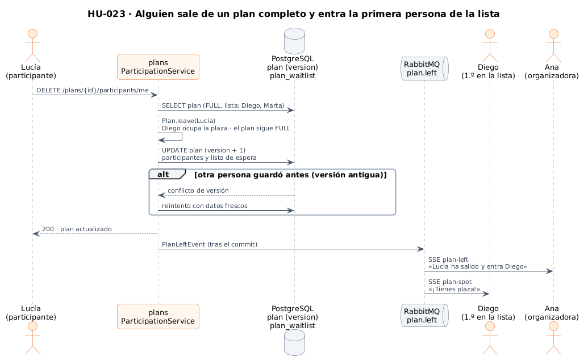
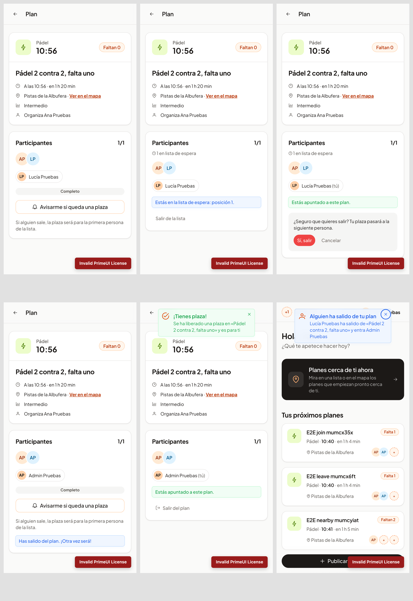

# 18 · Sprint 7: HU-023 Salir de un plan y lista de espera

**Fecha:** 29/09/2026 (trabajo del Sprint 7 adelantado) · **Sprint:** 7 (16–22/11/2026)

## 1. Planificación

| Issue | Tipo | MoSCoW | Puntos | Resultado |
|---|---|---|---|---|
| backend#43 · HU-023 Salir de un plan y lista de espera | Historia | Should | 5 | PR #86 |
| frontend#50 · HU-023 en la app (sub-issue) | Historia | Should | 3 | PR #51 |
| infra#37 · Tercera usuaria de prueba (sub-issue) | Tarea | Should | 1 | PR #38 |

**Objetivo:** que las plazas no se pierdan cuando alguien no puede ir. En un plan para dentro de unas horas, una
baja sin sustituto deja el plan cojo; la lista de espera lo rellena sola.

## 2. Decisiones

| Decisión | Motivo |
|---|---|
| Reglas en el agregado `Plan` (`leave`, `joinWaitlist`, `leaveWaitlist`) | Igual que `join` en HU-005: el dominio decide qué se puede hacer y los tests no necesitan base de datos |
| Al salir, la plaza pasa **automáticamente** a la primera persona de la lista | Es lo que da valor a la lista: nadie tiene que estar pendiente. Si nadie espera, la plaza queda libre y un plan `FULL` vuelve a `OPEN` (y a las búsquedas de cercanos) |
| Lista solo para planes completos y con un máximo de 10 | Con plazas libres se entra directamente (`409 plan.notFull`); el límite evita listas que nunca se llegan a mover |
| **Bloqueo optimista compartido** (`OptimisticPlanUpdates`) | Unirse, salir y la lista de espera cambian el mismo agregado. Se extrajo el reintento de HU-005 para que todas las operaciones compitan por la misma versión y las plazas nunca se desajusten |
| Evento `plan.left` publicado **tras el commit** | Una salida revertida no se anuncia nunca |
| Dos avisos distintos por el stream personal | `plan-left` a la organizadora (quién sale y quién entra) y `plan-spot` a quien consigue la plaza |
| Una sola conexión SSE por usuario en la web (`EventStream.openEvents`) | Con tres tipos de aviso, abrir una conexión por tipo triplicaría las conexiones del servidor |
| Confirmación antes de salir | Salir cede la plaza a otra persona y no se puede deshacer |

*Figura 89. Lucía sale de un plan completo, entra Diego y los dos avisos llegan en tiempo real. Fuente:
[`24-secuencia-lista-de-espera.puml`](../memoria/diagramas/src/24-secuencia-lista-de-espera.puml).*

## 3. En la app

*Figura 90. Arriba, el plan completo visto por Admin, que se apunta a la lista (posición 1), y Lucía confirmando que
sale. Abajo: Lucía ya fuera, Admin recibe «¡Tienes plaza!» y ya está dentro, y Ana, la organizadora, ve quién ha
salido y quién entra.*

## 4. Pruebas

- **Backend:** 76 tests en `plans` (100 % de líneas). Incluyen:
  - las reglas del agregado;
  - el servicio con conflictos simulados;
  - la persistencia (migración `V4__plan_waitlist.sql`);
  - un test de extremo a extremo con PostgreSQL y RabbitMQ reales: Lucía sale, entra Diego y los avisos llegan por SSE a la organizadora y a Diego.
- **Web:** 107 tests unitarios (96,8 % de sentencias) y dos E2E nuevos, salir y lista de espera, en los dos idiomas:
  12 E2E en total.
- La lista de espera necesita tres personas: se añadió `lucia@oneleft.dev` al realm de desarrollo
  (`sync-test-users.sh` la da de alta en un Keycloak en marcha sin tocar los demás usuarios).

## 5. Incidencias

- **Dos colecciones en el mismo agregado.** Hibernate no puede cargar dos `List` en el mismo *join*
  (`MultipleBagFetchException`). Participantes y lista de espera se cargan con consultas separadas
  (`@Fetch(FetchMode.SELECT)`) y por lotes.
- **Un plan completo decía «Faltan 0».** Ahora dice «Completo».
- **E2E contra una compilación antigua.** Sin `ng serve` en marcha, Playwright sirvió un `dist/` viejo. Hay que
  compilar antes (`npm run build -- --configuration development`), como hace la CI.
- **E2E en la CI.** Los tests nuevos necesitan el backend con HU-023, que aún no está en las imágenes `:pre`. Se
  ejecutarán en la próxima promoción a `pre`, después de promocionar el backend.
