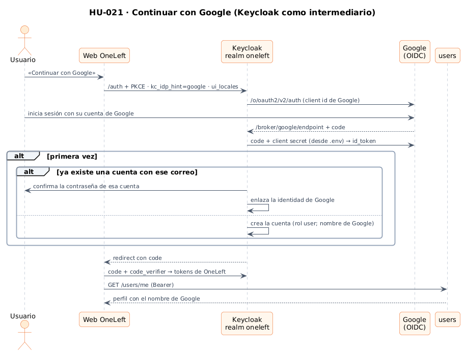
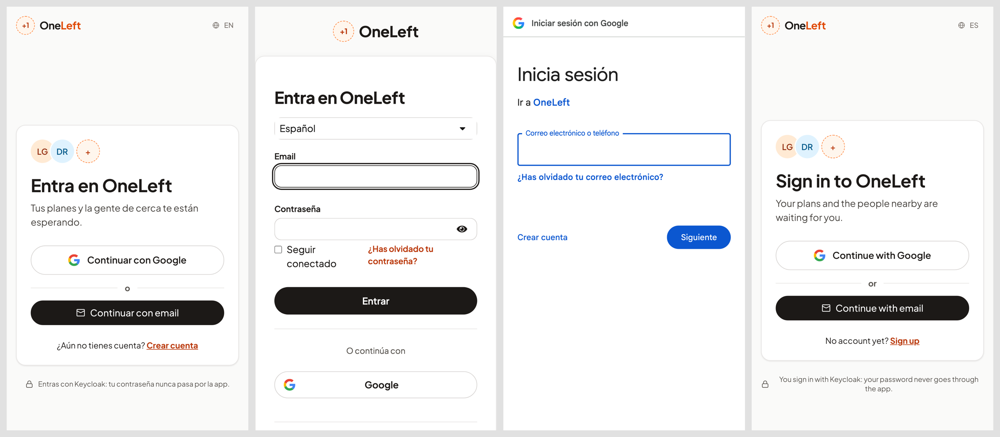

# 19 · HU-021: inicio de sesión con Google

**Fecha:** 29/09/2026 · **Sprints:** 5–6

## 1. Planificación

| Issue | Tipo | MoSCoW | Puntos | Resultado |
|---|---|---|---|---|
| infra#16 · HU-021 Inicio de sesión con Google | Historia | Should | 3 | PR #32 |
| frontend#14 · Continuar con Google en la web (sub-issue) | Historia | Should | 3 | PR #40; la parte de Android pasa a frontend#3 |

## 2. Decisiones

| Decisión | Motivo |
|---|---|
| **Keycloak como intermediario** (*identity brokering*) en lugar de hablar con Google desde la app | Los microservicios siguen validando un único emisor de tokens y los roles de OneLeft; la web y Android comparten el mismo flujo |
| `kc_idp_hint=google` | El botón «Continuar con Google» salta el formulario de Keycloak y va directo a Google |
| *Client id* y secreto por **variables de entorno** (`${GOOGLE_CLIENT_ID}` en el realm, `.env` en local) | El secreto nunca entra en el repositorio. Se comprobó en un Keycloak nuevo que la importación resuelve las variables |
| `sync-identity-providers.sh` | El realm solo se importa en el primer arranque; el script aplica el proveedor a un Keycloak en marcha **sin borrarlo**, así las cuentas enlazadas no se pierden |
| Primer acceso: cuenta nueva con rol `user` y nombre de Google | El servicio `users` crea el perfil con el claim `name`, así que no hizo falta tocar el backend |
| Mismo correo que una cuenta existente: se **confirma con su contraseña** y se enlaza | Es el flujo *first broker login* de Keycloak. Enlazar sin confirmar permitiría quedarse con una cuenta ajena controlando un correo en otro proveedor |
| App de Google Cloud en **modo prueba** con usuarios de prueba | Para el TFM basta y evita la verificación de Google. En producción habrá que registrar la URI de redirección del dominio |

*Figura 91. Continuar con Google con Keycloak como intermediario. Fuente:
[`25-secuencia-login-google.puml`](../diagramas/secuencia/src/25-secuencia-login-google.puml).*

## 3. Recorrido

*Figura 92. Página de entrada de OneLeft, login de Keycloak con su botón de Google, pantalla de Google para OneLeft y
la página de entrada en inglés.*

La autora completó el login con su cuenta de Google y volvió a OneLeft con la sesión iniciada y su nombre en la
cabecera y en el perfil. En Keycloak aparece la cuenta enlazada al proveedor `google` con el rol `user`. Esa pantalla
no se captura: contiene datos personales.

## 4. Seguridad

- El secreto de Google se compartió una vez por el chat de trabajo; se recomienda **regenerarlo** en Google Cloud y
  actualizar el `.env` (`sync-identity-providers.sh` lo aplica).
- Ni el *client id* ni el secreto aparecen en ningún commit (comprobado en el historial).

## 5. Pendiente

**Android:** en la app nativa, el login tiene que abrirse en el navegador del sistema (Google no permite OAuth en un
WebView) y volver por *deep link*. Pasa a frontend#3, la tarea de Capacitor, que está aparcada.
