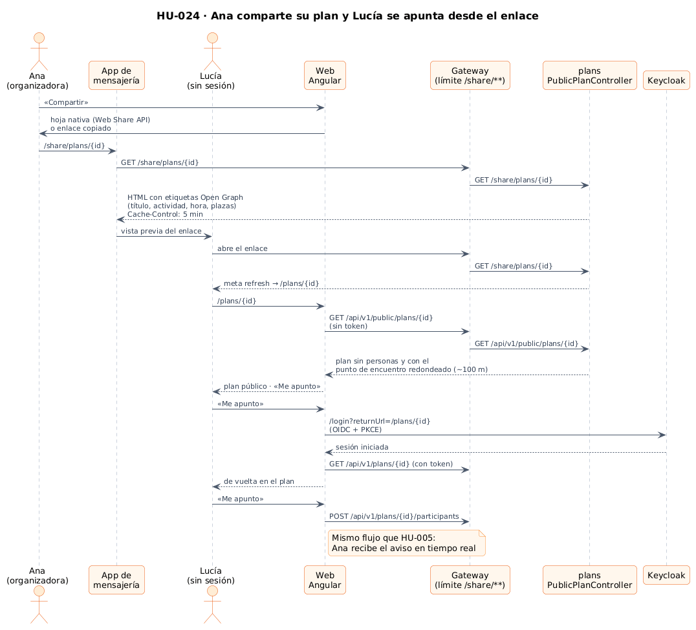
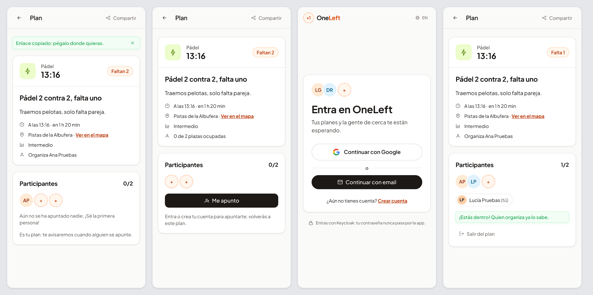
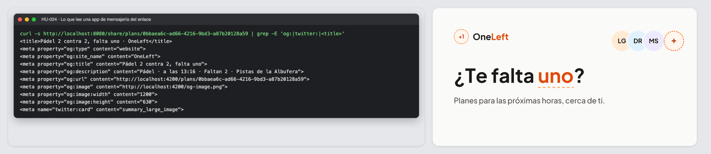

# 20 · Sprint 7: HU-024 Compartir un plan por enlace

**Fecha:** 29/09/2026 (trabajo del Sprint 7 adelantado) · **Sprint:** 7 (16–22/11/2026)

## 1. Planificación

| Issue | Tipo | MoSCoW | Puntos | Resultado |
|---|---|---|---|---|
| backend#44 · HU-024 Compartir un plan por enlace | Historia | Should | 3 | PR #87 |
| frontend#52 · HU-024 en la app (sub-issue) | Historia | Should | 2 | PR #53 |
| docs#44 · Documentar HU-024 (sub-issue) | Tarea | Should | 1 | esta entrada |

**Objetivo:** que un plan llegue también a quien todavía no usa OneLeft. Quien organiza ya tiene grupos de
mensajería con amigos; un enlace con buena vista previa es la forma más rápida de encontrar a «uno» que falte.

## 2. Decisiones

| Decisión | Motivo |
|---|---|
| Dos rutas públicas en `plans`: `GET /api/v1/public/plans/{id}` (JSON) y `GET /share/plans/{id}` (HTML) | Las apps de mensajería no ejecutan JavaScript: para la vista previa necesitan HTML con etiquetas Open Graph generado en el servidor. La web, en cambio, necesita los datos en JSON |
| La vista pública **no incluye personas** y **redondea el punto de encuentro a unos 100 m** | Un enlace puede acabar en cualquier grupo. Basta con saber qué, cuándo, dónde más o menos y cuántas plazas quedan; los nombres y el sitio exacto se ven al iniciar sesión |
| La página del enlace redirige a la web con `meta refresh` | Funciona sin JavaScript y los *crawlers* se quedan con las etiquetas, sin seguir la redirección |
| Vista previa en español si el cliente no pide idioma | Los *crawlers* suelen no enviar `Accept-Language`; el español es el idioma principal de la app. Con `Accept-Language: en`, en inglés |
| `Cache-Control: public, max-age=300` en la página del enlace | Las plazas cambian: la vista previa puede cachearse, pero poco tiempo |
| Límite por IP en el gateway para `/share/**` (60/min) | Es una ruta sin sesión: se protege igual que las demás (ver [14 · Límite de peticiones](14-limite-de-peticiones.md)) |
| Valores escapados en el HTML | El título lo escribe cualquier persona: sin escapar, un título con `"><script>` inyectaría código en la página |
| `/plans/:id` deja de exigir sesión en la web | El enlace abre la misma página del plan; sin sesión muestra la vista pública y el botón «Me apunto» lleva al login con `returnUrl` para volver al plan |
| «Compartir» usa la hoja nativa (Web Share API) y, si no existe, copia el enlace | En el móvil aparecen directamente WhatsApp, Telegram, etc. En el escritorio basta con pegar |
| Un plan completo también ofrece «Avisarme si queda una plaza» al invitado | Sin esto, quien abría el enlace de un plan completo no podía hacer nada |

*Figura 93. Ana comparte su plan, la app de mensajería genera la vista previa y Lucía, sin sesión, abre el plan,
inicia sesión y se apunta. Fuente:
[`26-secuencia-compartir-enlace.puml`](../diagramas/secuencia/src/26-secuencia-compartir-enlace.puml).*

## 3. En la app

*Figura 94. De izquierda a derecha: Ana pulsa «Compartir» (en un navegador sin hoja nativa, el enlace se copia);
Lucía abre el enlace sin sesión y ve el plan sin nombres, con «0 de 2 plazas ocupadas»; «Me apunto» la lleva a
iniciar sesión; y vuelve al plan, donde ya está dentro.*

*Figura 95. Lo que lee una app de mensajería del enlace: etiquetas Open Graph con la actividad, la hora, las plazas
y el lugar, y la imagen `og-image.png` (1200 × 630) que aparece en la vista previa.*

## 4. Pruebas

- **Backend:**
  - 81 tests en `plans` (99,8 % de líneas). Los 5 nuevos cubren la vista pública sin personas y con el punto
    redondeado, la página Open Graph en los dos idiomas, el escape del HTML y el plan inexistente (404 con una
    página que lleva al inicio).
  - 16 tests en `gateway`. Los 2 nuevos comprueban que las dos rutas públicas funcionan sin token y que solo la
    lectura es pública (un `POST` a la ruta pública o el detalle normal de un plan siguen pidiendo sesión).
- **Web:**
  - 111 tests unitarios (96,8 % de sentencias): vista de invitado, login con vuelta al plan (también desde la lista
    de espera) y compartir con la hoja nativa, cancelándola y copiando el enlace.
  - E2E nuevo `share.e2e.ts` en los dos idiomas: vista previa, plan sin sesión, login y apuntarse. **16 E2E** en total.

## 5. Incidencias

- **Tres E2E dependían del `authGuard`.** Unirse, salir y lista de espera abrían `/plans/:id` sin sesión y
  esperaban la redirección al login. Con la página pública, ahora inician sesión desde el botón del invitado, que
  es justo el recorrido de quien llega por un enlace.
- **E2E contra una compilación antigua (otra vez).** Los E2E sirven `dist/`: tras cambiar una plantilla hay que
  recompilar (`npm run build -- --configuration development`) antes de lanzarlos. Ya estaba anotado en la
  [entrada 18](18-hu023-salir-y-lista-de-espera.md).
- **Abrir el enlace en la app Android** (App Links) queda para frontend#3, con el resto de la app móvil.
