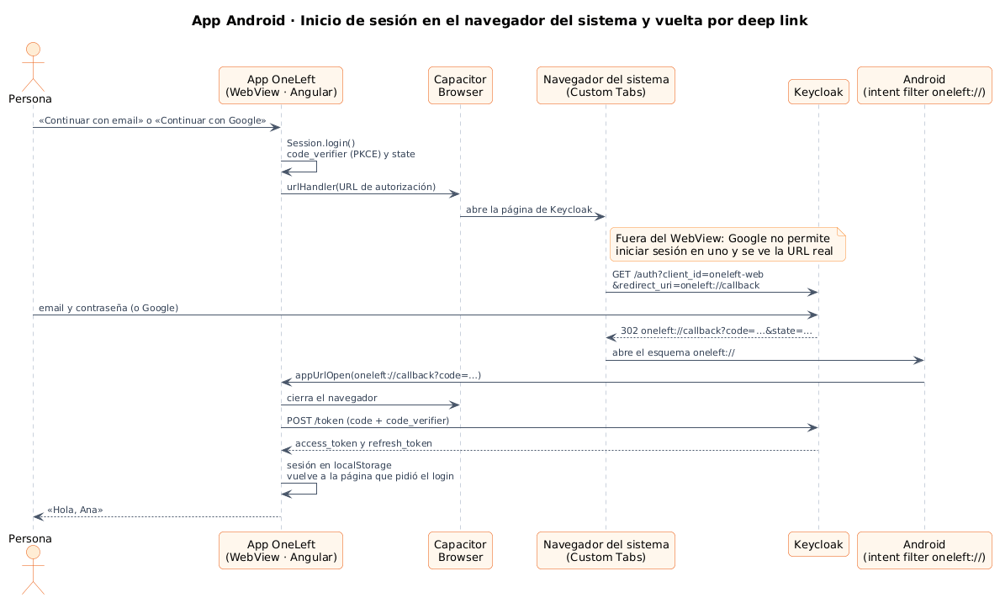
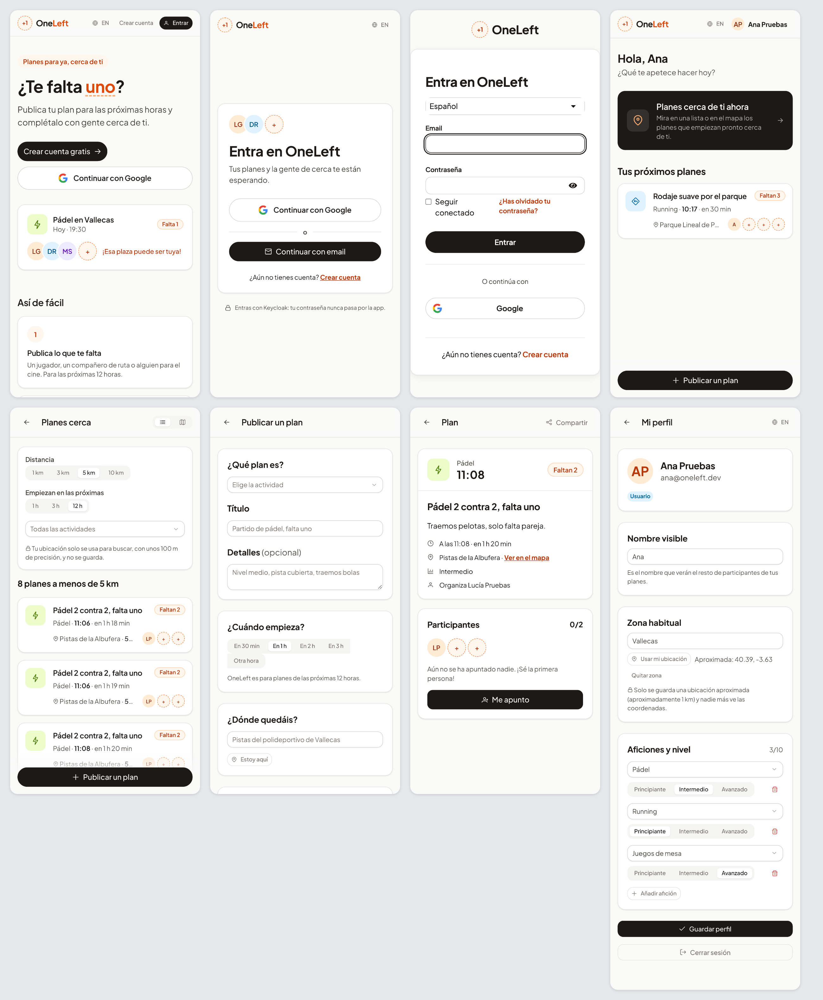
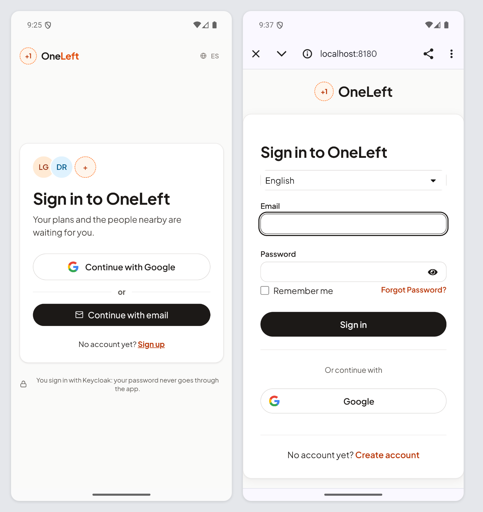
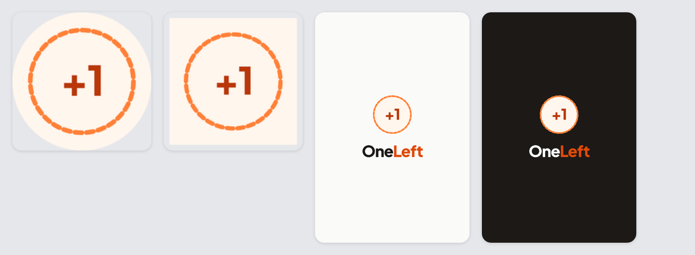

# 22 · Sprint 5: la app Android con Capacitor

**Fecha:** 28–30/09/2026 · **Sprint:** 5

## 1. Planificación

| Issue | Tipo | MoSCoW | Puntos | Resultado |
|---|---|---|---|---|
| frontend#3 · Integrar Capacitor y generar el APK de Android | Tarea | Must | 5 | PR #56 |
| docs#51 · Documentar la app Android (sub-issue) | Tarea | Should | 1 | esta entrada |
| frontend#55 · Notificaciones push con la app cerrada | Historia | Could | 5 | Backlog (Sprint 12) |

**Objetivo:** que OneLeft sea también una app de Android que **replica la web**: el mismo código Angular, empaquetado
con Capacitor, con las mismas historias de usuario. Lo nativo se limita a lo que el WebView no puede hacer bien.

## 2. Decisiones

| Decisión | Motivo |
|---|---|
| **Capacitor 8** sobre la misma compilación de Angular | Un solo código para web y Android; la app se sirve desde `https://localhost` dentro del WebView |
| Login, registro, Google y cierre de sesión en el **navegador del sistema** (Custom Tabs) | Google no permite iniciar sesión en un WebView incrustado, y la persona ve la URL real de Keycloak. La librería OIDC recibe un `urlHandler` que abre la URL con `@capacitor/browser` |
| Vuelta a la app por el ***deep link*** `oneleft://callback` | *Intent filter* en el manifiesto; el realm de Keycloak admite `oneleft://*` como redirección. La app cierra el navegador y canjea el código con PKCE, igual que la web |
| Sesión en `localStorage` dentro de la app | En la web vive en `sessionStorage`; en Android se perdería al cerrar la app |
| **Compartir** con `@capacitor/share` | El WebView de Android no implementa la Web Share API: sin el plugin solo se copiaba el enlace |
| Ubicación con la API del navegador | El WebView de Capacitor pide el permiso de Android (declarado en el manifiesto); no hace falta un plugin |
| `adb reverse` de los puertos 8080 y 8180 en desarrollo | El emulador o el móvil ven `localhost` como el Mac: la misma configuración que la web local |
| Icono y pantalla de arranque **generados** desde `assets/` | `scripts/generate-app-assets.mjs` dibuja en SVG el «hueco libre» (anillo discontinuo con «+1») con los colores y la tipografía de la app, y `@capacitor/assets` produce todas las densidades. Se pueden regenerar si cambia la identidad |
| Notificaciones push a un issue aparte (frontend#55) | Necesitan un proyecto de Firebase y un servicio de notificaciones en el backend que aún no existe |

*Figura 96. Inicio de sesión en la app Android: Keycloak se abre en el navegador del sistema y vuelve a la app por
`oneleft://callback`. Fuente:
[`27-secuencia-login-android.puml`](../memoria/diagramas/src/27-secuencia-login-android.puml).*

## 3. En la app

*Figura 97. Las pantallas a tamaño de móvil (Pixel 7, español), las mismas en la web y en la app: portada, acceso,
Keycloak con el tema de OneLeft, inicio de Ana, planes cercanos a Vallecas, publicar, un plan con «Compartir» y
«Me apunto», y el perfil.*

*Figura 98. La app instalada en un emulador Android (Pixel 7, API 36, en inglés): la página de acceso dentro de la
app y, al pulsar «Continue with email», Keycloak en el navegador del sistema (`localhost:8180`).*

*Figura 99. Icono adaptativo (redondo y cuadrado) y pantallas de arranque clara y oscura.*

## 4. Pruebas

- **Unitarias:** 118 tests, entre ellos el login en Custom Tabs (también con Google) y compartir con la hoja nativa
  simulando Android.
- **APK:** el job *Android APK* de la CI compila la web con la licencia de PrimeUI, la copia al proyecto Android y
  sube el APK de depuración como artefacto. En la PR #56 pasó en verde y publicó `oneleft-android-production`
  (5,4 MB comprimido).
- **Emulador:** el APK se instaló en un Pixel 7 con API 36. La portada y la página de acceso cargan contra el backend
  local y Keycloak se abre en Custom Tabs con el tema de OneLeft.
- **Pantallas a tamaño móvil:** recorrido con Chrome emulando un Pixel 7
  (`cap-android-web`): se publica un plan de Lucía en Vallecas, Ana inicia sesión y se recorren las ocho pantallas.

**Pendiente:** completar en el emulador el inicio de sesión y confirmar la vuelta a la app por
`oneleft://callback`. Por eso la PR #56 está en borrador.

## 5. Incidencias

- **Conflictos al actualizar la rama.** La rama llevaba desde el Sprint 5 y en `dev` habían entrado el rediseño,
  Google, HU-023 y HU-024. En `session.ts` se combinaron las dos cosas: la vuelta a la página que pidió el login
  (`returnUrl`) y el `urlHandler` de la app, que ahora también usan Google y el registro.
- **Pantalla en blanco al abrir la app.** El primer pintado del WebView en el emulador tarda más de 15 s; no era un
  fallo. La inspección con las DevTools de Chrome (`adb forward` al socket `webview_devtools_remote_<pid>`) mostró
  que la página estaba completa.
- **El login no avanzaba.** La librería OIDC no podía descargar la configuración de Keycloak: Docker se había parado
  al reiniciar el Mac. Con el stack levantado, Keycloak se abrió en Custom Tabs.
- **Texto mal escrito por `adb`.** `adb shell input text` pierde caracteres con el teclado del emulador; los datos de
  prueba se escriben a mano o en las pruebas con Playwright.
- **Licencia de PrimeUI en Android.** El script `android:local` compilaba con `ng build` y se saltaba la licencia;
  ahora usa `npm run build`, igual que la CI.
