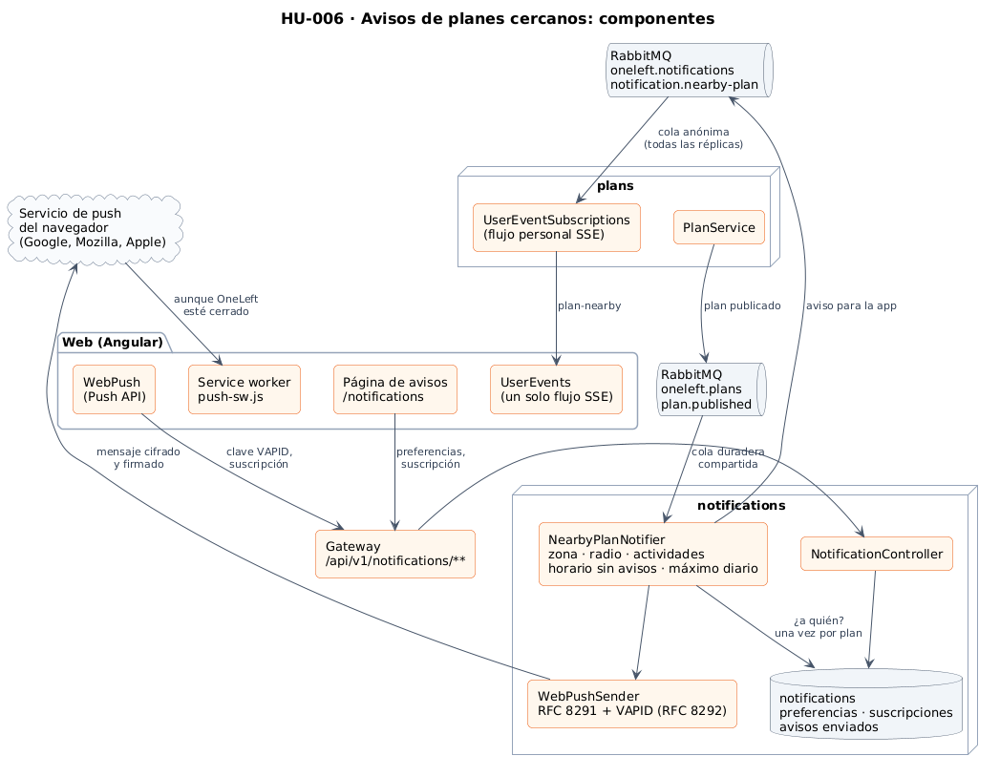
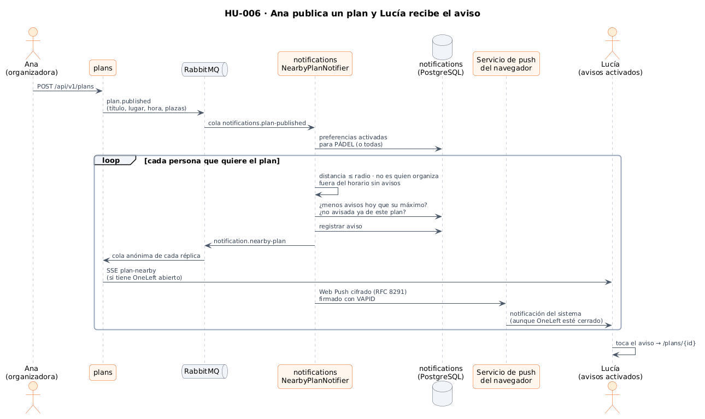
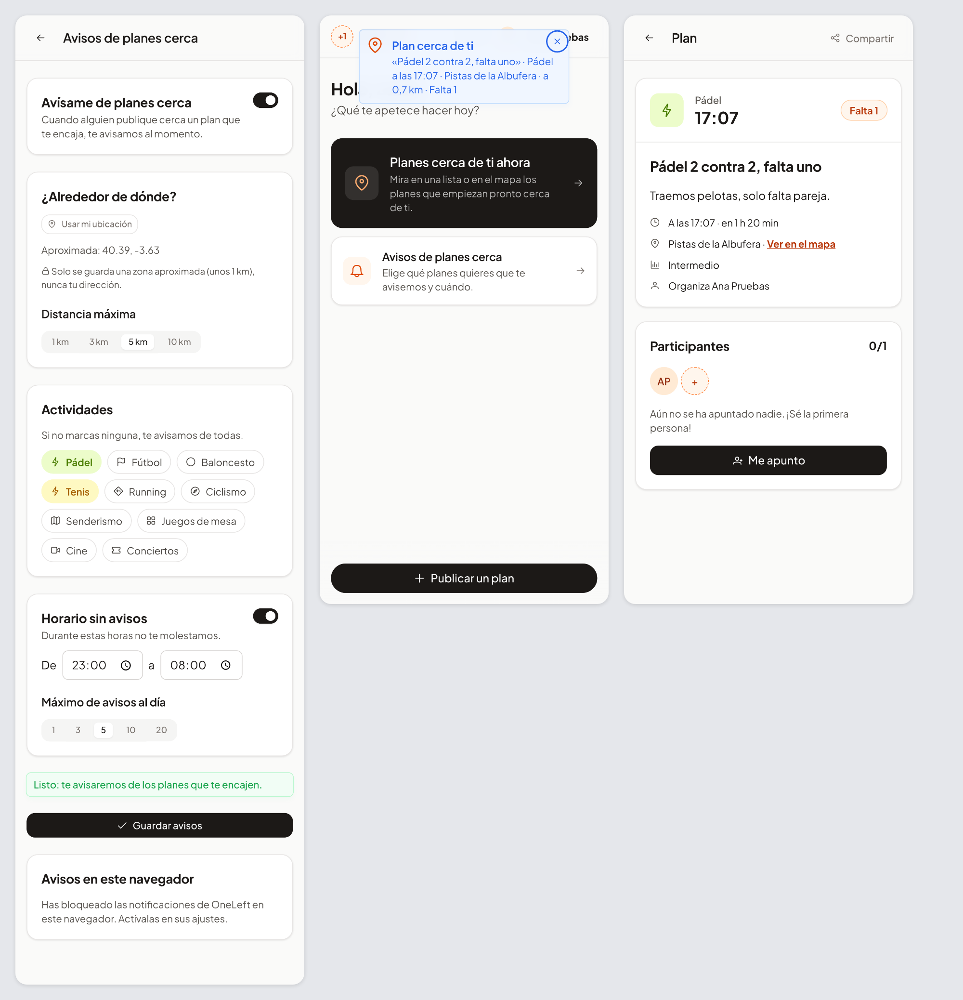

# 23 · Sprint 7: HU-006 Avisos de planes cercanos

**Fecha:** 30/09/2026 (trabajo del Sprint 7 adelantado) · **Sprint:** 7 (16–22/11/2026)

## 1. Planificación

| Issue | Tipo | MoSCoW | Puntos | Resultado |
|---|---|---|---|---|
| backend#9 · HU-006 Avisos de planes cercanos | Historia | Must | 8 | PR #96 |
| frontend#58 · Avisos en la app (sub-issue) | Historia | Must | 5 | PR #59 |
| infra#41 · Servicio notifications y claves VAPID (sub-issue) | Tarea | Must | 2 | PR #42 |
| docs#53 · Documentar HU-006 (sub-issue) | Tarea | Should | 1 | esta entrada |
| frontend#55 · Notificaciones push en Android | Historia | Could | 5 | Backlog (Sprint 12) |

**Objetivo:** que un plan con plazas libres llegue sin esperar a quien puede ocupar la plaza: la persona que vive
cerca y le gusta esa actividad. Es la pieza que da sentido a «planes para las próximas horas».

Se hizo **por fases** (decisión de la autora): en esta, el aviso dentro de la app y las notificaciones del
navegador (Web Push). Las notificaciones de Android necesitan un proyecto de Firebase y van en frontend#55.

## 2. Decisiones

| Decisión | Motivo |
|---|---|
| Servicio nuevo **`notifications`**, hexagonal y con su base de datos | Avisar es un contexto propio (preferencias, historial de avisos, suscripciones de navegadores); `plans` no tiene por qué saber a quién interesa cada plan |
| Los avisos se **activan a mano** (desactivados por defecto) | Nadie recibe avisos que no ha pedido. La zona se guarda aproximada (unos 1 km), como la del perfil |
| Preferencias propias en `notifications` y no las del perfil | El servicio no depende de `users`. La web propone la zona del perfil con un botón, pero es la persona quien decide |
| Reglas en el dominio: distancia ≤ radio, actividad elegida (ninguna = todas), fuera del horario sin avisos, por debajo del máximo diario, nunca a quien organiza | Se prueban sin base de datos ni red. El horario y el día siguen la hora local (Europe/Madrid, reloj inyectable) |
| **Una vez por plan** y persona (clave primaria en `sent_notice`) | Aunque el evento llegue dos veces, nadie recibe el mismo aviso repetido |
| `plan.published` en una **cola duradera compartida** por todas las réplicas | Cada plan se procesa una sola vez y los que se publiquen con el servicio parado se procesan al volver |
| El aviso de la app viaja **por el flujo en tiempo real que la web ya tiene abierto** con `plans` (evento `plan-nearby`) | Una sola conexión por persona para todos los avisos. `plans` lo recibe por una cola anónima, así que llega a la réplica donde esté conectada la persona |
| El evento `plan.published` lleva título y lugar | El aviso los necesita y así `notifications` no tiene que preguntar a `plans` |
| Cada servicio lee el JSON de los eventos **en sus propias clases** | El contrato son los campos, no las clases Java; el conversor deduce el tipo del listener |
| **Web Push implementado con el JDK**: cifrado `aes128gcm` (RFC 8291) y firma VAPID (RFC 8292) | Las librerías disponibles arrastran BouncyCastle y Apache HttpClient 4, o llevan tiempo sin publicarse. La implementación se **comprueba byte a byte con el ejemplo de la propia RFC 8291** |
| El texto de la notificación del sistema lo escribe el servidor en el idioma de la suscripción | La notificación se muestra con OneLeft cerrado, sin los ficheros de traducción de la web |
| Suscripciones caducadas (404/410 del servicio de push) se borran | Si alguien retira el permiso o borra los datos del navegador, no se le vuelve a intentar |
| Claves VAPID en `.env` (`generate-vapid-keys.sh`) y nunca en el repositorio | Son el secreto que firma los avisos. Sin ellas el servicio funciona, pero los avisos solo llegan con la app abierta |
| El permiso del navegador se pide **solo al pulsar** «Recibir avisos aunque OneLeft esté cerrado» | Pedirlo al entrar es molesto y los navegadores lo penalizan |

*Figura 100. Componentes de HU-006: `notifications` escucha los planes publicados, decide a quién avisar y entrega
el aviso por el flujo en tiempo real de `plans` y por el servicio de push del navegador. Fuente:
[`28-componentes-avisos.puml`](../memoria/diagramas/src/28-componentes-avisos.puml).*

*Figura 101. Ana publica un pádel en Vallecas y Lucía, que tiene los avisos activados, lo recibe en la app y como
notificación del sistema. Fuente:
[`29-secuencia-aviso-plan-cercano.puml`](../memoria/diagramas/src/29-secuencia-aviso-plan-cercano.puml).*

## 3. En la app

*Figura 102. A la izquierda, la página de avisos de Lucía: zona aproximada, 5 km, pádel y tenis, sin avisos de 23:00
a 08:00 y como mucho 5 al día. En el centro, el aviso que le llega en cuanto Ana publica un pádel cerca («a 0,7 km ·
Falta 1»). A la derecha, el plan que se abre al tocarlo. La tarjeta «Avisos en este navegador» aparece como
bloqueada porque las capturas se hacen con Chrome sin interfaz, que no admite notificaciones del sistema.*

## 4. Pruebas

- **notifications:** 41 tests (92,5 % de líneas y 85,7 % de ramas):
  - las reglas de preferencias y horario sin avisos;
  - `NearbyPlanNotifier` con dobles en memoria (a quién, horario, límite diario, una vez por plan, planes pasados o
    completos, suscripciones caducadas, sin Web Push);
  - el cifrado contra el **ejemplo de la RFC 8291** y una prueba de ida y vuelta que descifra como el navegador;
  - la firma VAPID y el envío (cabeceras, caducidad del mensaje, respuestas 404/410/429);
  - de extremo a extremo con PostgreSQL y RabbitMQ reales: la API y un `plan.published` con la cabecera de tipo de
    `plans` que termina en un solo aviso para quien lo pidió.
- **plans:** 84 tests; el aviso de `notifications` llega al flujo de la persona por RabbitMQ.
- **gateway:** 18 tests; la ruta de avisos exige sesión y su OpenAPI aparece en Swagger UI.
- **Web:** 133 tests unitarios (96,8 % de sentencias), con la Push API del navegador simulada, y un E2E nuevo en los
  dos idiomas: Lucía recibe el aviso cuando Ana publica y al tocarlo abre el plan, y Admin guarda sus preferencias.
  **20 E2E** en total.
- **Stack local:** `generate-vapid-keys.sh` genera un par válido (la clave pública se deriva de la privada) y el
  servicio publica la clave; Ana publica y a Lucía le llega el aviso en tiempo real con título, lugar, hora, plazas y
  distancia.

## 5. Incidencias

- **Faltaba `RestClient.Builder`.** En Spring Boot 4 el cliente REST autoconfigurado está en su propio *starter*
  (`spring-boot-starter-restclient`).
- **Las colas anónimas se borran solas.** En el test de integración, una `AnonymousQueue` desaparecía al retirar el
  primer consumidor. Se usa una cola exclusiva que no se autoelimina.
- **El seed avisaba a personas que no existen.** Se copiaron los ids de Lucía y Diego del seed de `plans`, que son
  organizadoras ficticias de los planes de demostración y nunca inician sesión. El seed usa ahora a Lucía y Admin
  del realm, y la prueba en el stack lo detectó (el servicio decía «2 personas avisadas», pero no llegaba nada).
- **Actividades ilegibles.** Diez actividades en un `SelectButton` quedaban en una fila apretada en el móvil; se
  cambiaron por *chips* con el icono y el color de cada actividad, como en la portada.
- **El límite diario en los E2E.** Cada test publica planes junto a Lucía; para repetir la batería muchas veces el
  mismo día contra el mismo stack hay que vaciar la base de datos de `notifications`. En la CI el stack es nuevo en
  cada ejecución.
