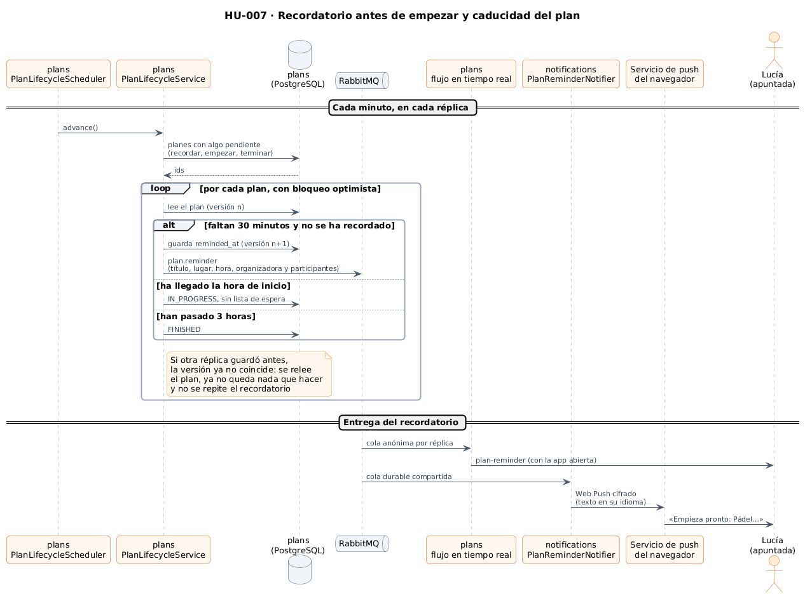

# 25 · Sprint 12: HU-007 Caducidad automática de planes y recordatorio

**Fecha:** 03/10/2026 · **Sprint:** 12 (02–08/10/2026)

## 1. Planificación

| Issue | Tipo | MoSCoW | Puntos | Resultado |
|---|---|---|---|---|
| backend#10 · HU-007 Caducidad automática de planes | Historia | Must | 3 | PR #104 |
| frontend#71 · Recordatorio y estado del plan en la app (sub-issue) | Historia | Must | 1 | PR #72 |
| docs#71 · Documentación (sub-issue) | Tarea | Must | 1 | esta entrada |

**Objetivo:** que solo se vean planes vigentes y que nadie se olvide del plan al que se apuntó. Hasta ahora las
búsquedas ya ocultaban los planes que habían empezado, pero su estado se quedaba en «abierto» para siempre.

## 2. Decisiones

| Decisión | Motivo |
|---|---|
| El ciclo de vida sigue el **diagrama de estados del anteproyecto**: abierto o completo → **en curso** a la hora de inicio → **terminado** | Ya estaba diseñado; ahora el dominio lo aplica (`Plan.advance`) |
| Un plan se da por terminado **3 horas después de empezar** (`Plan.DURATION`) | Los planes no tienen hora de fin y pedirla complicaría publicar. 3 horas cubren un partido, una película o un concierto; si hace falta, se puede añadir la duración al publicar |
| Al empezar se **vacía la lista de espera** | Ya nadie puede entrar: mantenerla daría esperanzas falsas |
| **Recordatorio 30 minutos antes** a quien organiza y a los participantes, en la app y como notificación del navegador | Media hora da tiempo a llegar. Llega aunque la app esté cerrada, con el Web Push de HU-006 |
| Sin recordatorio para los planes publicados con menos de 30 minutos de margen | Todos acaban de enterarse: el aviso sería ruido |
| El recordatorio no respeta el horario sin avisos ni el máximo diario | Es un plan propio, no una sugerencia: perderlo es peor que recibirlo |
| Una **tarea cada minuto** en `plans` busca los planes con algo pendiente y los avanza **uno a uno con bloqueo optimista** | Con varias réplicas, solo una guarda cada cambio; las demás releen el plan, ya no tienen nada que hacer y no repiten el recordatorio. Sin herramientas de bloqueo distribuido |
| El recordatorio viaja como evento `plan.reminder`: `plans` lo lleva al flujo en tiempo real de cada persona y `notifications` lo envía por Web Push desde su **cola durable** | Las dos piezas existían desde HU-005 y HU-006; solo cambia el evento |
| Índice parcial `plan_lifecycle` sobre los planes que aún se mueven | La consulta se ejecuta cada minuto; los planes terminados, que serán la mayoría, quedan fuera del índice |
| En los tests la tarea no se ejecuta sola | Cada test controla el tiempo con su propio reloj |

*Figura 100. Ciclo de vida de un plan con los tiempos de HU-007. Fuente:
[`04-estados-plan.puml`](../diagramas/estados/src/04-estados-plan.puml).*

*Figura 101. Cada minuto, cada réplica avanza los planes pendientes; el bloqueo optimista evita recordatorios
repetidos. El recordatorio llega por el flujo en tiempo real y por Web Push. Fuente:
[`31-secuencia-recordatorio.puml`](../diagramas/secuencia/src/31-secuencia-recordatorio.puml).*

## 3. En la app

- Aviso «Tu plan empieza pronto»: «Pádel 2 contra 2» empieza a las 19:30 en Pistas de la Albufera. Al tocarlo se
  abre el plan. Con la app cerrada llega como notificación del navegador, en el idioma de la suscripción.
- El detalle de un plan en curso, terminado o cancelado muestra su estado en lugar de las plazas libres y ya no
  ofrece unirse, salir ni la lista de espera.

## 4. Pruebas

- **Dominio** (`PlanLifecycleTest`, 7 tests): las transiciones, el paso directo a terminado de un plan muy antiguo,
  la lista de espera vacía al empezar, el recordatorio una sola vez y los planes publicados dentro del margen.
- **Aplicación** (`PlanLifecycleServiceTest`): recordar, empezar y terminar cada plan una vez, sin recordatorios
  tardíos, y un plan ocupado por otra réplica se deja para la siguiente pasada.
- **PostgreSQL real** (`JpaPlanRepositoryTest`): la consulta de planes pendientes y `reminded_at`.
- **RabbitMQ real**: el recordatorio llega al flujo en tiempo real.
- **notifications**: a quién llega el recordatorio y su mensaje Web Push (texto en los dos idiomas, etiqueta propia y
  caducidad a la hora de inicio).
- **Web**: el evento nuevo, el aviso y los estados del detalle. E2E nuevo: Ana publica un plan que empieza en 30
  minutos y 15 segundos, Lucía se apunta y recibe el recordatorio en menos de un minuto y medio.

## 5. Incidencias

- **La CI falló dos veces por microsegundos.** PostgreSQL guarda las horas con microsegundos y las **redondea**; el
  reloj del runner de Linux tiene nanosegundos (en macOS no se nota, porque su reloj ya da microsegundos). Primero
  falló la comparación de la hora del recordatorio guardada; después, según el redondeo, el plan leído empezaba unos
  nanosegundos más tarde y «aún no tocaba» recordarlo. El test trabaja ahora con los planes tal como vuelven de la base
  de datos. En el código no afecta: el recordatorio compara con la hora real en cada pasada, con un minuto de margen.
- **Sin memoria para Testcontainers en local.** Con el stack completo arrancado, Docker no podía levantar los
  contenedores de los tests de integración; se ejecutaron en la CI. Ver la entrada 24.
