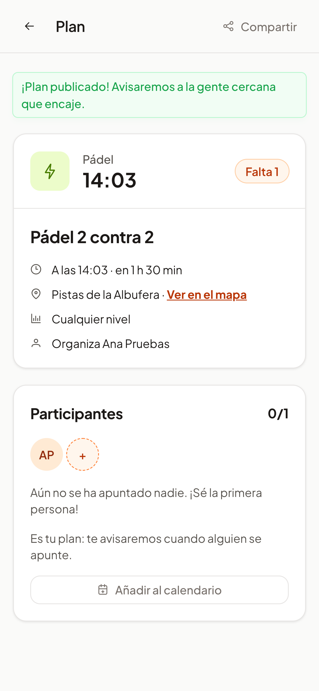

# 26 · Sprint 12: HU-027 Añadir un plan al calendario

**Fecha:** 04/10/2026 · **Sprint:** 12 (02–08/10/2026)

## 1. Planificación

| Issue | Tipo | MoSCoW | Puntos | Resultado |
|---|---|---|---|---|
| backend#47 · HU-027 Añadir un plan al calendario | Historia | Should | 2 | Sin cambios en el backend |
| frontend#77 · Añadir al calendario desde el detalle (sub-issue) | Historia | Should | 1 | PR #78 |
| docs#74 · Documentación (sub-issue) | Tarea | Should | 1 | esta entrada |

**Objetivo:** que quien organiza un plan o se ha apuntado lo tenga también en su calendario habitual, con el lugar,
la hora y un aviso, sin copiarlo a mano.

## 2. Decisiones

| Decisión | Motivo |
|---|---|
| El fichero **iCalendar** (`.ics`, RFC 5545) se genera **en la web**, sin endpoint nuevo | El detalle ya tiene todos los datos del plan. Un endpoint obligaría a descargar con el token de la sesión y no aportaría nada |
| Fechas en **UTC**, textos escapados y líneas plegadas a 75 octetos sin partir caracteres | Lo exige el estándar; las tildes y la «ñ» ocupan dos octetos y no se pueden cortar por la mitad |
| El evento dura **3 horas**, como el plan en el servicio (HU-007) | Los planes no tienen hora de fin; así el calendario coincide con la app |
| **Aviso 30 minutos antes** (`VALARM`) | El mismo margen que el recordatorio de la app (HU-007) |
| `UID` fijo por plan (`plan-<id>@oneleft`) | Si se añade dos veces, el calendario actualiza el evento en lugar de duplicarlo |
| Solo para quien **organiza** o **participa**, y mientras el plan no ha empezado | Es para no olvidar un plan propio; a un plan terminado no tiene sentido ir |
| En la **app Android** abre Google Calendar con el evento relleno | El WebView de Capacitor no descarga ficheros; casi todos los Android tienen Google Calendar |
| El nombre del fichero sale del título (`padel-2-contra-2.ics`) | Se reconoce en la carpeta de descargas |

## 3. En la app

Bajo los participantes aparece el botón «Añadir al calendario». En el navegador descarga el `.ics`, que Google
Calendar, Apple Calendar y Outlook abren como un evento nuevo con el título, la hora, el lugar, sus coordenadas, el
enlace al plan y el aviso.



*Figura 103. Detalle de un plan de Ana con el botón «Añadir al calendario» bajo los participantes. Captura generada
con [`tools/capture-calendar.mjs`](../tools/capture-calendar.mjs), que también guarda el fichero descargado.*

El fichero de ese plan (las 14:03 en Madrid son las 12:03 en UTC; la descripción, larga, se pliega en dos líneas):

```text
BEGIN:VEVENT
UID:plan-b6e43ad2-53a3-4b4b-9cb0-721a9095285b@oneleft
DTSTART:20261004T120300Z
DTEND:20261004T150300Z
SUMMARY:Pádel 2 contra 2
DESCRIPTION:Ver el plan en OneLeft: http://localhost:8080/share/plans/b6e43
 ad2-53a3-4b4b-9cb0-721a9095285b
LOCATION:Pistas de la Albufera
GEO:40.391;-3.629
BEGIN:VALARM
TRIGGER:-PT30M
END:VALARM
END:VEVENT
```

## 4. Pruebas

- **Unitarias** (`plan-calendar.spec.ts`, 100 % de cobertura): formato de fechas, duración, escapado de `;`, `,`
  y saltos de línea, plegado de líneas con caracteres de dos octetos, enlace de Google Calendar y nombre del fichero.
- **Detalle del plan** (`plan-detail.spec.ts`): quién ve el botón, la descarga en el navegador y Google Calendar en
  Android.
- **E2E** (`share.e2e.ts`): tras apuntarse al plan compartido, descarga el `.ics` y comprueba su `UID`, la hora y el
  aviso. Se usa el plan que el test ya publica, así que **no crea datos nuevos**: la API no permite borrar planes.
