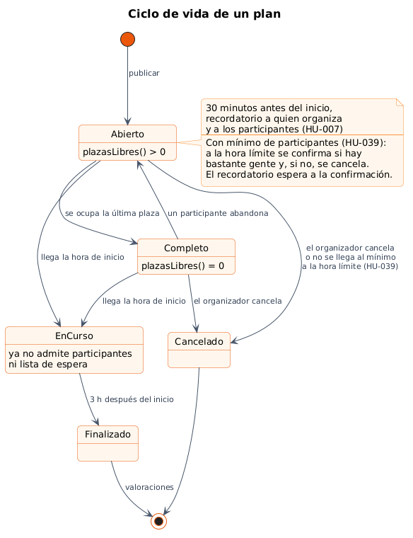
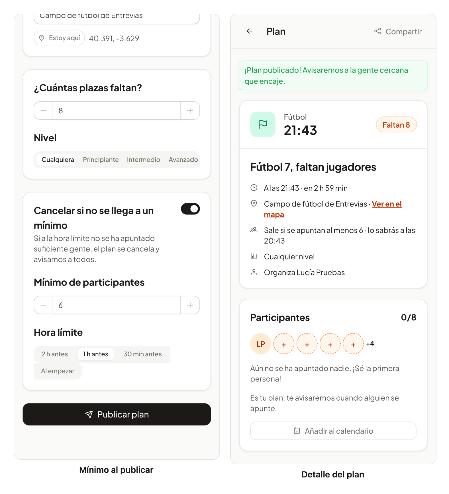
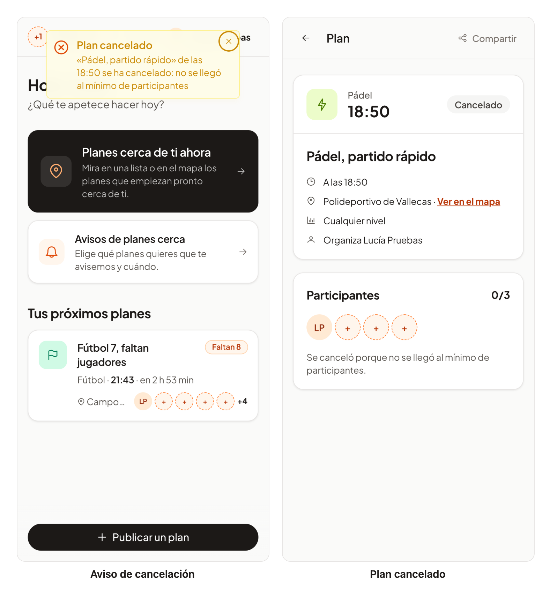

# 27 · Sprint 13: HU-039 Mínimo de participantes

**Fecha:** 08/10/2026 · **Sprint:** 13 (09–15/10/2026)

## 1. Planificación

| Issue | Tipo | MoSCoW | Puntos | Resultado |
|---|---|---|---|---|
| backend#56 · HU-039 Mínimo de participantes | Historia | Should | 3 | PR #106 |
| frontend#81 · Mínimo al publicar y aviso de cancelación (sub-issue) | Historia | Should | 2 | PR #82 |
| docs#77 · Documentación (sub-issue) | Tarea | Should | 1 | esta entrada |

**Objetivo:** que quien organiza un plan que solo tiene sentido con bastante gente (un fútbol 7, un pádel 2 contra 2)
no tenga que estar pendiente: si a una hora límite no se ha llegado al mínimo, el plan se cancela solo y todos se
enteran.

## 2. Decisiones

| Decisión | Motivo |
|---|---|
| El mínimo cuenta **participantes**, sin quien organiza, entre 1 y las plazas | Es la misma cuenta que las plazas libres («faltan 3»): quien publica ya sabe que va |
| **Hora límite** obligatoria con el mínimo: al menos a 5 minutos y no después del inicio | Sin hora límite, el plan no se podría cancelar a tiempo para que nadie vaya en balde |
| La web ofrece **2 h, 1 h, 30 min antes o al empezar**, solo las que aún son posibles | Elegir una hora exacta complica el formulario; si el inicio se acerca, se toma la más tardía posible |
| La comprobación la hace la **tarea de cada minuto de HU-007**, antes que el recordatorio | Ya recorre los planes con algo pendiente, con bloqueo optimista entre réplicas; solo cambia la consulta y un paso más |
| Al llegar al mínimo el plan queda **confirmado** y sigue aunque alguien salga después | Quien se organizó para ir no debe quedarse sin plan por una baja de última hora |
| Un plan con mínimo pendiente **no se recuerda** hasta confirmarse | Recordar un plan que aún puede cancelarse confunde |
| Al cancelarse se vacía la lista de espera y se avisa a **organizador, participantes y lista de espera** | Evento `plan.cancelled`: el flujo en tiempo real de cada persona y `notifications` (Web Push, cola durable) |
| La notificación del navegador lleva la **etiqueta del recordatorio** | Si el recordatorio sigue en pantalla, la cancelación lo sustituye |
| Restricción en la base de datos (`plan_minimum`) e índice parcial de mínimos pendientes | La consulta de cada minuto solo mira los planes que aún esperan su hora límite |

*Figura 105. Ciclo de vida de un plan con el mínimo de participantes de HU-039. Fuente:
[`04-estados-plan.puml`](../diagramas/estados/src/04-estados-plan.puml).*

## 3. En la app

*Figura 106. A la izquierda, Lucía publica un fútbol 7 que solo sale si se apuntan al menos 6 personas una hora antes. A
la derecha, el detalle lo indica con la hora a la que se sabrá.*

*Figura 107. Nadie se apuntó al pádel rápido: a su hora límite se cancela, Lucía recibe el aviso en la app, el plan
sale de sus próximos planes y el detalle explica por qué. Capturas generadas con
[`tools/capture-minimum.mjs`](../tools/capture-minimum.mjs).*

## 4. Pruebas

- **Dominio** (`PlanMinimumTest`, 10 tests): validaciones del mínimo y de la hora límite, confirmación, cancelación
  con sus destinatarios, plan confirmado que sigue aunque alguien salga, recordatorio que espera a la confirmación.
- **Aplicación** (`PlanLifecycleServiceTest`): un plan sin mínimo se cancela a su hora y nunca se recuerda; uno que lo
  alcanza se confirma y después se recuerda.
- **PostgreSQL real** (`JpaPlanRepositoryTest`): el mínimo se guarda y la consulta de cada minuto lo encuentra a su hora
  límite, pero no confirmado ni cancelado.
- **API, tiempo real y RabbitMQ:** publicar con mínimo, errores `plan.minimum` y `plan.minimumDeadline`, el aviso
  `plan-cancelled` solo para quienes estaban en el plan y su paso por RabbitMQ.
- **notifications:** la cancelación llega a todos los navegadores de los destinatarios, con texto en los dos idiomas.
- **Web:** formulario (lo que se envía, horas límite posibles, mínimo dentro de las plazas), detalle (pendiente,
  confirmado, cancelado) y aviso. E2E: publicar con mínimo y verlo en el detalle.

## 5. Incidencias

- **Otra vez los microsegundos.** El test de persistencia comparaba la hora límite truncada a microsegundos, pero
  PostgreSQL **redondea**: en la CI falló por un microsegundo. Ahora la hora del test va en segundos exactos.
- **Lo que enseñaron las capturas.** La primera captura de la cancelación mostró tres fallos que los tests no cubrían:
  el plan cancelado seguía en «Tus próximos planes» (el servicio no lo excluía y la portada no se recargaba con el
  aviso), el detalle decía «ya ha empezado» y seguía animando a apuntarse. Los tres se corrigieron con sus tests antes
  de fusionar.
- **Esperas largas en las capturas.** Puppeteer corta cualquier orden que tarde más de 180 segundos, así que esperar
  10 minutos al aviso de una vez fallaba sin llegar a esperar. La captura espera ahora en tramos de 2 minutos.
