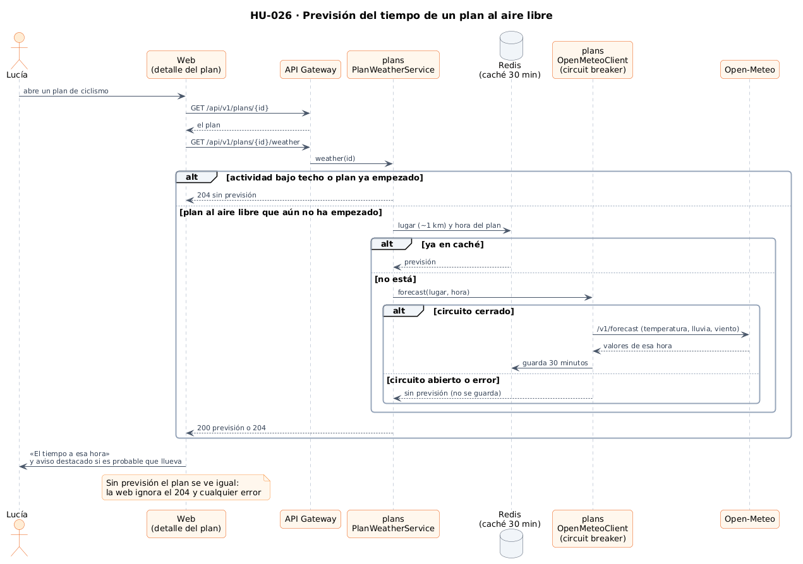
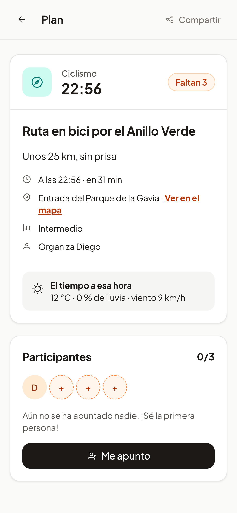

# 28 · Sprint 13: HU-026 Aviso del tiempo en planes al aire libre

**Fecha:** 08/10/2026 · **Sprint:** 13 (09–15/10/2026)

## 1. Planificación

| Issue | Tipo | MoSCoW | Puntos | Resultado |
|---|---|---|---|---|
| backend#46 · HU-026 Aviso del tiempo en planes al aire libre | Historia | Should | 3 | PR #107 |
| frontend#83 · Previsión en el detalle de los planes al aire libre (sub-issue) | Historia | Should | 1 | PR #84 |
| docs#79 · Documentación (sub-issue) | Tarea | Should | 1 | esta entrada |

**Objetivo:** que quien va a un plan al aire libre sepa de un vistazo si el tiempo acompaña, sin salir de la app.

## 2. Decisiones

| Decisión | Motivo |
|---|---|
| **Open-Meteo** | Gratuita, sin clave ni registro, con previsión por horas; el plan siempre empieza dentro de las próximas 12 horas |
| La previsión se pide **en `plans`** con un endpoint propio (`GET /api/v1/plans/{id}/weather`) | Es un dato del plan (lugar y hora). Un endpoint aparte hace que un fallo del tiempo nunca impida cargar el plan |
| Solo para **actividades al aire libre** (pádel, fútbol, baloncesto, tenis, running, ciclismo, senderismo) y planes que **aún no han empezado** | En el cine o en un concierto el tiempo no importa; para un plan ya empezado no sirve |
| La hora de la previsión es **la más cercana al inicio** | Open-Meteo da un valor por hora |
| **Caché en Redis** de 30 minutos por **lugar redondeado a ~1 km** y hora | Muchas visitas al mismo plan, o a planes cercanos, hacen una sola petición; la previsión apenas cambia en media hora |
| **Circuit breaker** (Resilience4j con Spring Cloud CircuitBreaker): se abre si fallan la mitad de las últimas llamadas y vuelve a probar a los 30 s; tiempos de espera cortos | Si Open-Meteo falla o va lento, el servicio deja de esperarlo: el plan se ve igual, sin previsión. Los fallos no se guardan en la caché |
| Aviso **destacado si la probabilidad de lluvia llega al 60 %** | Por debajo es ruido; por encima conviene hablarlo con el grupo antes de ir |
| La web pide la previsión **una vez por plan**, solo con sesión, e ignora el 204 y cualquier error | El tiempo es un extra: nunca rompe ni retrasa el detalle |

*Figura 108. La previsión pasa por la caché de Redis y, si no está, por el circuit breaker antes de llegar a
Open-Meteo. Fuente: [`32-secuencia-prevision-tiempo.puml`](../diagramas/secuencia/src/32-secuencia-prevision-tiempo.puml).*

## 3. En la app

*Figura 109. Una ruta en bici por el Anillo Verde con la previsión real de Open-Meteo a su hora: 12 °C, sin lluvia y
viento de 9 km/h. Con un 60 % de lluvia o más, el bloque se destaca y avisa de que conviene confirmarlo con el grupo.
Captura generada con [`tools/capture-weather.mjs`](../tools/capture-weather.mjs).*

## 4. Pruebas

- **Dominio y aplicación** (`ForecastTest`, `PlanWeatherServiceTest`): qué actividades son al aire libre, el umbral de
  lluvia, que solo se pregunta por planes al aire libre que no han empezado y que sin respuesta no hay previsión.
- **Integración** (`PlanWeatherIntegrationTest`) con **Open-Meteo simulado con WireMock** y **Redis real**
  (Testcontainers): la previsión de la hora correcta, dos visitas con una sola petición, un plan bajo techo sin
  petición, un error del servicio sin previsión mientras el plan se carga, el circuito abierto tras cinco fallos (las
  visitas siguientes ya no llegan al servicio) y un plan que no existe.
- **Web:** la API (previsión, 204 y error) y el detalle (previsión, lluvia destacada, nada en planes terminados).

## 5. Incidencias

- **La clave de la caché.** La primera versión calculaba la clave con una expresión SpEL que llamaba a un método no
  público del cliente: compilaba, pero fallaba al pedir la previsión con un error 500. La web lo ocultaba (simplemente
  no mostraba el tiempo), pero la prueba de integración lo detectó en la CI y también se vio en local. Ahora el
  adaptador redondea el lugar y la hora antes de llamar al cliente, y la caché usa esos argumentos tal cual.
- **El reposo del Mac.** Una captura no mostraba la previsión porque, tras horas en reposo, el plan elegido ya había
  empezado: era el comportamiento correcto. La captura usa un plan que aún no ha empezado.
