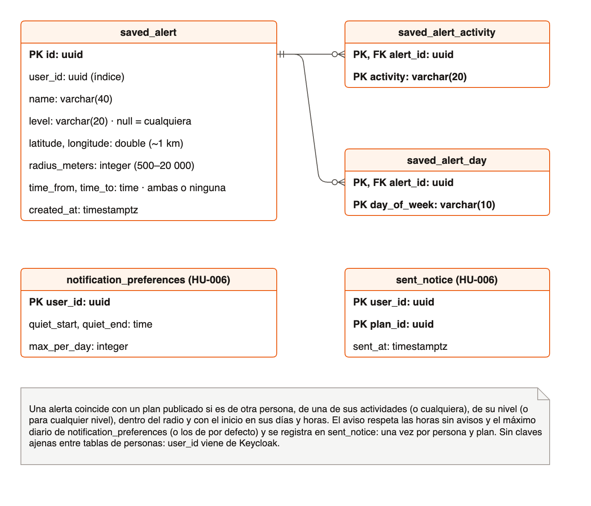
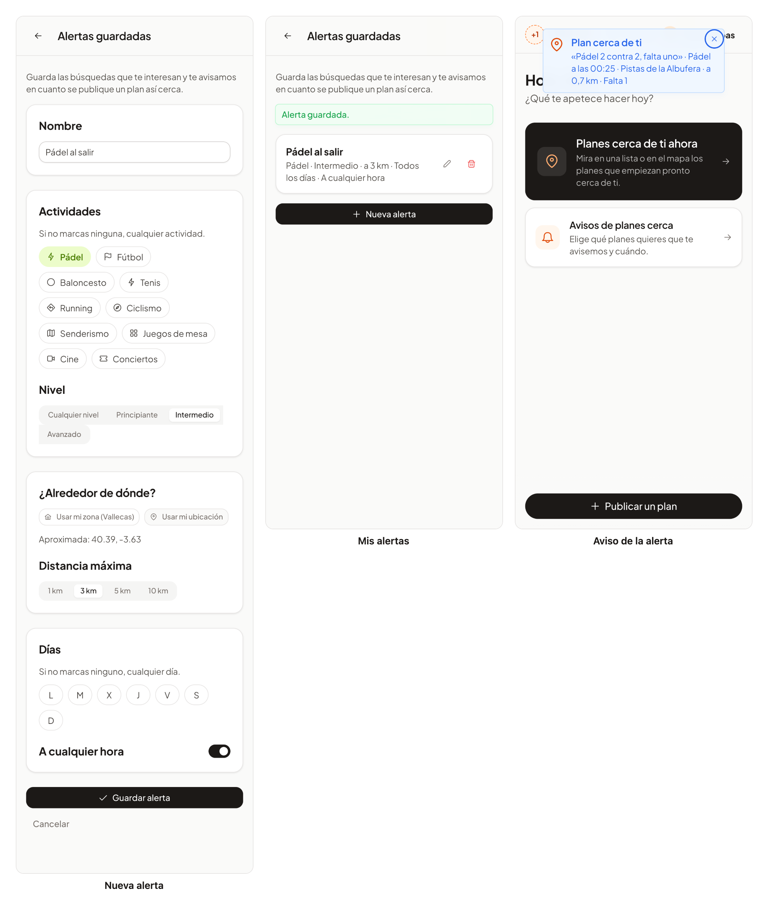

# 29 · Sprint 13: HU-036 Alertas guardadas

**Fecha:** 08/10/2026 · **Sprint:** 13 (09–15/10/2026)

## 1. Planificación

| Issue | Tipo | MoSCoW | Puntos | Resultado |
|---|---|---|---|---|
| backend#53 · HU-036 Alertas guardadas | Historia | Should | 3 | PR #108 |
| frontend#85 · Página de alertas guardadas (sub-issue) | Historia | Should | 2 | PR #86 |
| docs#81 · Documentación (sub-issue) | Tarea | Should | 1 | esta entrada |

**Objetivo:** que alguien con un plan concreto en mente («pádel intermedio a menos de 3 km entre semana por la
tarde») no tenga que estar mirando la app: lo guarda una vez y le avisamos en cuanto aparece.

## 2. Decisiones

| Decisión | Motivo |
|---|---|
| Las alertas viven en **`notifications`** | Es el servicio que ya decide a quién avisar de cada plan publicado (HU-006); las alertas son otra forma de decirlo |
| Una alerta guarda **actividades, nivel, zona, radio, días y horas** del inicio; vacío significa «cualquiera» | Cubre el ejemplo de la historia sin campos obligatorios de más |
| Un plan **para cualquier nivel** coincide con todas las alertas de nivel | Quien busca pádel intermedio también puede ir a uno abierto a todos |
| La zona se **redondea a ~1 km** y la distancia se mide igual que en la búsqueda por proximidad de HU-004 | Nunca se guarda una dirección exacta; un plan sale en la alerta si saldría en la búsqueda |
| Días y horas se comparan con la **hora local** del inicio | «Por la tarde» es la tarde en Madrid, no en UTC |
| **Una sola vez por persona y plan**, aunque coincidan varias alertas o también sus avisos de HU-006 | El registro `sent_notice` de HU-006 ya garantiza un aviso por persona y plan |
| Se respetan las **horas sin avisos y el máximo diario** de la persona, o los de por defecto si nunca los configuró | Una alerta no es excusa para molestar de madrugada |
| Como mucho **5 alertas por persona** (`MAX_ALERTS`), 409 `alerts.limit` | Límite razonable; es una constante que la reputación de HU-009 podrá ampliar |
| Solo su dueño ve o cambia una alerta: para los demás **no existe** (404) | No se desvela que una alerta exista |
| El evento `plan.published` se lee ahora **con su nivel** | `plans` ya lo enviaba; `notifications` lo ignoraba |

*Figura 110. Tablas de las alertas guardadas en la base de datos de `notifications`, junto a las de HU-006 que usan.
Fuente: [`33-modelo-alertas.drawio`](../diagramas/datos/src/33-modelo-alertas.drawio), el primer diagrama de datos en
draw.io, exportado con [`tools/render-drawio.mjs`](../tools/render-drawio.mjs).*

## 3. En la app

*Figura 111. Ana guarda «Pádel al salir» (pádel intermedio a 3 km de su zona, cualquier día y hora) desde la página
de avisos, la ve en su lista y, en cuanto Lucía publica un pádel intermedio cerca, recibe el aviso aunque no tenga
activados los avisos generales. Captura generada con [`tools/capture-alerts.mjs`](../tools/capture-alerts.mjs), que
borra la alerta al terminar.*

## 4. Pruebas

- **Dominio** (`SavedAlertTest`): validaciones, zona aproximada, actividades, nivel (y planes para cualquier nivel),
  radio, planes propios, días y horas en hora local y edición.
- **Aplicación** (`AlertServiceTest`, `NearbyPlanNotifierTest`): límite de alertas, solo el dueño las cambia, un
  aviso por persona aunque coincidan varias alertas y los avisos de HU-006, filtros y horas sin avisos.
- **Integración** (PostgreSQL y RabbitMQ reales): la API completa, validación y límite, y un plan publicado que llega
  al dueño de una alerta.
- **Web:** la página (resumen, vacía, error, crear, editar, borrar, límite, zona, inglés) y la API. E2E: guardar una
  alerta, verla y **borrarla**, sin dejar datos.

## 5. Incidencias

- **El resumen con los siete días** decía «lunes, martes, … domingo» en lugar de «todos los días», y la lista quedaba
  pegada al botón: los dos detalles salieron en la primera captura y se corrigieron antes de fusionar.
- **draw.io sin instalar.** Para no instalar la aplicación, el diagrama se exporta con el visor oficial de
  diagrams.net en el mismo navegador sin ventana que hace las capturas.
- **El Mac, al límite.** Con el stack completo, la carga media llegó a 11: algún test de la web y alguna captura
  fallaron por tiempo y pasaron al repetirlos. En la CI no ocurre.
