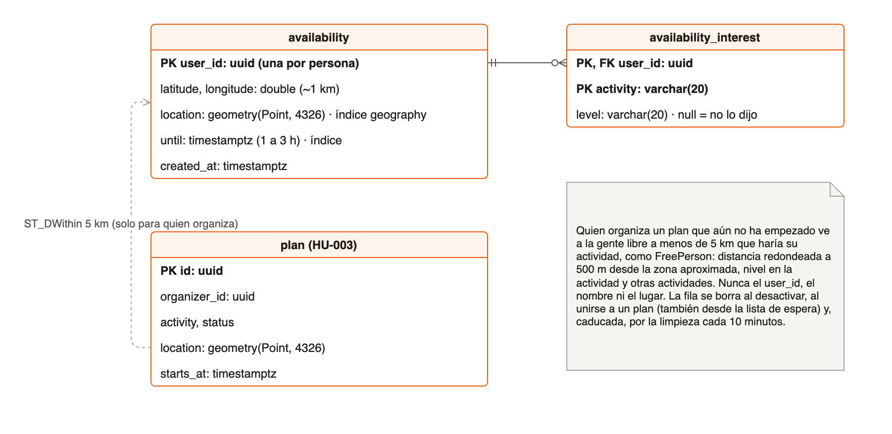
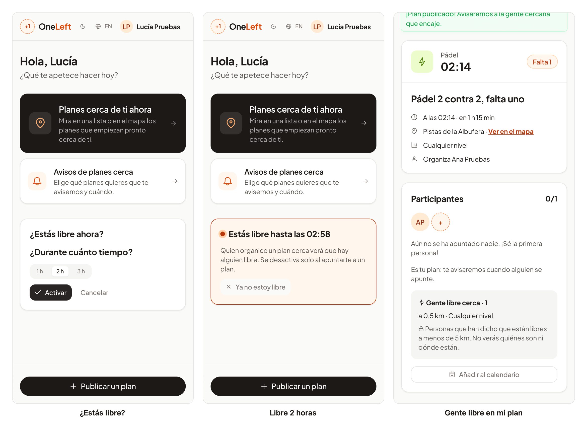

# 30 · Sprint 13: HU-035 «Estoy libre ahora»

**Fecha:** 09/10/2026 · **Sprint:** 13 (09–15/10/2026)

## 1. Planificación

| Issue | Tipo | MoSCoW | Puntos | Resultado |
|---|---|---|---|---|
| backend#52 · HU-035 «Estoy libre ahora» | Historia | Should | 5 | PR #109 |
| frontend#87 · «Estoy libre ahora» en la portada y gente libre en mis planes (sub-issue) | Historia | Should | 2 | PR #88 |
| docs#83 · Documentación (sub-issue) | Tarea | Should | 1 | esta entrada |
| backend#110 · Bug: el test de alertas fallaba de noche | Bug | Must | 1 | PR #111 |

**Objetivo:** que quien organiza sepa si merece la pena publicar o esperar, porque hay gente cerca que acaba de decir
que está libre, sin exponer a esas personas.

## 2. Decisiones

| Decisión | Motivo |
|---|---|
| El modo libre dura **1, 2 o 3 horas**, una vez por persona (activarlo de nuevo lo sustituye) | OneLeft es para planes de ya; más de 3 horas deja de ser «ahora» |
| Se guarda con la **zona redondeada a ~1 km** y las **aficiones del perfil con su nivel** (ninguna marcada: cualquier plan) | Lo mínimo para encajar con un plan, sin una posición exacta |
| **Solo lo ve quien organiza** un plan que aún no ha empezado, y solo a menos de **5 km** de su punto de encuentro y para su actividad | Es lo que pide la historia: visible para quien publica cerca, no un directorio de gente disponible |
| Lo que ve es un **`FreePerson`**: distancia **redondeada a 500 m**, nivel en la actividad y otras actividades. Sin id, nombre ni lugar | Aunque se cruzaran varios planes, no se puede localizar a nadie |
| Se desactiva al **caducar**, al **desactivarlo** y al **unirse a un plan**, también al conseguir plaza desde la lista de espera | Quien ya tiene plan no está libre |
| Búsqueda con **PostGIS** (`ST_DWithin` sobre `geography`) e índice propio, como los planes cercanos de HU-004 | Misma técnica, ya probada |
| Limpieza de las caducadas **cada 10 minutos** | Las consultas ya las ignoran; solo mantiene la tabla pequeña |
| La web usa la **ubicación aproximada del dispositivo** y, sin ella, la zona del perfil | Funciona igual en la app Android, que usa la misma geolocalización del navegador |

*Figura 112. Tablas del modo libre en la base de datos de `plans` y su relación con los planes. Fuente:
[`34-modelo-disponibilidad.drawio`](../diagramas/datos/src/34-modelo-disponibilidad.drawio).*

## 3. En la app

*Figura 113. Lucía dice en la portada que está libre durante 2 horas; Ana publica un pádel cerca y, en el detalle, ve
que hay una persona libre a 0,5 km, sin saber quién es ni dónde está. Captura generada con
[`tools/capture-free-now.mjs`](../tools/capture-free-now.mjs), que desactiva el modo libre al terminar.*

## 4. Pruebas

- **Aplicación** (`AvailabilityServiceTest`): horas y zona, caducidad y limpieza, lo que ve quien organiza (distancia,
  nivel, actividades, orden), que nadie más lo ve, que no cuentan ni quien organiza ni quien ya participa. Unirse o
  conseguir plaza desde la lista de espera desactiva el modo libre (`JoinPlanServiceTest`, `ParticipationServiceTest`).
- **Integración** (PostGIS real, `AvailabilityControllerTest`): la API, la vista de quien organiza sin identificadores
  y que unirse al plan termina el modo libre.
- **Web:** la tarjeta (activar con las aficiones elegidas, zona del perfil sin ubicación, sin zona, error, cancelar,
  desactivar y no mostrarse hasta saber el estado), el detalle (gente libre para quien organiza, nadie, nada para los
  demás) y la API. E2E: activar y **desactivar** el modo libre, sin dejar datos.

## 5. Incidencias

- **Un test que fallaba de noche (backend#110).** En la CI de esta historia falló el test de HU-036 que comprueba que
  una alerta avisa a su dueño: lo ejecutó a las 23:17 y, sin preferencias propias, se aplicaban las horas sin avisos
  por defecto (de 23:00 a 08:00). La app hacía lo correcto; el test dependía de la hora. Se abrió como bug, se
  corrigió en `dev` y se llevó a esta rama.
- **La tarjeta decía lo contrario un instante.** Al abrir la portada, la tarjeta preguntaba «¿Estás libre ahora?»
  antes de saber que la persona ya lo estaba, y luego cambiaba. Lo descubrió la captura; ahora no se muestra hasta
  conocer el estado.
- **El redondeo en un test.** La zona de la persona libre se redondeaba a otra centésima que la del plan y la distancia
  salía 1 km en vez de 500 m; la CI lo detectó y el test usa ahora una zona que redondea a la del plan.
