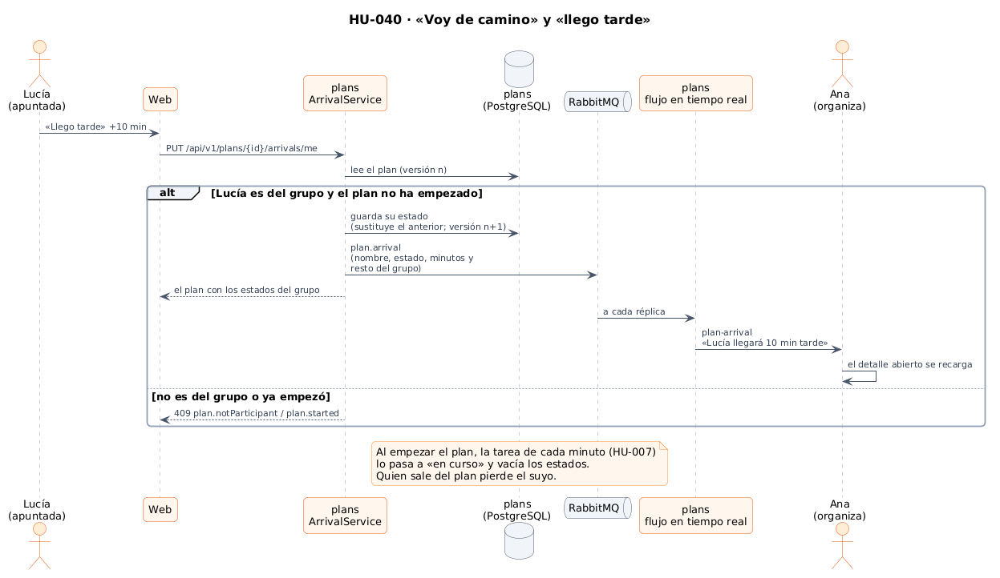
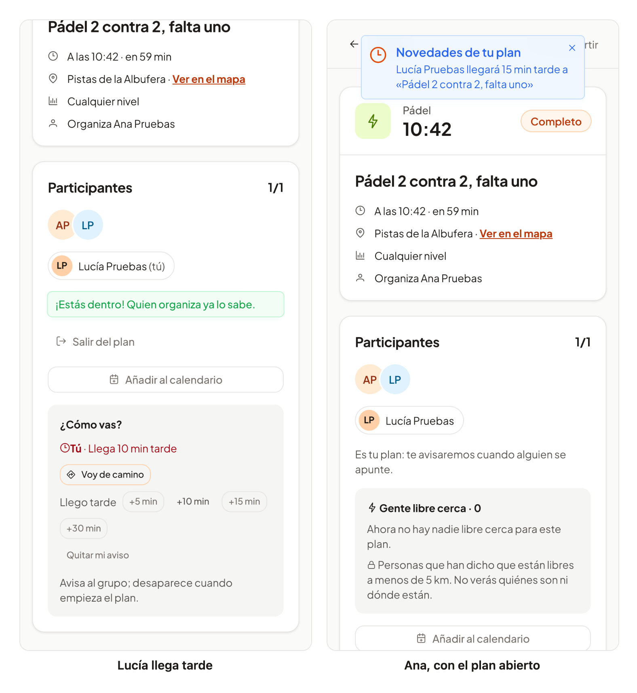

# 31 · Sprint 13: HU-040 Recordatorio y «voy de camino / llego tarde»

**Fecha:** 09/10/2026 · **Sprint:** 13 (09–15/10/2026)

## 1. Planificación

| Issue | Tipo | MoSCoW | Puntos | Resultado |
|---|---|---|---|---|
| backend#57 · HU-040 Recordatorio y «voy de camino / llego tarde» | Historia | Should | 5 | PR #112 |
| frontend#89 · «Voy de camino» y «llego tarde» en el detalle (sub-issue) | Historia | Should | 2 | PR #90 |
| docs#85 · Documentación (sub-issue) | Tarea | Should | 1 | esta entrada |

**Objetivo:** que el grupo se coordine en los últimos minutos sin salir de la app. El primer criterio de la historia
(aviso 30 minutos antes del inicio) ya lo cumple el recordatorio de HU-007 ([entrada 25](25-hu007-caducidad-y-recordatorio.md)).

## 2. Decisiones

| Decisión | Motivo |
|---|---|
| Dos estados: **«voy de camino»** y **«llego tarde»** con 5, 10, 15 o 30 minutos | Opciones cerradas: se pulsan en un segundo y el grupo entiende lo mismo |
| Los estados son parte del **agregado del plan**, guardados con **bloqueo optimista** | Como la lista de espera: si dos personas avisan a la vez, ninguno se pierde |
| Solo **quien organiza y quien participa**, y **hasta que empieza** el plan | Es información del grupo; después del inicio ya no sirve |
| Un aviso nuevo **sustituye** al anterior de la misma persona, y se puede **quitar** | Cada persona tiene un único estado actual |
| El plan solo trae los estados a **quien es del grupo**; en la búsqueda de planes cercanos o para cualquier otra persona, vacíos | Nadie de fuera sabe quién va con retraso |
| El evento `plan.arrival` llega al **flujo en tiempo real** del resto del grupo, sin notificación del navegador | Es un detalle de última hora para quien tiene la app abierta; el recordatorio de HU-007 ya avisa con la app cerrada |
| Al **empezar** el plan (tarea de HU-007) se vacían los estados; quien **sale** del plan pierde el suyo | Así caducan solos, sin otra tarea |

*Figura 114. Lucía avisa de que llega tarde; el estado se guarda en el plan y llega a Ana en tiempo real. Fuente:
[`33-secuencia-voy-de-camino.puml`](../diagramas/secuencia/src/33-secuencia-voy-de-camino.puml).*

## 3. En la app

*Figura 115. A la izquierda, Lucía se apunta y avisa de que llega 10 minutos tarde. A la derecha, Ana, con el plan
abierto, recibe al momento que Lucía llegará 15 minutos tarde. Captura generada con
[`tools/capture-arrivals.mjs`](../tools/capture-arrivals.mjs), que quita los avisos al terminar.*

## 4. Pruebas

- **Aplicación** (`ArrivalServiceTest`): avisar y a quién llega, sustituir, quitar, quien organiza también avisa,
  solo el grupo, minutos válidos, nada tras el inicio, y los estados que desaparecen al empezar o al salir.
- **Integración** (PostgreSQL y RabbitMQ reales): la API (el grupo ve los estados, alguien de fuera no; errores), el
  evento por RabbitMQ y el flujo en tiempo real.
- **Web:** el detalle (avisar, lista con «Tú» primero, quitar, nada para quien no es del grupo ni en planes empezados,
  recarga con el aviso), el aviso emergente, el flujo de eventos y la API. E2E: tras apuntarse, «voy de camino» y el
  aviso a quien organiza, en el mismo test de unirse (sin crear datos nuevos).

## 5. Incidencias

- **El Mac, otra vez al límite.** Con el stack completo y la web en contenedor, algunas pruebas y capturas tardaron
  varios minutos o fallaron por tiempo, y el ordenador llegó a dormirse a mitad de una batería de tests (un test tardó
  15 minutos y la hora de un plan de prueba quedó desfasada). Se repitieron con más margen; en la CI no ocurre.
